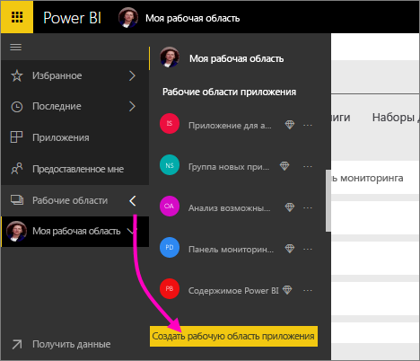
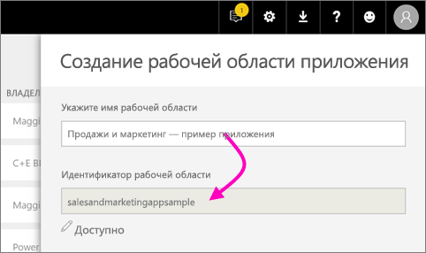
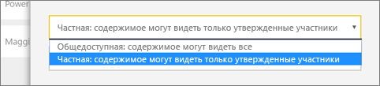
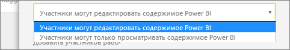
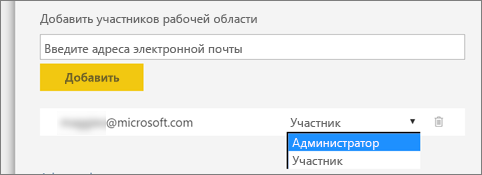

1. Начнем с создания рабочей области. Выберите **Рабочие области** > **Создать рабочую область приложения**. 
   
     
   
    Здесь будет сохраняться содержимое, над которым работали вы и ваши коллеги.

2. На баннере **Вы создаете рабочую область обновленной версии** нажмите кнопку **Вернуться к классической версии**. 

    

3. Присвойте рабочей области имя. Если соответствующее поле **Workspace ID** (Идентификатор рабочей области) недоступно, измените это имя, чтобы указать уникальный идентификатор.
   
     Приложение будет иметь то же имя, что и рабочая область.
   
     

3. Вы можете выбрать один из доступных вариантов. Если вы выбрали **Общедоступный**, все пользователи организации смогут просматривать содержимое рабочей области. Если выбрать **Частный**, только члены рабочей области смогут просматривать ее содержимое.
   
     
   
    После создания группы изменить параметр открытого или закрытого доступа нельзя.

4. Вы также можете задать права для членов рабочей области: разрешить **изменение** содержимого или предоставить доступ **только для просмотра**.
   
     
   
     Добавляйте пользователей в рабочую область приложения в том случае, если им нужно изменять содержимое. Если им нужно только просматривать содержимое, не добавляйте их в рабочую область. Их можно будет указать при публикации приложения.

5. Добавьте адреса электронной почты сотрудников, которым необходимо предоставить доступ к рабочей области, и нажмите кнопку **Добавить**. Вы не можете добавлять псевдонимы групп, а только отдельных пользователей.

6. Предоставьте каждому пользователю либо права участника, либо администратора.
   
     
   
    Администраторы могут самостоятельно изменять рабочую область, в том числе добавлять других участников. Участники могут изменять содержимое рабочей области (за исключением тех случаев, когда они имеют доступ только на просмотр). Публиковать приложения могут и администраторы, и участники.

7. Нажмите кнопку **Сохранить**.

После этого служба Power BI создаст рабочую область и откроет ее. Она отображается в списке рабочих областей, в которые вы входите. Администратор может щелкнуть многоточие (…), чтобы вернуться и внести изменения в рабочую область, например добавить новых участников или изменить разрешения.

