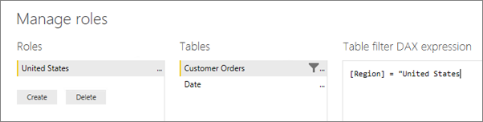

## <a name="define-roles-and-rules-in-power-bi-desktop"></a>Создание ролей и правил в Power BI Desktop
В приложении Power BI Desktop можно задавать роли и правила. При публикации в Power BI публикуются и определения ролей.

Чтобы задать роли безопасности, выполните следующие действия.

1. Импортируйте данные в отчет Power BI Desktop или настройте подключение DirectQuery.
   
   > [!NOTE]
   > Задавать определения ролей в Power BI Desktop для динамических подключений служб Analysis Services нельзя. Это делается непосредственно в модели Analysis Services.
   > 
   > 
2. На вкладке **Моделирование** выберите **Управление ролями**.
   
   
3. В окне **Управление ролями** выберите **Создать**.
   
   
4. В поле **Роли** укажите имя роли. 
5. В списке **Таблицы** выберите таблицу, к которой хотите применить правило DAX.
6. В поле **Выражение DAX фильтра таблицы** введите выражение DAX. Это выражение возвращает истину (true) или ложь (false). Например: ```[Entity ID] = “Value”```
      
   

   > [!NOTE]
   > В этом выражении можно использовать функцию *username()* . Помните о том, что в Power BI Desktop функция *username()* возвращает значения в формате *ДОМЕН\имя_пользователя*. В службе Power BI и сервере отчетов Power BI оно задается в формате имени участника-пользователя (UPN). Кроме того, можно использовать функцию *userprincipalname()* , которая всегда возвращает пользователя в формате имени участника-пользователя: *имя_пользователя\@contoso.com*.
   > 
   > 

7. Чтобы проверить созданное выражение DAX, установите флажок над полем выражения.
      
   
   
   > [!NOTE]
   > В этом поле выражения для разделения аргументов функции DAX используются запятые, даже если используется языковой стандарт, который обычно использует как разделитель точку с запятой (например, французский или немецкий). 
   >
   >
   
8. Щелкните **Сохранить**.

Назначать пользователей роли в Power BI Desktop нельзя. Вы назначаете их в службе Power BI. Чтобы использовать в Power BI Desktop функции динамической системы безопасности, используйте функции DAX *username()* или *userprincipalname()* и настройте соответствующие связи. 

