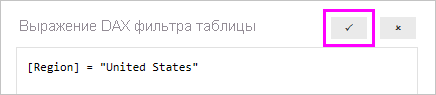

## Создание ролей и правил в Power BI Desktop
В приложении Power BI Desktop можно задавать роли и правила. При публикации в Power BI публикуются и определения ролей.

Чтобы задать роли безопасности, выполните следующие действия.

1. Импортируйте данные в отчет Power BI Desktop или настройте подключение DirectQuery.
   
   > [!NOTE]
   > Задавать определения ролей в Power BI Desktop для динамических подключений служб Analysis Services нельзя. Это делается непосредственно в модели Analysis Services.
   > 
   > 
1. Откройте вкладку **Моделирование**.
2. Выберите **Управление ролями**.
   
   
4. Выберите **Создать**.
   
   
5. Укажите имя роли. 
6. Выберите таблицу, для которой хотите применить правило DAX.
7. Введите выражения DAX. Выражение должно возвращать истину (true) или ложь (false). Пример: [Код объекта] = "Значение".
   
   > [!NOTE]
   > В этом выражении можно использовать функцию *username()*. Помните о том, что в Power BI Desktop функция *username()* возвращает значения в формате *ДОМЕН\имя_пользователя*. В службе Power BI и сервере отчетов Power BI оно задается в формате имени участника-пользователя (UPN). Кроме того, можно использовать функцию *userprincipalname()*, которая всегда возвращает пользователя в формате имени участника-пользователя: *имя_пользователя\@contoso.com*.
   > 
   > 
   
   
8. Созданное выражение DAX можно проверить с помощью флажка над полем выражения.
   
   
9. Нажмите кнопку **Сохранить**.

Назначать пользователей роли в Power BI Desktop нельзя. Вы назначаете их в службе Power BI. Чтобы использовать в Power BI Desktop функции динамической системы безопасности, используйте функции DAX *username()* или *userprincipalname()* и настройте соответствующие связи. 

