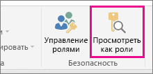
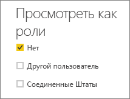
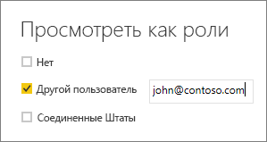

## Проверка ролей в Power BI Desktop
Создав роли, вы можете проверить их действие в приложении Power BI Desktop.

1. Выберите **Просмотреть как роли**. 

    

    В разделе **Просмотреть как роли** показаны роли, которые вы создали.

    

3. Выберите созданную роль и нажмите кнопку **ОК**, чтобы применить ее. В отчет будут включены данные, которые относятся к этой роли. 

4. Кроме того, можно выбрать **Другой пользователь** и указать определенного пользователя. Рекомендуется указывать имя участника-пользователя, так как именно с ним работает служба Power BI и сервер отчетов Power BI.

    

1. Нажмите кнопку **ОК**, и в отчет будет включена информация, которая доступна данному пользователю. 

В Power BI Desktop результаты при выборе варианта **Другой пользователь** меняются только при использовании динамической системы безопасности на базе выражений DAX. 

