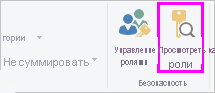

## Проверка роли в приложении Power BI Desktop
Создав роль, вы можете проверить ее действие в приложении Power BI Desktop. Для этого выберите **Просмотреть как роли**.

В диалоговом окне **Просмотреть как роли** можно изменить содержимое представления для определенного пользователя или роли. Здесь показаны роли, которые вы создали.

Выберите роль и нажмите кнопку **ОК**, чтобы применить ее к представлению данных. В отчетах отображаются только те данные, которые относятся к данной роли.

Кроме того, можно выбрать **Другой пользователь** и указать определенного пользователя. Рекомендуется указывать имя субъекта-пользователя, так как именно с ним работает служба Power BI. Нажмите кнопку **ОК**, и в отчетах отобразится информация, которая доступна данному пользователю. 

> [!NOTE]
> Внешний вид отчетов в Power BI Desktop меняется только при использовании динамической системы безопасности на базе выражений DAX.
> 
> 

