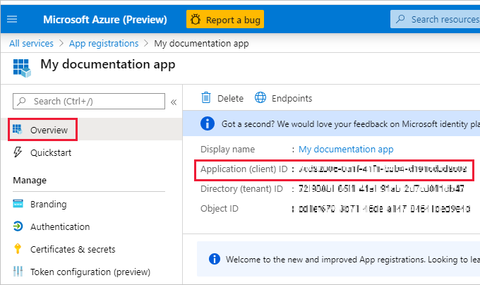

1. Выполните вход в [Microsoft Azure](https://ms.portal.azure.com/#allservices).

2. В строке поиска найдите **Регистрация приложений** и щелкните ссылку **Регистрация приложений**.

    

3. Щелкните **Новая регистрация**.

    

4. Заполните необходимые сведения:
    * **Имя** — введите имя для своего приложения.
    * **Поддерживаемые типы учетных записей** — выберите поддерживаемые типы учетных записей.
    * (Необязательно) **URI перенаправления** — при необходимости введите универсальный код ресурса (URI).

5. Щелкните **Зарегистрировать**.

6. После регистрации на вкладке **Обзор** доступен *Идентификатор приложения*. Скопируйте и сохраните *Идентификатор приложения* для последующего использования.

    