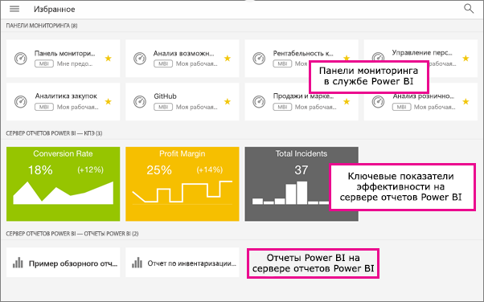

# Добавление панелей мониторинга, приложений и локальных отчетов в избранное в мобильных приложениях Power BI
Область применения:

|  |  |  |  |  |
|:--- |:--- |:--- |:--- |:--- |
| iPhone |iPad |Телефоны под управлением Android |Планшеты Android |Устройства под управлением Windows 10 |

В мобильных приложениях на странице "Избранное" отображаются избранные приложения и панели мониторинга Power BI, а также избранные локальные ключевые показатели эффективности и мобильные отчеты сервера отчетов Power BI и служб Reporting Services. Когда вы добавляете панель мониторинга или приложение в *избранное* в мобильном приложении Power BI, этот элемент отображается на странице избранного в службе Power BI ([https://powerbi.com](https://powerbi.com)) и на всех ваших мобильных устройствах. 

Вы также можете [добавлять в избранное приложения и панели мониторинга Power BI в службе Power BI](service-dashboard-favorite.md). В таком случае эти элементы появятся в мобильном приложении на странице избранного.

На веб-портале сервера отчетов Power BI и служб Reporting Services ключевые показатели эффективности и отчеты можно отметить как избранные. Так вы сможете просматривать эти данные на мобильном устройстве в одной папке вместе с избранными панелями мониторинга Power BI.

## Просмотр избранных приложений и панелей мониторинга Power BI, а также локальных мобильных отчетов и ключевых показателей эффективности
* Коснитесь меню навигации  вверху и выберите **Избранное**.
  
  
  
  Все избранные элементы отображаются на этой странице.
  
  

## Добавление приложения в избранное
1. В списке приложений в мобильном приложении нажмите кнопку с многоточием (…) рядом с приложением и выберите пункт **Добавить в избранное**.
   
    
   
    Теперь оно будет отображаться вместе с другими избранными приложениями и панелями мониторинга.
   
    

## Добавление панели мониторинга в избранное в мобильных приложениях iOS и Windows 10
Приложение или панель мониторинга Power BI можно добавить в избранное из списка панелей мониторинга или прямо из самой панели.

* В мобильном приложении в списке панелей мониторинга коснитесь пустой звездочки  рядом с именем панели. Звездочка станет желтой .
  
    
* В верхней части панели мониторинга, на ленте, коснитесь пустой звездочки . Звездочка станет желтой .
  
    

## Добавление панели мониторинга в избранное в мобильных приложениях Android
Панель мониторинга можно добавить в избранное из списка панелей мониторинга или прямо из самой панели.

* В мобильном приложении в списке панелей мониторинга коснитесь вертикального многоточия (…) рядом с именем панели мониторинга, а затем выберите пункт **Favorite** (Добавить в избранное). Рядом с именем появится желтая звездочка .
  
    
* В верхней части панели мониторинга, на ленте, коснитесь пустой звездочки . Звездочка станет темно-серой .
  
    

## Добавление отчетов и ключевых показателей эффективности сервера отчетов Power BI и служб Reporting Services в "Избранное"
Хотя избранные отчеты и ключевые показатели эффективности сервера отчетов Power BI и служб Reporting Services можно просматривать в мобильных приложениях Power BI, вы не может добавить их в "Избранное" в мобильных приложениях. Вы [можете отметить их как "Избранное" на веб-портале](report-server/getting-around.md#tag-your-favorite-reports-and-kpis). 

## Дальнейшие действия
* [Избранные панели мониторинга в Power BI](service-dashboard-favorite.md) 
* У вас появились вопросы? [Попробуйте задать вопрос в сообществе Power BI.](http://community.powerbi.com/)

