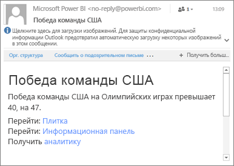

# Настройка оповещений о данных в мобильных приложениях Power BI
Область применения:

|  |  |  |  |  |
|:--- |:--- |:--- |:--- |:--- |
| iPhone |iPad |Телефоны под управлением Android |Планшеты Android |Устройства под управлением Windows 10 |

Оповещения можно настраивать на панели мониторинга в службе Power BI и мобильных приложениях Power BI. Оповещения уведомляют о том, что данные на плитке выходят за пределы заданного порога. Оповещения используются с плитками, которые сдержат отдельные элементы (например, карточки и датчики), но не данные потоковой передачи. Оповещения о данных можно настраивать на мобильном устройстве и просматривать в службе Power BI, и наоборот. Видеть настраиваемые оповещения о данных можете только вы, даже если панель мониторинга или моментальный снимок плитки находятся в общем доступе.

Настроить оповещения для плиток можно при наличии лицензии Power BI Pro или бесплатной лицензии Power BI, а также если для общей панели мониторинга доступна емкость Premium. 

> [!WARNING]
> Уведомления на основе данных содержат сведения о данных. Если ваше устройство украдено, рекомендуем отключить все правила генерации оповещений на основе данных в службе Power BI. 
> 
> Дополнительные сведения об [управлении оповещениями о данных в службе Power BI](service-set-data-alerts.md).
> 
> 

## Оповещения о данных на устройстве iPhone или iPad
### Настройка оповещений на устройстве iPhone или iPad
1. Коснитесь плитки или датчика с числом на панели мониторинга, чтобы открыть ее в режиме фокусировки.  
   
   
2. Коснитесь значка колокольчика , чтобы добавить оповещение.  
3. Нажмите **Добавить правило оповещения**.
   
   
4. Укажите тип оповещений (текущее значение становится больше или меньше заданного порога), которые хотите получать, и введите число.
   
   
5. Укажите, хотите ли вы получать ежечасные или ежедневные уведомления, а также сообщения электронной почты.
   
   > [!NOTE]
   > Вы не будете получать уведомления каждый час или каждый день, если данные не были обновлены за соответствующий период.
   > 
   > 
6. Вы также можете изменить название оповещения.
7. Коснитесь элемента **Сохранить**.
8. Для одной плитки можно настроить оповещения как для превышения порога, так и для падения ниже его. В разделе **Управление оповещениями** нажмите **Добавить правило оповещения**.
   
   

### Управление оповещениями на устройствах iPhone и iPad
На мобильном устройстве можно управлять отдельными оповещениями. [Всеми оповещениями можно управлять в службе Power BI](service-set-data-alerts.md).

1. На панели мониторинга нажмите на плитку числа или датчика, на которой есть оповещение.  
   
   
2. Нажмите на значок звонка .  
3. Коснитесь имени оповещения, чтобы изменить его, коснитесь ползунка, чтобы отключить оповещения по электронной почте, или коснитесь значка корзины для удаления оповещения.
   
    

## Оповещения о данных на устройстве Android
### Настройка оповещений на устройстве Android
1. На панели мониторинга в Power BI коснитесь плитки с датчиком или числом, чтобы открыть ее.  
2. Коснитесь значка колокольчика , чтобы добавить оповещение.  
   
   
3. Нажмите на значок плюса (+).
   
   
4. Укажите тип оповещений (текущее значение становится больше или меньше заданного порога), которые хотите получать, и введите число.
   
   
5. Коснитесь элемента **Готово**.
6. Укажите, хотите ли вы получать ежечасные или ежедневные уведомления, а также сообщения электронной почты.
   
   > [!NOTE]
   > Вы не будете получать уведомления каждый час или каждый день, если данные не были обновлены за соответствующий период.
   > 
   > 
7. Вы также можете изменить название оповещения.
8. Коснитесь элемента **Сохранить**.

### Управление оповещениями на устройстве Android
Вы можете управлять отдельными оповещениями в мобильном приложении Power BI, а также [всеми своими оповещениями в службе Power BI](service-set-data-alerts.md).

1. На панели мониторинга нажмите на плитку карточки или датчика, на которой есть оповещение.  
2. Коснитесь значка колокольчика .  
3. Нажмите на оповещение, чтобы изменить значение или отключить его.
   
    
4. Чтобы добавить еще одно оповещение на ту же плитку, коснитесь значка плюса (+).
5. Чтобы полностью удалить оповещение, коснитесь значка корзины .

## Оповещения о данных на устройстве с Windows
### Настройка оповещений о данных на устройстве с Windows
1. Коснитесь плитки или датчика с числом на панели мониторинга, чтобы открыть ее.  
2. Коснитесь значка колокольчика , чтобы добавить оповещение.  
   
   
3. Нажмите на значок плюса (+).
   
   
4. Укажите тип оповещений (текущее значение становится больше или меньше заданного порога), которые хотите получать, и введите число.
   
   
5. Укажите, хотите ли вы получать ежечасные или ежедневные уведомления, а также сообщения электронной почты.
   
   > [!NOTE]
   > Вы не будете получать уведомления каждый час или каждый день, если данные не были обновлены за соответствующий период.
   > 
   > 
6. Вы также можете изменить название оповещения.
7. Нажмите на значок галочки.
8. Для одной плитки можно настроить оповещения как для превышения порога, так и для падения ниже его. В разделе **Управление оповещениями** нажмите на значок плюса (+).
   
   

### Управление оповещениями на устройстве с Windows
Вы можете управлять отдельными оповещениями в мобильном приложении Power BI, а также [всеми своими оповещениями в службе Power BI](service-set-data-alerts.md).

1. На панели мониторинга нажмите на плитку карточки или датчика, на которой есть оповещение.  
2. Нажмите на значок звонка .  
   
   
3. Нажмите на оповещение, чтобы изменить значение или отключить его.
   
    
4. Чтобы полностью удалить оповещение, щелкните его правой кнопкой мыши или нажмите с удержанием и выберите команду **Удалить**.

## Получение оповещений
Оповещения появляются в [центре уведомлений](mobile-apps-notification-center.md) Power BI на вашем мобильном устройстве или в службе Power BI вместе с оповещениями о новых панелях мониторинга, к которым вам предоставили доступ.

Источники данных часто настраиваются для ежедневного обновления, хотя некоторые источники обновляются чаще. Если при обновлении данных на панели выясняется, что отслеживаемые значения вышли за установленные пороги, может произойти несколько вещей.

1. Power BI проверяет, прошло ли больше часа или 24 часов (в зависимости от выбранного вами варианта) с момента отправки предыдущего оповещения.
   
   Пока значение находится за установленным порогом, вы будете получать оповещение каждый час или каждые 24 часа.
2. Если вы включили отправку оповещений на электронную почту, в ваш ящик придет примерно такое сообщение:
   
   
3. Power BI добавляет сообщение в ваш **Центр уведомлений**, а также значок нового оповещения на соответствующую плитку .
4. Нажмите кнопку глобальной структуры навигации , чтобы [открыть **центр уведомлений**](mobile-apps-notification-center.md) и просмотреть сведения об оповещении.
   
      

> [!NOTE]
> Оповещения отправляются только при обновлении данных. При обновлении данных Power BI проверяет, настроены ли для них оповещения. Если значение достигает заданного порога, оповещение срабатывает.
> 
> 

## Советы и устранение неполадок
* В настоящее время не поддерживаются оповещения для плиток Bing, а также для плиток карточек с мерами даты и времени.
* Оповещения работают только с числовыми данными.
* Оповещения отправляются только при обновлении данных. Они не работают со статическими данными.
* Оповещения не используются с плитками, которые содержат данные потоковой передачи.

## Дальнейшие действия
* [Управление оповещениями в службе Power BI](service-set-data-alerts.md)
* [Получение уведомлений в мобильных приложениях Power BI](mobile-apps-notification-center.md)
* У вас появились вопросы? [Попробуйте задать вопрос в сообществе Power BI.](http://community.powerbi.com/)

