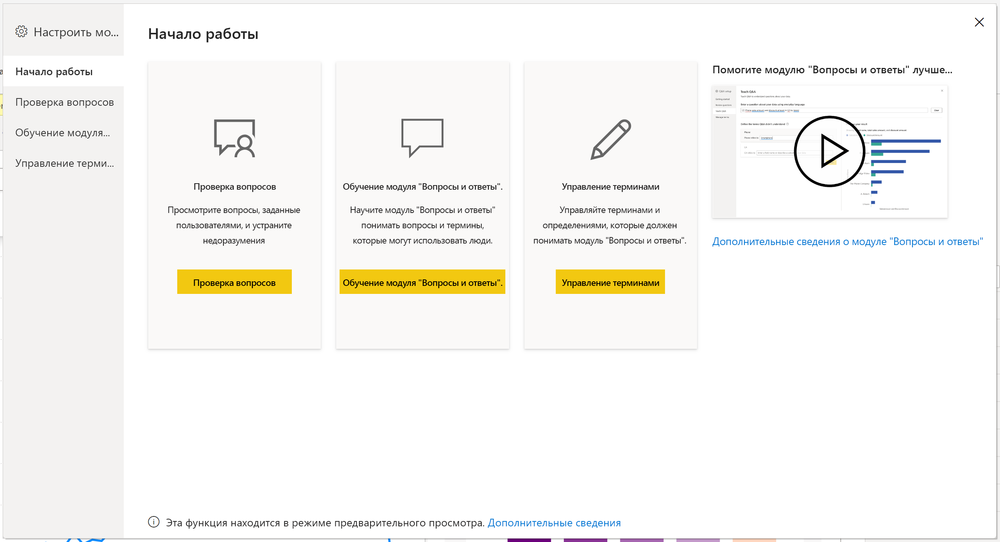
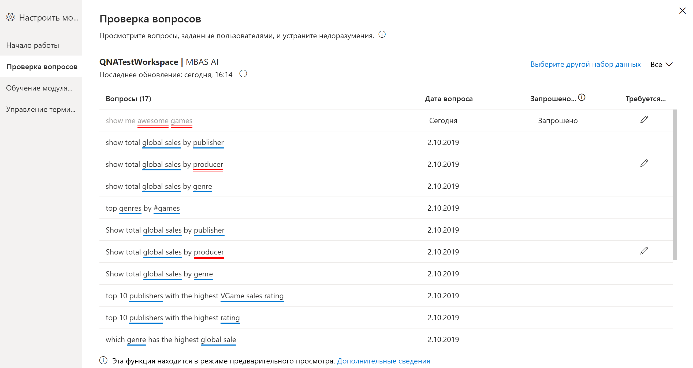
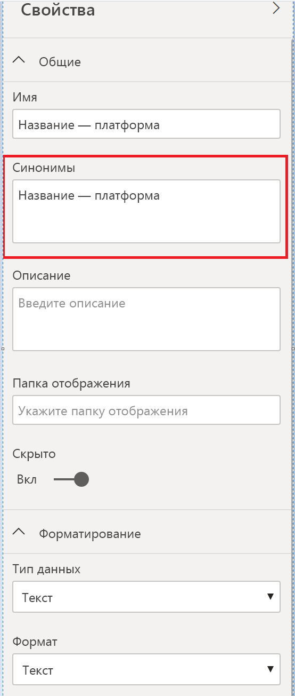

# Знакомство со средствами для обучения модуля "Вопросы и ответы" в Power BI (предварительная версия)

С помощью *средств* модуля "Вопросы и ответы" в Power BI вы можете улучшить работу пользователей с естественным языком. Как разработчик или администратор вы можете улучшить подсистему естественного языка по трем направлениям: 

- проверка вопросов, задаваемых пользователями;
- обучение модуля "Вопросы и ответы" пониманию вопросов;
- управление терминами, которым вы обучили модуль "Вопросы и ответы".

Помимо этих специальных возможностей, на вкладке **Моделирование** в Power BI Desktop доступны дополнительные параметры:  

- Синонимы
- Метки строк
- Скрыть из модуля "Вопросы и ответы"
- Настройка лингвистической схемы (расширенная)

## Начало работы со средствами модуля "Вопросы и ответы"

Средства модуля "Вопросы и ответы" доступны только в Power BI Desktop и в настоящее время поддерживают только режим импорта.

1. Откройте Power BI Desktop и создайте визуальный элемент с помощью модуля "Вопросы и ответы". 
2. В углу визуального элемента щелкните значок шестеренки. 

    

    Откроется страница "Начало работы".  

    

### Проверка вопросов.

Щелкните **Просмотреть вопросы**, чтобы увидеть список наборов данных, используемых в службе Power BI для вашего клиента. На странице **Просмотр вопросов** также отображаются владелец набора данных, рабочая область и дата последнего обновления. Здесь можно выбрать набор данных и узнать, какие вопросы задавали пользователи. Кроме того, отображаются слова, которые не были распознаны. Все данные представлены за последние 28 дней.

### Обучение модуля "Вопросы и ответы".

Раздел **Вопросы и ответы: обучение** позволяет обучать модуль "Вопросы и ответы" новым словам. Сначала введите вопрос, содержащий слово или слова, которые модуль "Вопросы и ответы" не распознает. Модуль "Вопросы и ответы" попросит вас дать определение этого термина. Введите либо фильтр, либо имя поля, которое соответствует значению слова. После этого модуль "Вопросы и ответы" повторно интерпретирует исходный вопрос. Если результаты вас устраивают, вы можете сохранить определение. Дополнительные сведения см. в статье [Обучение модуля "Вопросы и ответы"](q-and-a-tooling-teach-q-and-a.md).

### Управление терминами

На этой странице отображаются все данные, сохраненные в разделе "Вопросы и ответы: обучение". Вы можете просматривать или удалять определенные вами термины. В настоящее время изменить существующее определение нельзя. Поэтому, чтобы переопределить термин, необходимо удалить его и создать заново.

## Другие параметры в модуле "Вопросы и ответы"

### Добавление нескольких синонимов

На вкладке **Моделирование** в Power BI Desktop есть и другие параметры для улучшения работы с модулем "Вопросы и ответы". 

1. В Power BI Desktop выберите представление "Моделирование".

2. Выберите поле или таблицу, чтобы отобразить область **Свойства**.  Эта область появляется в правой части холста и содержит несколько действий модуля "Вопросы и ответы". Одно из них — **Синонимы**. В поле **Синонимы** можно быстро определить альтернативные термины для выбранной таблицы или поля. Синонимы можно также определять в разделе **Вопросы и ответы: обучение** диалогового окна "Средства", но обычно в этом поле можно быстрее определить синонимы для большого количества полей в таблице.

    

3. Чтобы определить несколько синонимов для одного поля, введите их через запятую.

### Скрыть из модуля "Вопросы и ответы"

Поля и таблицы можно также скрывать, чтобы они не отображались в результатах модуля "Вопросы и ответы". 

1. В Power BI Desktop выберите представление "Моделирование".

2. Выберите поле или таблицу, чтобы отобразить область **Свойства**, и переведите переключатель **Является скрытым** в положение **Вкл**.

    Модуль "Вопросы и ответы" учитывает этот параметр и не будет распознавать данное поле. Например, желательно скрывать поля идентификаторов и внешние ключи, чтобы избежать повторяющихся полей с одинаковыми именами. Если поле скрыто, вы по-прежнему можете использовать его в Power BI Desktop в визуальных элементах вне модуля "Вопросы и ответы".

### Установка метка строки

Метка строки позволяет указать, какой столбец (или *поле*) наилучшим образом идентифицирует строку в таблице. Например, для таблицы с именем "Клиент" меткой строки обычно является "Отображаемое имя". Если предоставить эти дополнительные метаданные, модуль "Вопросы и ответы" сможет представить пользователям более полезный визуальный элемент после ввода вопроса "Показать продажи по клиентам". Вместо того чтобы рассматривать термин "Клиент" как таблицу, модуль может использовать столбец "Отображаемое имя" и вывести линейчатую диаграмму с продажами каждого клиента. Метку строки можно задать только в представлении "Моделирование". 

1. В Power BI Desktop выберите представление "Моделирование".

2. Выберите таблицу, чтобы отобразить область **Свойства**.

3. В поле **Метка строки** выберите поле.

## Настройка лингвистической схемы (расширенная)

В Power BI можно проводить полное обучение и усовершенствование подсистемы естественного языка в модуле "Вопросы и ответы", включая изменение алгоритмов оценки и определения весов для результатов вопросов на естественном языке. Дополнительные сведения см. в статье [Изменение лингвистической схемы функции "Вопросы и ответы" и добавление выражений](q-and-a-tooling-advanced.md).

## Дальнейшие действия

Существует ряд рекомендаций по улучшению подсистемы естественного языка. Дополнительные сведения см. в следующей статье:

* ["Вопросы и ответы": рекомендации](q-and-a-best-practices.md)
