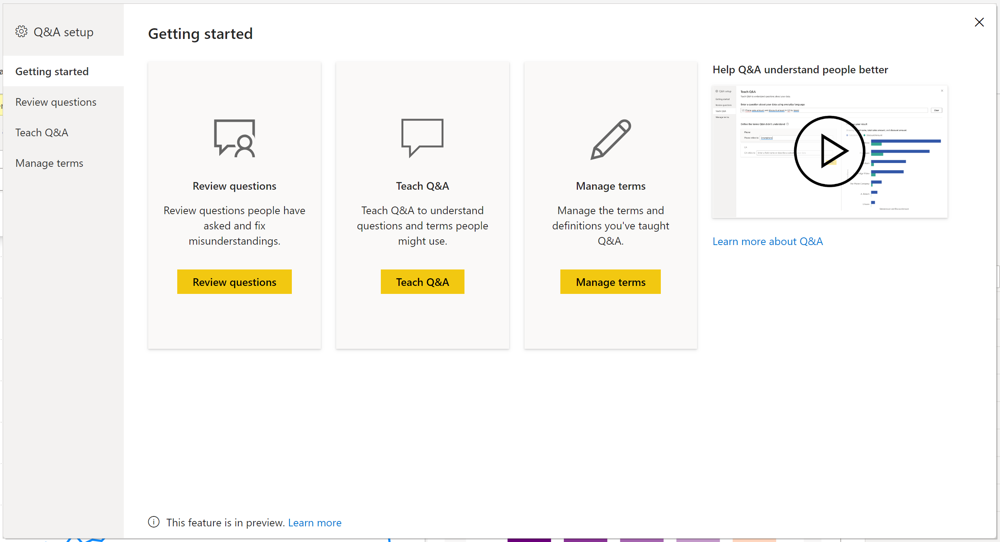

# Знакомство со средствами для обучения модуля "Вопросы и ответы" в Power BI (предварительная версия)

С помощью *средств* модуля "Вопросы и ответы" в Power BI вы можете улучшить работу пользователей с естественным языком. Как разработчик или администратор вы можете улучшить подсистему естественного языка по трем направлениям: 

- проверка вопросов, задаваемых пользователями;
- обучение модуля "Вопросы и ответы" пониманию вопросов;
- управление терминами, которым вы обучили модуль "Вопросы и ответы".

Помимо этих специальных возможностей, на вкладке **Моделирование** в Power BI Desktop доступны дополнительные параметры:  

- Синонимы
- Метки строк
- Скрыть из модуля "Вопросы и ответы"
- Настройка лингвистической схемы (расширенная)

## Начало работы со средствами модуля "Вопросы и ответы"

Средства модуля "Вопросы и ответы" доступны только в Power BI Desktop и в настоящее время поддерживают только режим импорта.

1. Откройте Power BI Desktop и создайте визуальный элемент с помощью модуля "Вопросы и ответы". 
2. В углу визуального элемента щелкните значок шестеренки. 

    

    Откроется страница "Начало работы".  

    

### Синонимы полей

Выберите **Field Synonyms** (Синонимы полей), чтобы просмотреть все таблицы и столбцы, принадлежащие модели. Это представление позволяет добавлять альтернативные имена для столбцов, которые помогают пользователям. Кроме того, можно выбрать, следует ли скрывать столбец или таблицу от функции "Вопросы и ответы".

Щелкните одну из таблиц, чтобы развернуть ее, после чего появится диалоговое окно, аналогичное приведенному ниже.

В диалоговом окне будут показаны все столбцы и таблицы, а также их соответствующие термины и синонимы, которые пользователи могут использовать, чтобы задавать вопросы по набору данных. Вы можете быстро просмотреть все термины в одном месте, а также добавить или удалить термины для нескольких столбцов. 

- Добавление терминов — если существует поле с названием "продажи", можно добавить термин "доход", чтобы пользователь мог использовать это слово вместо слова "продажи". Щелкните знак добавления, чтобы быстро добавить новый термин

- "Include in Q&A" (Включить в вопросы и ответы) — этот параметр позволяет исключить столбец или таблицу из функции "Вопросы и ответы", не отображая как их самих, так и результаты с ними. При работе с датами может возникнуть необходимость не включать столбец. Если имеется множество полей дат или внешних ключей, можно удалить все поля дат, кроме одного, чтобы обеспечить выбор правильного столбца даты, когда пользователь задает вопрос, связанный с датой.

- Рекомендуемые термины — функция "Вопросы и ответы" также рекомендует предлагаемые термины, полученные из нашей подсистемы предложений, для быстрого добавления терминов и синонимов. Если предложения не добавляются, они по-прежнему используются, но пользователь увидит оранжевую пунктирную линию, указывающую, что функция "Вопросы и ответы" не может гарантировать правильность предлагаемого ответа. Если предложенный синоним правильный, щелкните значок "+", чтобы его можно было использовать в качестве синонима. Если предложение неверно, щелкните значок "x", чтобы удалить термин и запретить его использование в качестве термина или синонима, а также в функции "Вопросы и ответы". Предложения основаны на словаре Office, а также берутся из переименований, найденных в отчете

### Проверка вопросов.

Щелкните **Просмотреть вопросы**, чтобы увидеть список наборов данных, используемых в службе Power BI для вашего клиента. На странице **Просмотр вопросов** также отображаются владелец набора данных, рабочая область и дата последнего обновления. Здесь можно выбрать набор данных и узнать, какие вопросы задавали пользователи. Кроме того, отображаются слова, которые не были распознаны. Все данные представлены за последние 28 дней.

### Обучение модуля "Вопросы и ответы".

Раздел **Вопросы и ответы: обучение** позволяет обучать модуль "Вопросы и ответы" новым словам. Сначала введите вопрос, содержащий слово или слова, которые модуль "Вопросы и ответы" не распознает. Модуль "Вопросы и ответы" попросит вас дать определение этого термина. Введите либо фильтр, либо имя поля, которое соответствует значению слова. После этого модуль "Вопросы и ответы" повторно интерпретирует исходный вопрос. Если результаты вас устраивают, вы можете сохранить определение. Дополнительные сведения см. в статье [Обучение модуля "Вопросы и ответы"](q-and-a-tooling-teach-q-and-a.md).

### Управление терминами

На этой странице отображаются все данные, сохраненные в разделе "Вопросы и ответы: обучение". Вы можете просматривать или удалять определенные вами термины. В настоящее время изменить существующее определение нельзя. Поэтому, чтобы переопределить термин, необходимо удалить его и создать заново.

### Предложение вопросов

Без выполнения каких-либо настроек визуальный элемент "Вопросы и ответы" будет предлагать несколько вопросов, чтобы начать работу. Эти вопросы создаются автоматически на основе модели данных. В **Предложение вопросов** вы можете заменить автоматически создаваемые вопросы собственными вопросами.

Для начала введите вопрос, который нужно добавить в текстовое поле. В разделе "Предварительный просмотр" вы увидите, как будет выглядеть результат в визуальном элементе "Вопросы и ответы". 

:::image type="content" source="media/q-and-a-tooling-intro/power-bi-qna-suggest-questions.png" alt-text="Предложить вопросы в разделе Вопросы и ответы":::
 
Нажмите кнопку **Добавить**, чтобы добавить этот вопрос в **Ваши предлагаемые вопросы**. Каждый новый вопрос добавляется в конец списка. Вопросы отображаются в визуальном элементе "Вопросы и ответы" в том же порядке, что и в этом списке. 

:::image type="content" source="media/q-and-a-tooling-intro/power-bi-qna-save-suggest-questions.png" alt-text="Сохранить предлагаемые вопросы":::
 
Нажмите **Сохранить**, чтобы отобразить список предлагаемых вами вопросов в визуальном элементе "Вопросы и ответы". 

> [!NOTE]
> Предлагаемые вопросы будут отображаться для всех экземпляров визуального элемента "Вопросы и ответы". Невозможно создать отдельный набор предложений для каждого визуального элемента "Вопросы и ответы".
> 
> 

## Другие параметры в модуле "Вопросы и ответы"

### Установка метка строки

Метка строки позволяет указать, какой столбец (или *поле*) наилучшим образом идентифицирует строку в таблице. Например, для таблицы с именем "Клиент" меткой строки обычно является "Отображаемое имя". Если предоставить эти дополнительные метаданные, модуль "Вопросы и ответы" сможет представить пользователям более полезный визуальный элемент после ввода вопроса "Показать продажи по клиентам". Вместо того чтобы рассматривать термин "Клиент" как таблицу, модуль может использовать столбец "Отображаемое имя" и вывести линейчатую диаграмму с продажами каждого клиента. Метку строки можно задать только в представлении "Моделирование". 

1. В Power BI Desktop выберите представление "Моделирование".

2. Выберите таблицу, чтобы отобразить область **Свойства**.

3. В поле **Метка строки** выберите поле.

## Настройка лингвистической схемы (расширенная)

В Power BI можно проводить полное обучение и усовершенствование подсистемы естественного языка в модуле "Вопросы и ответы", включая изменение алгоритмов оценки и определения весов для результатов вопросов на естественном языке. Дополнительные сведения см. в статье [Изменение лингвистической схемы функции "Вопросы и ответы" и добавление выражений](q-and-a-tooling-advanced.md).

## Дальнейшие действия

Существует ряд рекомендаций по улучшению подсистемы естественного языка. Дополнительные сведения см. в [Рекомендации, вопросы и ответы](q-and-a-best-practices.md).
