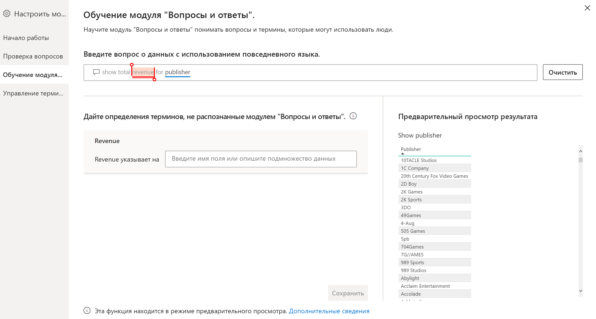
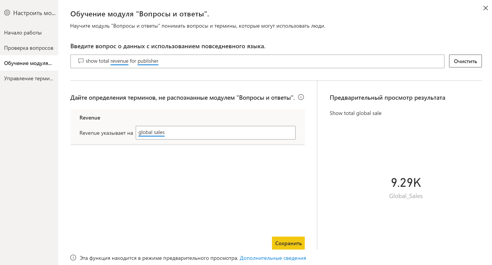
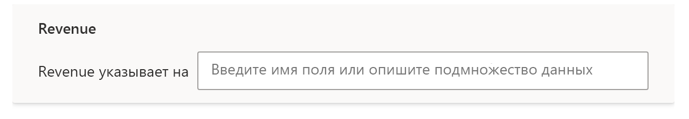
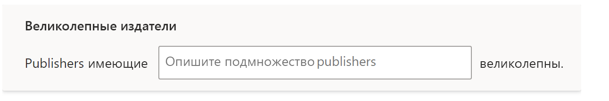
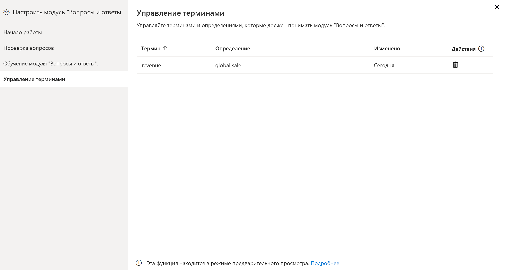

# Обучение модуля "Вопросы и ответы" пониманию вопросов и терминов — "Вопросы и ответы" в Power BI

В разделе **Вопросы и ответы: обучение** можно научить модуль "Вопросы и ответы" понимать вопросы на естественном языке и термины, которые он еще не распознает. Сначала вы отправляете вопрос, содержащий слово или слова, которые модуль "Вопросы и ответы" не распознает. Затем модуль "Вопросы и ответы" просит вас дать определение термина. Вы вводите либо фильтр, либо имя поля, которое соответствует значению слова. После этого модуль "Вопросы и ответы" повторно интерпретирует исходный вопрос. Если результаты вас устраивают, вы сохраняете их.

> [!NOTE]
> Функция "Вопросы и ответы: обучение" поддерживает только режим импорта. Кроме того, она пока не поддерживает подключение к локальному источнику данных или источнику данных Azure Analysis Services. Это ограничение должно быть снято в одном из следующих выпусков Power BI.

## Начало обучения модуля "Вопросы и ответы"

1. В Power BI Desktop на ленте **Моделирование** выберите **Настроить модуль "Вопросы и ответы"**  > **Вопросы и ответы: обучение**.

    

2. Введите предложение с термином, который модуль "Вопросы и ответы" не распознает, и щелкните **Отправить**.

3. Выделите слово, подчеркнутое красным. 

    Модуль "Вопросы и ответы" предоставляет варианты и предлагает указать правильное определение термина. 
    
3. В разделе **Дайте определения терминов, не распознанные модулем "Вопросы и ответы"** укажите определение.

    

4. Для предварительного просмотра обновленного визуального элемента нажмите кнопку **Сохранить**.

5. Введите следующий вопрос или щелкните **X**, чтобы закрыть окно.

Пользователи отчета не увидят это изменение, пока отчет не будет снова опубликован в службе.

## Определение существительных и прилагательных

Модуль "Вопросы и ответы" можно обучать терминам двух типов:

- существительные;
- прилагательные.

### Определение синонима существительному

При работе с данными часто встречаются имена полей, на которые можно ссылаться с помощью альтернативных имен. Примером может служить имя "Продажи". Продажи можно называть различными словами или фразами, например "доход". Если столбец имеет имя "Продажи", а пользователь отчета введет слово "доход", модулю "Вопросы и ответы" может не удаться выбрать правильный столбец, чтобы ответить на вопрос. В этом случае следует сообщить модулю "Вопросы и ответы", что слова "Продажи" и "Доход" означают одно и то же.

Модуль "Вопросы и ответы" автоматически определяет, что нераспознанное слово является существительным, используя знания из Microsoft Office. Если модуль "Вопросы и ответы" обнаруживает существительное, то выдается следующий запрос:

- <your term> **указывает на** 

В поле необходимо указать термин из данных.

Если указать слово или фразу, которые не являются именем поля в модели данных, результаты могут быть непредсказуемыми.

### Определение условия фильтра для прилагательного

Иногда может потребоваться определить термины, выступающие в качестве условия для базовых данных. Примером может служить термин "Отличные издатели". Слово "отличные" может быть условием для выбора издателей, которые опубликовали не менее X продуктов. Модуль "Вопросы и ответы" пытается определить прилагательные и выводит другой запрос:

- <field name> **со значением**  

В поле необходимо указать условие.

Вот некоторые примеры условий:

- "Страна" равным "Россия"
- "Страна" не равным "Россия"
- "Вес" > 2000
- "Вес" = 2000
- "Вес" < 2000

В средстве можно определить только одно условие. Чтобы определить более сложное условие, создайте вычисляемый столбец с помощью DAX, а затем в разделе средства создайте условие для этого вычисляемого столбца. Меры не поддерживаются. Используйте вместо них вычисляемые столбцы.

## Управление терминами

После того как вы предоставили определения, вы можете вернуться и просмотреть все внесенные исправления, а также изменить или удалить их. 

1. В меню **Настроить модуль "Вопросы и ответы"** перейдите к разделу **Управление терминами**.

2. Удалите термины, которые больше не нужны. В настоящее время изменять термины нельзя. Чтобы переопределить термин, удалите его и определите заново.

    

## Дальнейшие действия

Существует ряд рекомендаций по улучшению подсистемы естественного языка. Дополнительные сведения см. в следующей статье:

* ["Вопросы и ответы": рекомендации](q-and-a-best-practices.md)
