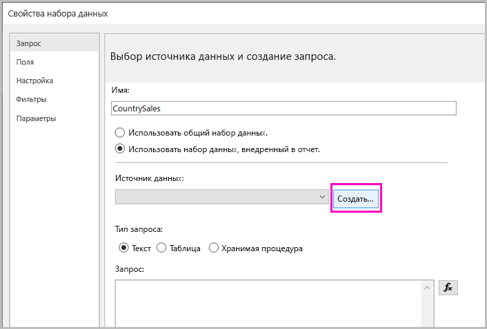
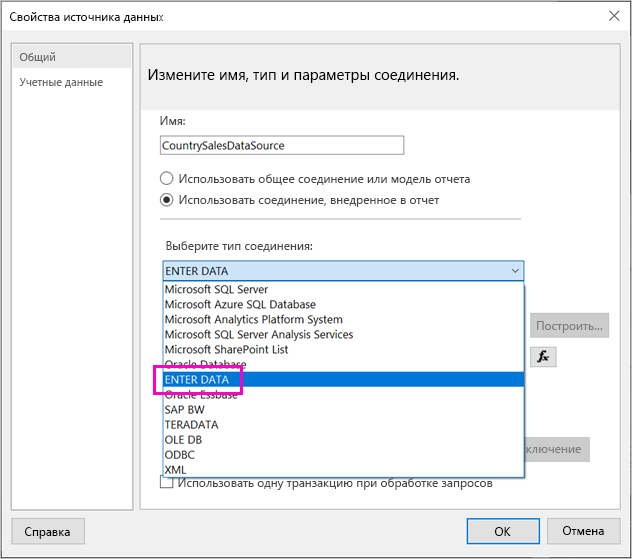
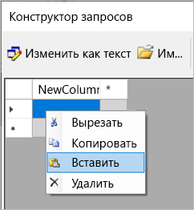
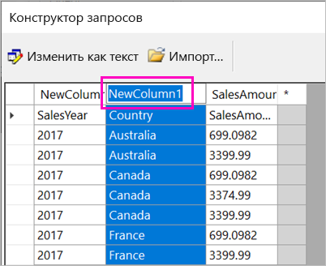
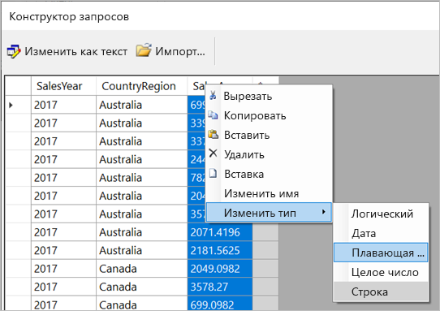
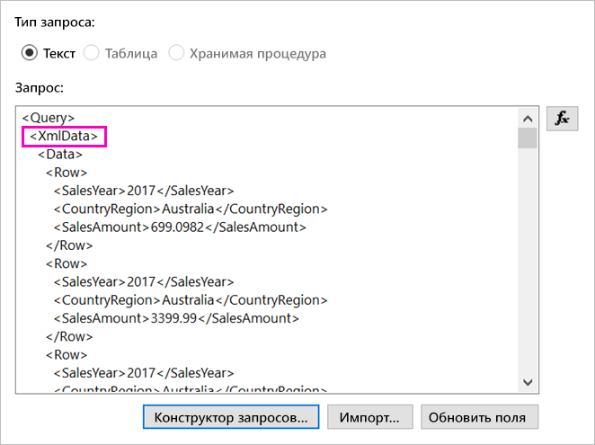
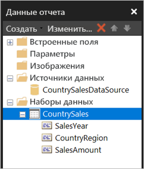

# <a name="enter-data-directly-in-a-paginated-report-in-report-builder---power-bi"></a>Ввод данных непосредственно в отчет с разбивкой на страницы в построителе отчетов — Power BI

В этой статье вы узнаете о функции новой версии построителя отчетов SQL Server 2016, которая позволяет вводить данные непосредственно в отчет RDL как внедренный набор данных.  Аналогичная функция реализована в Power BI Desktop. Можно ввести значение непосредственно в набор данных в отчете или вставить его из другой программы, например из Microsoft Excel. После создания набора данных путем ввода данных его можно использовать так же, как и любой другой созданный вами внедренный набор данных. Кроме того, вы можете добавить несколько таблиц и использовать одну таблицу в качестве фильтра для других. Эта функция особенно удобна для небольших и статичных наборов данных, которые может потребоваться использовать в отчете, таких как параметры отчета.
 
## <a name="prerequisites"></a>Предварительные требования

- Чтобы ввести данные непосредственно в отчет с разбивкой на страницы, установите новую версию [построителя отчетов из центра загрузки Майкрософт](https://www.microsoft.com/download/details.aspx?id=53613). 
- Чтобы сохранить отчет с разбивкой на страницы в службе Power BI, вам потребуется [учетная запись Power BI Pro](service-self-service-signup-for-power-bi.md) и доступ на запись для рабочей области в [емкости Power BI Premium](service-premium-what-is.md).
- Чтобы сохранить отчет с разбивкой на страницы на сервере отчетов, необходимы разрешения на [изменение файла RsReportServer.config](#upload-the-paginated-report-to-a-report-server).

## <a name="get-started"></a>Начало работы

После загрузки и установки построителя отчетов вы выполните ту же процедуру, которая использовалась для добавления внедренного источника данных и набора данных в отчет. В следующей процедуре в разделе **Источники данных** доступен новый вариант: **Ввод данных**.  Этот источник данных потребуется настроить в отчете только один раз. После, с помощью этого одного источника данных, можно создать несколько таблиц с введенными данными в качестве отдельных наборов данных.

1. В области **данных отчета** выберите **Создать** > **Набор данных**.

    

1. В диалоговом окне **Свойства набора данных** выберите **Использовать набор данных, внедренный в отчет**.

1. В поле **Источник данных** выберите **Создать**.

    

1. В диалоговом окне **Свойства источника данных** выберите **Использовать соединение, внедренное в отчет**.
2. В поле **Выберите тип подключения** выберите **ВВОД ДАННЫХ** > **ОК**.

    

1. Вернитесь в диалоговое окно **Свойства набора данных** и выберите **Конструктор запросов**.
2. В области **конструктора запросов** щелкните правой кнопкой мыши и вставьте данные в таблицу.

    

1. Чтобы задать имена столбцов, дважды щелкните каждый столбец **NewColumn** и введите имя столбца.

    

1. Если первая строка содержит заголовки столбцов из исходных данных, щелкните ее правой кнопкой мыши и удалите.
    
9. По умолчанию типом данных для каждого столбца является строка. Чтобы изменить тип данных, щелкните правой кнопкой мыши заголовок столбца, выберите **Изменить тип** и присвойте значение другого типа данных, например "Дата" или "Число с плавающей запятой".

    

1. Завершив создание таблицы, нажмите кнопку **ОК**.  

    Создаваемый запрос совпадает с тем, который бы отображался с источником данных XML. На самом деле мы используем XML как поставщик данных.  Он используется для разных целей, в том числе для реализации этого сценария.

    

12. В диалоговом окне **Свойства набора данных** нажмите кнопку **ОК**.

13. Источник данных и набор данных отображаются в области **Данные отчета**.

    

Набор данных можно использовать как основу для визуализаций данных в отчете. Можно также добавить другой набор данных и использовать для него тот же источник данных.

## <a name="upload-the-paginated-report-to-the-power-bi-service"></a>Отправка отчета с разбивкой на страницы в службу Power BI

Теперь, когда в службе Power BI поддерживаются отчеты с разбивкой на страницы, вы можете отправить отчет с разбивкой на страницы в емкость Premium. Подробные сведения см. в разделе [Отправка отчета с разбивкой на страницы](paginated-reports-save-to-power-bi-service.md).

## <a name="upload-the-paginated-report-to-a-report-server"></a>Отправка отчета с разбивкой на страницы на сервер отчетов

Отчет с разбивкой на страницы можно также отправить на сервер отчетов Power BI или сервер отчетов SQL Server Reporting Services 2016 или 2017. Однако перед этим необходимо добавить следующий элемент в файл RsReportServer.config как дополнительное расширение данных. Создайте резервную копию файла RsReportServer.config перед внесением изменений на случай возникновения проблем.

```xml
<Extension Name="ENTERDATA" Type="Microsoft.ReportingServices.DataExtensions.XmlDPConnection,Microsoft.ReportingServices.DataExtensions">
    <Configuration>
        <ConfigName>ENTERDATA</ConfigName>
    </Configuration>
</Extension>
```

Когда вы закончите редактирование файла, список поставщиков данных в файле конфигурации должен выглядеть следующим образом:


Вот и все. Теперь отчеты, использующие эти новые функции, можно публиковать на сервере отчетов.

## <a name="next-steps"></a>Дальнейшие действия

- [Сведения об отчетах с разбивкой на страницы в Power BI Premium](paginated-reports-report-builder-power-bi.md)
- [Что такое Сервер отчетов Power BI?](report-server/get-started.md)
