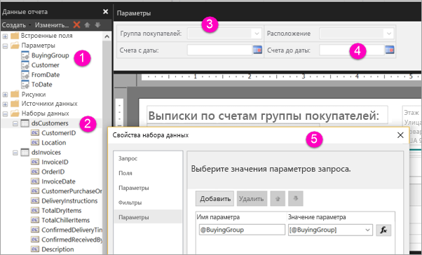

# Создание параметров для отчетов с разбивкой на страницы в службе Power BI (предварительная версия)

Из этой статьи вы узнаете, как в службе Power BI создать параметры для отчетов с разбивкой на страницы.  Параметр отчета позволяет выбрать данные для отчета и изменить его внешний вид. Вы можете указать для параметра значение по умолчанию и список доступных значений, а читатели отчета смогут изменять этот выбор.  

Ниже вы видите представление конструктора в построителе отчетов для отчета с параметрами @BuyingGroup, @Customer, @FromDate и @ToDate. 
  

  
1.  Параметры отчета в области данных отчета.  
  
2.  Таблица с одним из параметров в наборе данных.  
  
3.  Панель параметров. Вы можете настроить макет параметров на панели параметров. 
  
4.  Параметры @FromDate и @ToDate имеют тип данных **DateTime**. При просмотре отчета вы можете ввести дату в текстовом поле или выбрать ее в элементе управления "Календарь". 

5.  Один из параметров в диалоговом окне **Свойства набора данных**.  

  
## Создание или изменение параметра отчета  
  
1.  Откройте отчет с разбивкой на страницы в построителе отчетов.

1. На панели **Данные отчета** щелкните правой кнопкой мыши узел **Параметры** и выберите **Добавить параметр**. Откроется диалоговое окно **Свойства параметра отчета**.  
  
2.  В поле **Имя** введите для этого параметра имя или сохраните имя по умолчанию.  
  
3.  В поле **Prompt** (Подсказка) введите текст, который будет отображаться рядом с текстовым полем параметра при запуске отчета.  
  
4.  В поле **Тип данных** выберите тип данных для значения параметра.  
  
5.  Если параметр может содержать пустое значение, установите флажок **Разрешить пустое значение**.  
  
6.  Если параметр может содержать значение NULL, установите флажок **Разрешить значение NULL**.  
  
7.  Чтобы пользователь мог выбирать для параметра несколько значений, установите флажок **Разрешить несколько значений**.  
  
8.  Настройте режим видимости.  
  
    -   Чтобы параметр отображался на панели инструментов в верхней части отчета, выберите вариант **Видимый**.  
  
    -   Чтобы скрыть параметр, то есть не отображать его на панели инструментов, выберите вариант **Скрытый**.  
  
    -   Чтобы скрыть параметр и защитить его от изменений на сервере отчетов после публикации отчета, выберите **Внутренний**. В этом случае параметр отчета будет доступен только в определении отчета. Также при этом необходимо задать значение по умолчанию или разрешить для параметра значение NULL.  
  
9. Нажмите кнопку **ОК**. 
  
## Дальнейшие действия

В статье [View parameters for paginated reports in the Power BI service](paginated-reports-view-parameters.md) (Просмотр параметров для отчетов с разбивкой на страницы в службе Power BI) объясняется, как отображаются параметры в службе Power BI.

Дополнительные сведения о параметрах в отчетах с разбивкой на страницы см. в статье [Параметры отчета (Построитель отчетов и Конструктор отчетов)](https://docs.microsoft.com/sql/reporting-services/report-design/report-parameters-report-builder-and-report-designer) из документации по SQL Server Reporting Services.  
