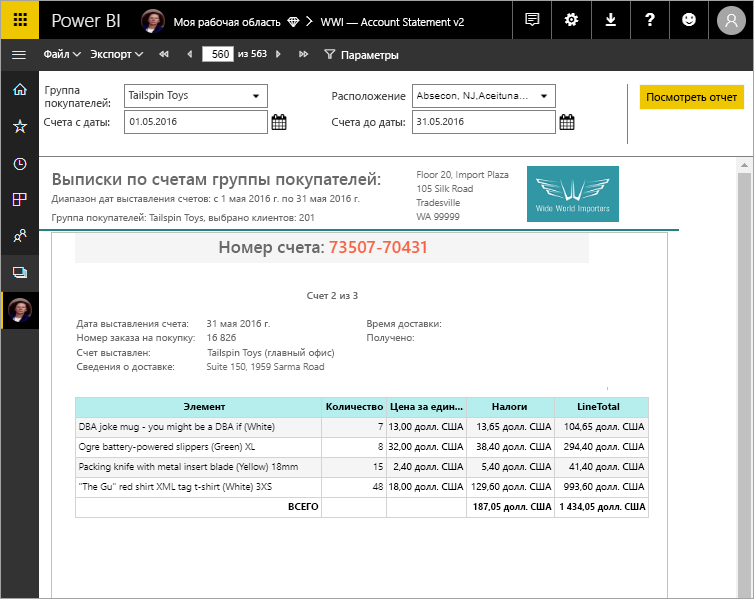

# Сведения об отчетах с разбивкой на страницы в Power BI Premium (предварительная версия)
Отчеты с разбивкой на страницы уже давно стали стандартным форматом отчетов в SQL Server Reporting Services. Теперь они доступны и в службе Power BI. Отчеты с разбивкой на страницы создаются специально для печати и (или) совместного использования. Под термином "с разбивкой на страницы" подразумевается то, что формат отчетов подбирается с учетом отображения на странице. Можно настроить отображение всех данных отчета в таблице, даже если для этого потребуется много страниц. Иногда в качестве названия для таких отчетов употребляют описательное выражение "с точностью до пикселя", которое указывает на возможность точно настраивать макет отчета. Отчеты с разбивкой на страницы создаются на основе технологии RDL (языка определения отчетов), используемой в SQL Server Reporting Services. Построитель отчетов — это автономное средство для создания отчетов с разбивкой на страницы. 

Отчеты с разбивкой на страницы могут распространяться на большое число страниц. Например, этот отчет содержит 563 страницы. Для каждой страницы соблюдается точное форматирование: на каждой странице размещен строго один счет и повторяются стандартные колонтитулы.

Вы можете просмотреть такой отчет в Построителе отчетов, а затем опубликовать его в службе Power BI http://app.powerbi.com. Для публикации отчета в службе нужна лицензия Power BI Pro. Вы можете публиковать и совместно использовать отчеты с разбивкой на страницы в своей рабочей области или в рабочей области приложений, если эта рабочая область находится в емкости Power BI Premium. Кроме того, администратору Power BI нужно включить функцию отчетов с разбивкой на страницы через портал администрирования Power BI. Изучите дополнительные сведения о [настройке рабочих нагрузок](service-admin-premium-manage.md#configure-workloads). 

## Создание отчетов в Построителе отчетов

Для отчетов с разбивкой на страницы есть специальное средство проектирования — Построитель отчетов. Если вы уже создавали отчеты с разбивкой на страницы для сервера отчетов Power BI или SQL Server Reporting Services (SSRS), вы можете воспользоваться тем же инструментом и даже той же версией. Более того, все отчеты с разбивкой на страницы, локально созданные для SSRS 2016 и 2017 или для Сервера отчетов Power BI, полностью совместимы со службой Power BI. Служба Power BI поддерживает обратную совместимость. То есть вы сможете переносить все отчеты в следующие версии и свободно обновлять отчеты с разбивкой на страницы, созданные в любой предыдущей версии. Не все функции отчетов доступны при запуске. Подробные сведения см. в разделе [Рекомендации и ограничения](#limitations-and-considerations) этой статьи.
     
## Отчеты по нескольким источникам данных

Один отчет с разбивкой на страницы может иметь несколько разных источников данных. В отличие от отчетов Power BI здесь не используется базовая модель данных. В первой версии компонента отчетов с разбивкой на страницы в службе Power BI вы создавали внедренные источники данных и наборы данных в самом отчете. Сейчас нельзя использовать общие источники данных или наборы данных. Отчеты создаются в Построителе отчетов на локальном компьютере. Если отчет подключается к локальным данным, после его загрузки в службу Power BI следует создать шлюз для перенаправления подключения к данным. Ниже приведены источники данных, к которым можно подключиться в исходной версии:

- База данных SQL и хранилище данных Azure;
- SQL Server через шлюз;
- SQL Server Analysis Services через шлюз.
 
На этапе предварительной версии будут добавлены дополнительные источники данных.

## Создание отчета  

### Создание отчетов с разбивкой на страницы с помощью макета матрицы, диаграммы или свободной формы

Табличные отчеты удобны для данных в формате столбцов, матричные отчеты (например, отчеты с перекрестными ссылками или PivotTable) — для сводных данных, диаграммы — для графических данных, а отчеты в виде *списка* свободной формы — для любых других данных, например для счетов. 
  
Для начала работы можно воспользоваться любым мастером Построителя отчетов. Мастеры таблиц, матриц и диаграмм предоставляют пошаговый интерфейс для подключения к внедренному источнику данных и внедренного набора данных. Завершив этот процесс, вы можете перетащить нужные поля, чтобы создать запрос к набору данных, а затем выбрать макет, стиль и другие параметры отчета.  
  
Мастер карты позволяет создавать отчеты, в которых отображаются статистические данные на географическом или геометрическом фоне. Для карты можно использовать пространственные данные из запроса Transact-SQL или файл фигуры ESRI (Environmental Systems Research Institute, Inc.). Также вы можете добавить в качестве фона карту Microsoft Bing.  

### Добавление элементов в отчет

Вы можете изменять данные с помощью фильтрации, группировки, сортировки и (или) добавления формул и выражений. Можно улучшить визуальное представление данных, добавив диаграммы, датчики, спарклайны и индикаторы.  Используйте параметры и фильтры, чтобы отобрать нужные данные для пользовательских представлений. Внедряйте изображения и другие ресурсы, в том числе внешнее содержимое, напрямую или по ссылкам.  

Вы можете настраивать параметры всех элементов отчета с разбивкой на страницы, начиная со свойств самого отчета и заканчивая всеми текстовыми полями, изображениями, таблицами и диаграммами, чтобы отображаемый результат в точности соответствовал вашим пожеланиям.

## Создание определения отчета

При разработке отчета с разбивкой на страницы вы, по сути, создаете *определение отчета*. Оно не содержит никаких данных. В нем лишь указано, где получить нужные данные, какие данные следует отобразить и как именно. Когда вы запускаете отчет, обработчик отчетов анализирует созданное вами определение отчета, затем извлекает нужные данные и объединяет их с макетом отчета, чтобы получить отображение отчета. Определение отчета вы передаете в службу Power BI http://app.powerbi.com и размещаете в личной рабочей области или в корпоративной рабочей области, используемой совместно с коллегами. Если источник данных отчета находится на локальном компьютере, после отправки отчета следует перенаправить на шлюз подключение к этому источнику данных. 

## Просмотр отчета с разбивкой на страницы
Размещенный в службе Power BI отчет с разбивкой на страницы можно просматривать в браузере и в мобильных приложениях Power BI. В службе Power BI вы можете экспортировать отчет в несколько форматов, например HTML, MHTML, PDF, XML, CSV, TIFF, Word и Excel. Вы также можете использовать отчет совместно с другими.  
  
## Рекомендации и ограничения

Ниже описаны некоторые другие функции, которые не поддерживаются в первоначальном выпуске.

- Закрепление страниц отчета или визуальных элементов на информационных панелях Power BI.
- Интерактивные возможности, в том числе карты документов и кнопки отображения и скрытия элементов.
- Вложенные отчеты и детализированные отчеты.
- Подписки.
- Общие источники данных и общие наборы данных.
- Наборы данных Power BI.
- Визуальные элементы из отчетов Power BI.
- Отчеты с разбивкой на страницы в приложениях. Вы можете предоставить общий доступ к отчету с разбивкой на страницы из рабочей области приложения, но не можете добавить его в приложение при публикации из этой рабочей области.
 
## Дальнейшие действия

- [Установка Построителя отчетов из Центра загрузки Майкрософт](http://go.microsoft.com/fwlink/?LinkID=734968)
- [Руководство по созданию отчета с разбивкой на страницы](paginated-reports-quickstart-aw.md)
- [Ввод данных непосредственно в отчет с разбивкой на страницы](paginated-reports-enter-data.md)

  

