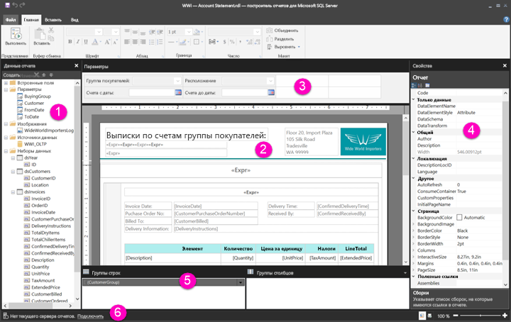

# Навигация в представлении конструктора отчетов для отчетов с разбивкой на страницы (предварительная версия)

Представление конструктора отчетов в построителе отчетов — это пространство для проектирования отчетов с разбивкой на страницы, которые можно опубликовать в службе Power BI. В центре построителя отчетов размещается область конструктора, и ее окружают лента и панели. Именно в области конструктора вы будете добавлять и упорядочивать элементы отчета. В этой статье приводятся сведения о панелях, которые позволяют добавлять, выбирать и упорядочивать ресурсы отчета, а также изменять свойства элементов отчета.  

1.  [Панель данных отчета](#report-data-pane) 
2.  [Область конструктора отчетов](#report-design-surface)  
3.  [Панель параметров](#parameters-pane) 
4.  [Панель свойств](#properties-pane) 
5.  [Панель группирования](#grouping-pane) 
6.  [Строка текущего состояния отчета](#current-report-status-bar)  
  
## 1. Панель данных отчета  
 На панели данных отчета вы можете определить данные и ресурсы, необходимые для создания отчета, прежде чем переходить к составлению макета отчета. Например, на панель данных отчета можно добавить источники данных, наборы данных, вычисляемые поля, параметры отчета и изображения.  
  
 Завершив добавление элементов на панель данных отчета, перетащите нужные поля в элементы отчета, размещенные в области конструктора, чтобы определить правила отображения данных в отчете.  
  
> [!TIP]  
>  Если вы перетащите поле из панели данных отчета непосредственно в область конструктора отчета, а не в область данных (например, в таблицу или диаграмму), при выполнении отчета будет отображаться только первое значение из данных в этом поле.  
  
 Также вы можете перетаскивать встроенные поля из области данных отчета в область конструктора отчета. При отрисовке отчета в эти поля помещаются сведения о самом отчете, например его имя, общее число страниц и номер текущей страницы.  
  
 Некоторые элементы добавляются в область данных отчета автоматически при добавлении элементов в область конструктора отчета. Например, если вы внедряете в отчет изображение, оно добавляется в папку Images в области данных отчета.  
  
> [!NOTE]  
>  Кнопка **Создать** позволяет добавить новый элемент в область данных отчета. Вы можете добавить в отчет несколько наборов данных из одного источника данных или из разных источников данных. Чтобы добавить новый набор данных из того же источника данных, щелкните этот источник правой кнопкой мыши и выберите **Добавить набор данных**.  
  
## 2. Область конструктора отчета  
 Область конструктора отчета в построителе отчетов — это основная рабочая зона при разработке отчетов. Чтобы поместить в отчет дополнительные элементы, например области данных, вложенные отчеты, текстовые поля, изображения, прямоугольники и линии, выберите их на ленте или в галерее элементов отчета и перенесите в область конструктора. Здесь можно также добавить группы, выражения, параметры, фильтры, действия, настроить видимость и форматирование для элементов отчета.  
  
 Также вы можете изменять следующие параметры:  
  
-   Чтобы изменить свойства текста отчета, например цвета границ и заливки, щелкните правой кнопкой мыши белую область в области конструктора, где нет ни одного элемента отчета, и выберите **Свойства текста отчета**.  
  
-   Чтобы изменить свойства колонтитулов, например цвета границ и заливки, щелкните правой кнопкой мыши белую область в области верхнего или нижнего колонтитула, где нет ни одного элемента отчета, и выберите **Свойства верхнего колонтитула** или **Свойства нижнего колонтитула**.  
  
-   Чтобы изменить свойства самого отчета, например параметры страницы, щелкните правой кнопкой мыши серую область вокруг области конструктора и выберите **Свойства отчета**.  
  
-   Чтобы изменить свойства отдельного элемента отчета, щелкните его правой кнопкой мыши и выберите **Свойства**.  
  
### Размер области конструктора и область печати  
Размер области конструктора может отличаться от размера страницы и области печати, настроенной для печати отчета. Изменение размера области конструктора не влияет на размер области печати отчета. Независимо от размера, заданного для области печати отчета, полный размер области конструктора остается неизменным. Дополнительные сведения см. в разделе об алгоритмах отрисовки. 
  
- Чтобы отобразить линейку, установите на вкладке **Представление** флажок **Линейка**.  
  
## 3. Панель параметров  
 Параметры отчета позволяют управлять данными отчета, объединять связанные отчеты и изменять внешний вид отчета. На панели параметров представлена гибкая схема параметров отчета.  
  
 Изучите дополнительные сведения о параметрах отчета.   
  
## 4. Панель свойств
 Каждый элемент отчета, включая области данных, изображения, текстовые поля и сам текст отчета, имеют набор связанных свойств. Например, свойство BorderColor для текстового поля содержит значение цвета для границы этого текстового поля, а свойство PageSize для отчета содержит размер страницы для этого отчета.  
  
 Эти свойства отображаются на панели свойств. Значения свойств на панели изменяются в зависимости от выбранного элемента отчета.  
  
- Чтобы отобразить панель "Свойства", на вкладке **Представление** в группе **Показать/скрыть** выберите элемент **Свойства**.  
  
### Изменение значений свойств  
 В построителе отчетов у вас есть несколько способов изменить свойства элементов отчета:  
  
-   с помощью кнопок и списков на ленте;  
  
-   изменяя параметры в диалоговых окнах;  
  
-   изменяя значения свойств на панели свойств.  
  
 Все наиболее часто используемые свойства вынесены в диалоговые окна и на ленту.  
  
 В зависимости от характера свойства его значение можно выбрать из раскрывающегося списка, ввести в текстовое поле или создать в конструкторе выражений, щелкнув `<Expression>`.  
  
### Изменение представления панели свойств  
 По умолчанию свойства, отображаемые на панели "Свойства", разделены на обобщенные категории: "Действие", "Границы", "Заливка", "Шрифт", "Общие". С каждой категорией сопоставлен определенный набор свойств. Например, в категории "Шрифт" перечислены следующие свойства: Color, FontFamily, FontSize, FontStyle, FontWeight, LineHeight и TextDecoration. При желании вы можете отсортировать по алфавиту все свойства, представленные на этой панели. В этом случае все категории скрываются, а свойства выстраиваются в общем алфавитном порядке независимо от категории.  
  
 В верхней части панели свойств размещены три кнопки: **Категория**, **По алфавиту** и **Страница свойств**. Кнопки "Категория" и "По алфавиту" переключают разные представления панели "Свойства". Кнопка **Страница свойств** открывает диалоговое окно свойств для выбранного элемента отчета.  
  
  
## 5. Панель группирования

 Группы позволяют создать визуальную иерархию для данных отчета и вычислять по ним итоговые значения. Группы строк и столбцов можно просматривать в области данных в области конструктора, а также на панели группирования. Панель группирования делится на две области: группы строк и группы столбцов. Когда вы выбираете какую-либо область данных, на панели группирования отображаются все входящие в эту область группы в виде иерархического списка: дочерние группы отображаются с отступом под родительскими.  
  
 Вы можете создавать новые группы, перетаскивая поля из области данных отчета в область конструктора или на панель группирования. На панели группирования можно добавлять родительские, смежные и дочерние группы, изменять свойства групп и удалять группы.  
  
 По умолчанию панель группирования всегда отображается, но вы можете скрыть ее, сняв флажок "Панель группирования" на вкладке "Вид". Панель группирования недоступна для областей данных типов "Диаграмма" и "Датчик".  
  
 Дополнительные сведения представлены в разделе о панели группирования и группах.  
  
## 6. Строка текущего состояния отчета

В строке текущего состояния отчета отображается имя сервера, к которому подключен отчет, или текст "Нет текущего сервера отчетов". Здесь можно щелкнуть действие **Подключиться**, чтобы выбрать сервер для подключения.

## Дальнейшие действия

[Сведения об отчетах с разбивкой на страницы в Power BI Premium (предварительная версия)](paginated-reports-report-builder-power-bi.md) 

  
  
