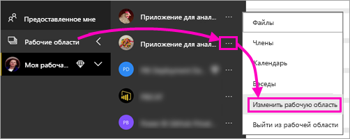
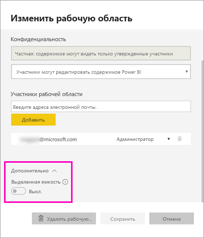
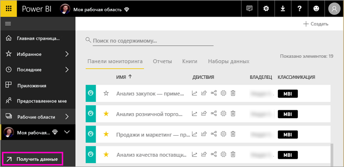
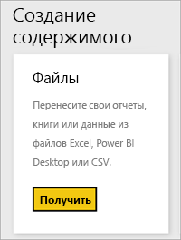
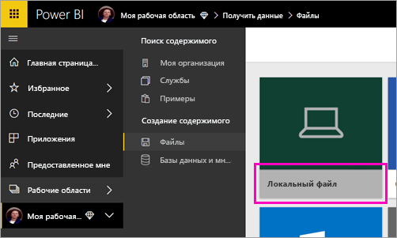
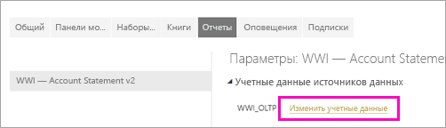
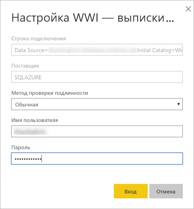
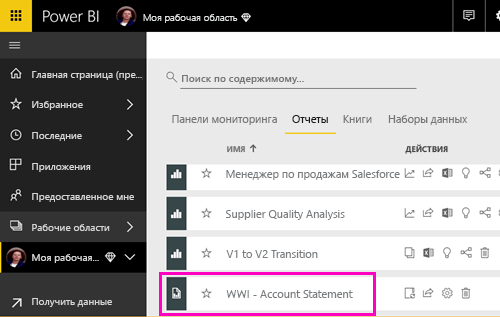
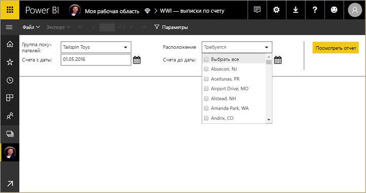

# Публикация отчета с разбивкой на страницы в службе Power BI

Из этой статьи вы узнаете, как опубликовать отчет с разбивкой на страницы в службе Power BI, передав его с локального компьютера. Отчеты с разбивкой на страницы можно передавать в личную рабочую область или в любую другую рабочую область, размещенную в емкости Premium. Найдите значок в виде бриллианта  рядом с именем рабочей области. 

Если источник данных отчета находится на локальном компьютере, после отправки отчета необходимо [создать шлюз](#create-a-gateway).

## Добавление рабочей области в емкость Premium

Если рабочая область не имеет значка с бриллиантом  рядом с именем, ее следует добавить в емкость Premium. 

1. Выберите **Рабочие области**, щелкните многоточие ( **...** ) рядом с именем рабочей области и выберите **Изменить рабочую область**.

    

1. В диалоговом окне **Изменение рабочей области** разверните узел **Дополнительно**, затем переместите ползунок **Dedicated capacity** (Выделенная емкость) в положение **Вкл.**

    

   Возможно, вы не сможете внести такое изменение. В этом случае обратитесь к администратору емкости Power BI Premium, чтобы он предоставил вам права назначения для добавления рабочей области в емкость Premium.

## Отправка отчета с разбивкой на страницы

1. Создайте отчет с разбивкой на страницы в построителе отчетов и сохраните этот отчет на локальный компьютер.

1. Откройте службу Power BI в браузере и перейдите к рабочей области Premium, где вы намерены опубликовать отчет. Теперь здесь есть значок бриллианта  рядом с именем рабочей области. 

1. Выберите **Получить данные**.

    

1. В поле **Файлы** выберите **Получить**.

    

1. Выберите **Локальный файл**, перейдите к отчету с разбивкой на страницы и щелкните **Открыть**.

    

1. Щелкните **Продолжить** > **Изменить учетные данные**.

    

1. Введите учетные данные и щелкните **Вход**.

    

   Вы увидите новый отчет в списке отчетов.

    

1. Выберите отчет, чтобы открыть его в службе Power BI. Если отчет имеет параметры, выберите их, чтобы перейти к просмотру отчета.
 
    

## Создание шлюза

Как и с любым другим отчете Power BI, если источник данных размещен на локальном компьютере, для доступа к этим данным следует создать или выбрать существующий шлюз.

1. Щелкните **Управление** рядом с именем отчета.

   

1. Подробное описание процесса и дальнейшие действия см. в статье [Что такое локальный шлюз данных](service-gateway-onprem.md).

### Ограничения шлюза

Сейчас шлюзы не поддерживают многозначные параметры.

## Дальнейшие действия

- [Просмотр отчета с разбивкой на страницы в службе Power BI](paginated-reports-view-power-bi-service.md)
- [Сведения об отчетах с разбивкой на страницы в Power BI Premium](paginated-reports-report-builder-power-bi.md)

