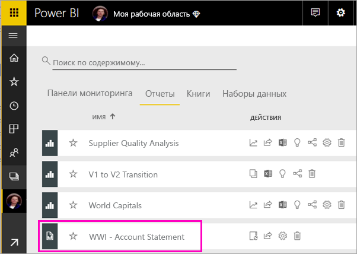
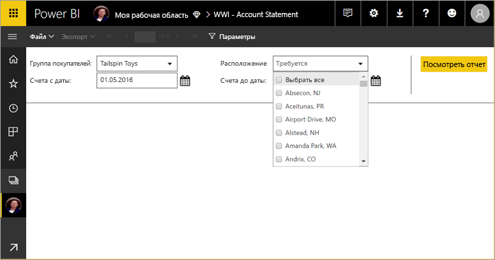
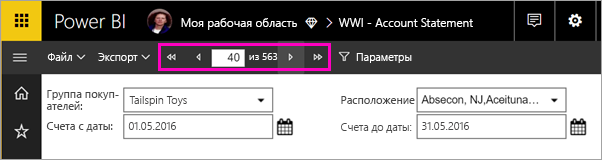
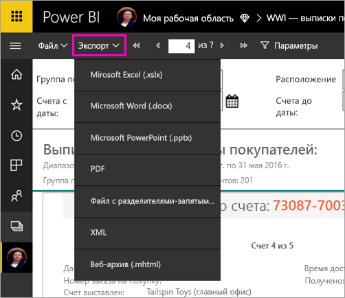

# Просмотр отчета с разбивкой на страницы в службе Power BI (предварительная версия)

В этой статье представлены сведения о просмотре отчетов с разбивкой на страницы в службе Power BI. Отчеты с разбивкой на страницы можно создать с помощью построителя отчетов и передать в любую рабочую область в емкости Premium. Найдите значок в виде бриллианта  рядом с именем рабочей области. 

Для отчетов с разбивкой на страницы есть собственный значок: .

Также вы можете экспортировать отчеты с разбивкой на страницы в нескольких форматах: 

- Microsoft Excel;
- Microsoft Word;
- Microsoft PowerPoint;
- PDF;
- значения с разделителями-запятыми;
- XML
- MHTML (веб-архив).

## Просмотр отчета с разбивкой на страницы

1. Выберите отчет с разбивкой на страницы в рабочей области.

    

2. Если этот отчет имеет параметры, как в нашем примере, при первом открытии вы не сразу увидите отчет. Выберите значения параметров и щелкните **Просмотреть отчет**. 

     

    Вы можете изменить значения параметров в любое время.

1. Пролистайте страницы отчета с помощью стрелок в верхней части страницы или введите номер страницы в соответствующем поле.
    
   

4. Выберите **Экспорт** и найдите нужный формат, чтобы экспортировать отчет с разбивкой на страницы.

    

## Дальнейшие действия

[Сведения об отчетах с разбивкой на страницы в Power BI Premium (предварительная версия)](paginated-reports-report-builder-power-bi.md)
