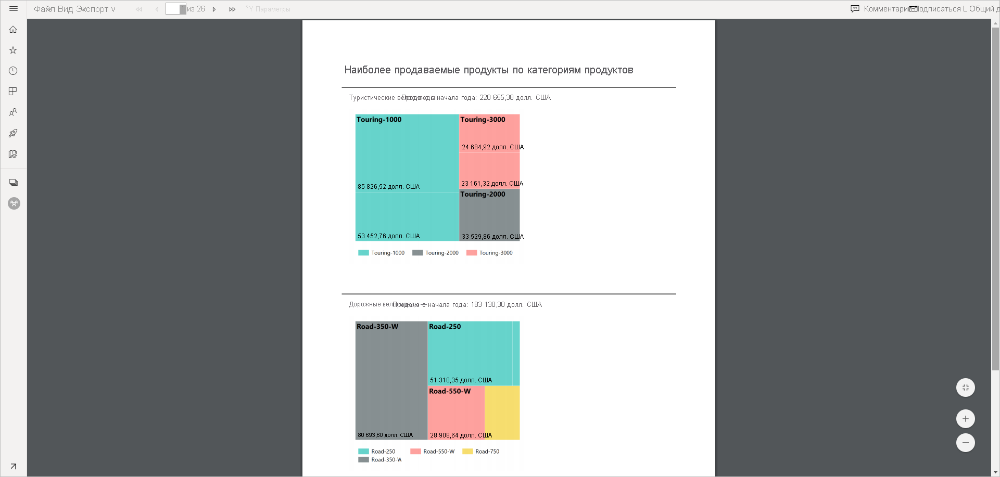
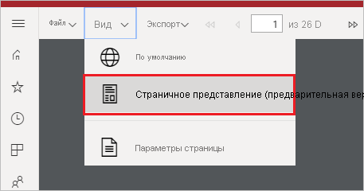
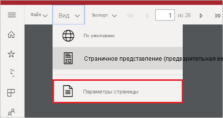
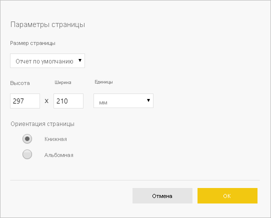

# Установка представлений отчетов для отчетов с разбивкой на страницы в службе Power BI

При отрисовке отчета с разбивкой на страницы в службе Power BI представление по умолчанию основано на HTML и является интерактивным. Другим представлением отчетов для фиксированных форматов страниц, таких как PDF, является новый параметр "Просмотр страницы".

**Интерактивное представление по умолчанию**

**Просмотр страницы**

В представлении "Просмотр страницы" отчет, готовый для просмотра, отличается от отчета, который отображается в представлении по умолчанию. Некоторые свойства и понятия в отчетах с разбивкой на страницы применяются только к фиксированным страницам. Представление аналогично тому, которое используется для печати или экспорта отчета. По-прежнему можно изменять некоторые элементы, такие как значения параметров, однако в таком отчете недоступны другие интерактивные функции, такие как сортировка и переключение столбцов.

В представлении "Просмотр страницы" поддерживаются все функции, которые поддерживает средство просмотра PDF-файлов в браузере, такие как увеличение и уменьшение масштаба, "Вписать в страницу".

## Переключение в представление "Просмотр страницы"

При открытии отчета с разбивкой на страницы он по умолчанию отображается в интерактивном представлении. Если отчет содержит параметры, выберите параметры, а затем просмотрите отчет.

1. На панели инструментов выберите **Вид** > **Просмотр страницы**.

    

2. Можно изменить параметры представления, выбрав пункт **Параметры страницы** в меню **Вид** на панели инструментов. 

    
    
    В диалоговом окне **Параметры страницы** находятся параметры **Размер страницы** и **Ориентация** для представления "Просмотр страницы". После применения параметров страницы применяются те же параметры, что и при печати страницы в дальнейшем.
   
    

3. Чтобы вернуться к интерактивному представлению, выберите **По умолчанию** в раскрывающемся списке **Вид**.

## Поддержка браузеров

Представление "Просмотр страницы" поддерживается в браузерах Google Chrome и Microsoft Edge. Убедитесь, что в браузере включен просмотр документов PDF. Этот параметр по умолчанию включен в данных браузерах.

Представление "Просмотр страницы" не поддерживается в Internet Explorer и Safari, поэтому этот параметр отключен. Он также не поддерживается в браузерах на мобильных устройствах или в собственных мобильных приложениях Power BI.  

## Дальнейшие действия

- [Просмотр отчета с разбивкой на страницы в службе Power BI](../consumer/paginated-reports-view-power-bi-service.md)
- [Сведения об отчетах с разбивкой на страницы в Power BI Premium](paginated-reports-report-builder-power-bi.md)
