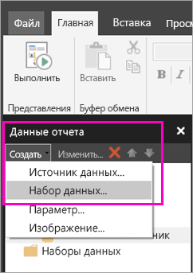
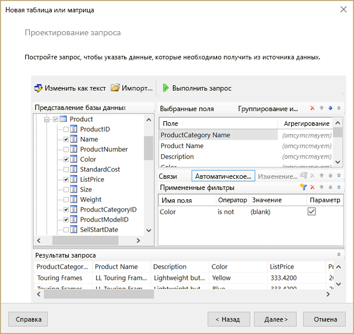
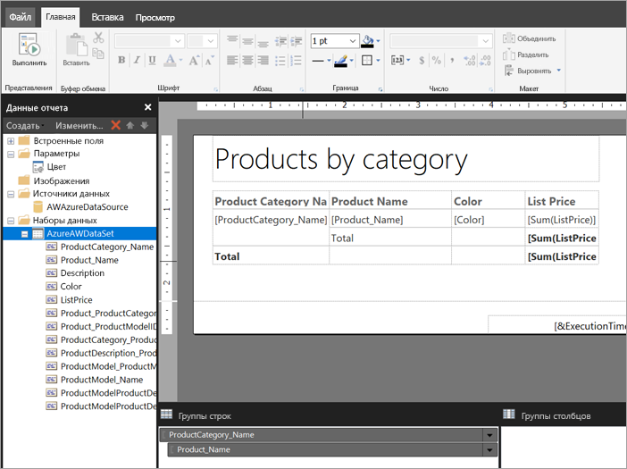

# Создание внедренного набора данных для отчета с разбивкой на страницы в службе Power BI

Из этой статьи вы узнаете, как на основе внедренного источника данных создать внедренный набор данных для отчета с разбивкой на страницы в службе Power BI. Внедренные наборы данных хранятся в одном отчете с разбивкой на страницы и используются в этом отчете. В настоящее время отчеты с разбивкой на страницы, опубликованные в службе Power BI, могут использовать только внедренные наборы данных и внедренные источники данных. Внедренный источник данных и набор данных вы создаете в построителе отчетов Power BI в процессе создания отчета. 

Перед созданием набора данных необходимо создать источник данных. Этот процесс описан в статье [Создание внедренного источника данных для отчетов с разбивкой на страницы в службе Power BI](paginated-reports-embedded-data-source.md).
  
## Создание внедренного набора данных
  
1. В области данных отчета в построителе отчетов Power BI выберите **Создать** > **Набор данных**.

1. На вкладке **Запрос** диалогового окна **Свойства набора данных** укажите имя набора данных. Внедренный источник данных автоматически подставляется в поле **Источник данных**. Также вы можете создать другой внедренный источник данных, щелкнув **Новый**.
 
     

3. В разделе **Тип запроса** выберите тип команды или запроса, которые будут использоваться для набора данных. 
    - Тип **Текст** обозначает запрос на получение данных из базы данных. Это вариант по умолчанию, который подходит для большинства запросов. Введите строку запроса или импортируйте существующий запрос действием **Импорт**. Чтобы создать запрос в графическом интерфейсе, выберите **Конструктор запросов**. Когда вы создаете запрос в конструкторе запросов, текст этого запроса отображается в соответствующем поле. Нажмите кнопку **Выражение** (**fx**), чтобы применить выражение для динамического создания запроса. 
    - Вариант **Таблица** позволяет выбрать все поля в таблице. Введите имя таблицы, которую вы намерены использовать в качестве набора данных.
    - Вариант **Хранимая процедура** позволяет выполнить хранимую процедуру с указанным именем.

4. В конструкторе запросов вы можете просмотреть и настроить таблицы и поля, выбранные для набора данных, импортировать запрос или изменить его текст. Здесь можно также добавить фильтры и параметры. 

    

5. В конструкторе запросов выберите **Выполнить запрос**, чтобы протестировать его, а затем щелкните **ОК**.

1. Вернувшись в диалоговое окно "Свойства набора данных" введите в поле **Время ожидания (в секундах)** время в секундах до истечения времени ожидания запроса. По умолчанию здесь указано значение 30 секунд. Значение в поле **Время ожидания** должно быть пустым или числом больше нуля. Если поле пусто, для запроса не применяется ограничение времени ожидания.

7.  На других вкладках вы можете задать другие свойства для набора данных:
    - Создайте вычисляемые поля на вкладке **Поля**.
    - Настройте дополнительные параметры на вкладке **Параметры**.
    - Добавьте или обновите **Фильтры** и **Параметры** на соответствующих вкладках.

8. Нажмите кнопку **ОК**.
 
   Отчет откроется в режиме конструктора отчетов. В области данных отчета отображаются источник данных, набор данных и коллекция полей набора данных. Вы можете продолжать работу над отчетом с разбивкой на страницы.  

     
 
## Дальнейшие действия 

- [Сведения об отчетах с разбивкой на страницы в Power BI Premium](paginated-reports-report-builder-power-bi.md)  
- [Руководство. Создание отчета с разбивкой на страницы и его отправка в службу Power BI (предварительная версия)](paginated-reports-quickstart-aw.md)
- [Публикация отчета с разбивкой на страницы в службе Power BI](paginated-reports-save-to-power-bi-service.md)

