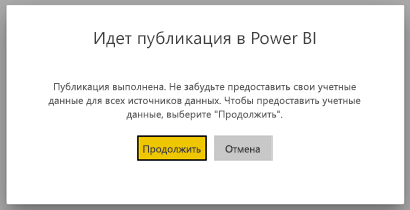
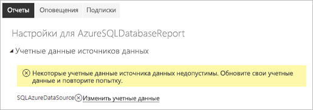
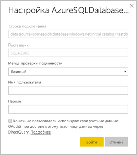

# Поддерживаемые источники данных для отчетов с разбивкой на страницы Power BI

Эта статья описывает поддерживаемые источники данных для отчетов с разбивкой на страницы в службе Power BI и подключение к источникам данных базы данных SQL Azure. Некоторые источники данных поддерживаются изначально. К другим вы можете подключиться с помощью шлюзов данных.

## Изначально поддерживаемые источники данных

Отчеты с разбивкой на страницы изначально поддерживают следующие источники данных:

| Источник данных | Authentication | Примечания |
| --- | --- | --- |
| База данных SQL Azure  Хранилище данных SQL Azure | Базовый, единый вход, OAuth2 | Вы можете использовать корпоративный шлюз с базой данных SQL Azure. Однако вы не можете использовать SSO или oAuth2 для проверки подлинности в этих сценариях.   |
| Управляемый экземпляр базы данных SQL Azure | Базовый | через общедоступную или частную конечную точку (частная конечная точка должна маршрутизироваться через корпоративный шлюз)  |
| Azure Analysis Services | SSO, OAuth2 | Брандмауэр AAS должен быть отключен или настроен для разрешения всех диапазонов IP-адресов.|
| Набор данных Power BI | Единый вход | Наборы данных Power BI Premium и отличные от них. Требуется разрешение на чтение |
| Набор данных Premium Power BI (XMLA) | Единый вход | Наборы данных Power BI не поддерживаются в качестве источников для внедренных отчетов с разбивкой на страницы.  |
| Введите данные | Н/Д | Данные внедряются в отчет. |

Все источники данных, кроме базы данных SQL Azure, готовы к использованию после отправки отчета в службу Power BI. Источники данных по умолчанию используют единый вход (SSO), где это применимо. Для Azure Analysis Services можно изменить тип проверки подлинности на OAuth2. Но, как только тип проверки подлинности для этого источника данных изменится на OAuth2, вернуться к использованию единого входа станет невозможно.  Кроме того, это изменение коснется всех отчетов, которые используют этот источник, то есть всех рабочих областей этого клиента.  Безопасность на уровне строк в отчетах с разбивкой на страницы не будет работать, если для проверки подлинности пользователь не выбрал единый вход.

Для источников данных базы данных SQL Azure нужно указать дополнительные сведения, как описано в разделе [Проверка подлинности базы данных SQL Azure](#azure-sql-database-authentication).

## Другие источники данных

Кроме указанных выше изначально поддерживаемых источников данных, можно получить доступ к следующим источникам данных с помощью [шлюза данных Power BI](../connect-data/service-gateway-onprem.md):

- SQL Server
- Службы SQL Server Analysis Services
- Oracle;
- Teradata

Для отчетов с разбивкой на страницы доступ к базе данных SQL Azure и Azure Analysis Services через шлюз данных Power BI сейчас невозможен.

## Проверка подлинности для базы данных SQL Azure

Для источников данных базы данных SQL Azure нужно указать тип проверки подлинности, прежде чем запускать отчет. Это применимо только при первом использовании источника данных в рабочей области. В первый раз выводится следующее сообщение:

Если не указать учетные данные, при запуске отчета возникает ошибка. Нажмите кнопку **Продолжить**, чтобы перейти на страницу **Учетные данные источника данных** для только что отправленного отчета:

Щелкните ссылку **Изменить учетные данные** для заданного источника данных, чтобы открыть диалоговое окно **Настройка**:

Ниже приведены поддерживаемые типы проверки подлинности для источников данных базы данных SQL Azure:

- Базовый (имя пользователя и пароль)
- Единый вход
- OAuth2 (сохраненный токен AAD)

Для правильной работы единого входа и OAuth2 на сервере базы данных SQL Azure, к которому подключается источник данных, должна быть включена [поддержка проверки подлинности AAD](https://docs.microsoft.com/azure/sql-database/sql-database-aad-authentication-configure). Для метода проверки подлинности OAuth2 AAD создает токен и сохраняет его для будущего обращения к источнику данных. Чтобы вместо этого использовать [метод проверки подлинности на базе единого входа](https://docs.microsoft.com/power-bi/service-azure-sql-database-with-direct-connect#single-sign-on), выберите расположенный ниже параметр единого входа **Конечные пользователи используют свои учетные данные OAuth2 при доступе к этому источнику данных через DirectQuery**.
  
## Дальнейшие действия

[Просмотр отчета с разбивкой на страницы в службе Power BI](../consumer/paginated-reports-view-power-bi-service.md)

Остались вопросы? [Ответы на них см. в сообществе Power BI.](https://community.powerbi.com/)

