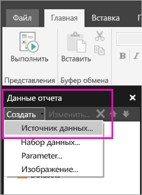

# Создание внедренного источника данных для отчетов с разбивкой на страницы в службе Power BI

Из этой статьи вы узнаете, как создать и изменить внедренный источник данных для отчета с разбивкой на страницы в службе Power BI. Внедренный источник данных можно определить только в одном отчете и использовать его только в этом отчете. Сейчас отчеты с разбивкой на страницы, опубликованные в службе Power BI, могут использовать только внедренные наборы данных и внедренные источники данных. Поддерживаются следующие источники данных:

- Azure Analysis Services
- Базе данных SQL Azure и 
- Хранилище данных SQL Azure
- SQL Server
- Службы SQL Server Analysis Services
- Oracle 
- Teradata 

Для следующих источников данных используйте параметр [Подключение к службам SQL Server Analysis Services](../admin/service-premium-connect-tools.md):

- Наборы данных Power BI Premium

Отчеты с разбивкой на страницы подключаются к локальным источникам данных через [шлюз Power BI](../connect-data/service-gateway-onprem.md). Шлюз настраивается после публикации отчета в службе Power BI.

Дополнительные сведения см. в статье [Данные отчетов в построителе отчетов Power BI](report-builder-data.md).

## Создание внедренного источника данных
  
1. Откройте построитель отчетов Power BI.

1. На панели инструментов в области данных отчета выберите **Новый** > **Источник данных**. Откроется диалоговое окно **Свойства источника данных**.

   
  
1. В текстовом поле **Имя** введите имя источника данных или сохраните имя по умолчанию.  
  
1. Установите флажок **Использовать соединение, внедренное в отчет**.  
  
1. В списке **Выберите тип подключения** выберите тип источника данных. 

1. Укажите строку подключения, используя один из следующих методов:  
  
   - Введите строку подключения непосредственно в текстовое поле **Строка подключения**. 
  
   - Выберите **Сборка**, чтобы открыть диалоговое окно **Свойства соединения** для источника данных, выбранного на шаге 2.  
  
     В диалоговом окне **Свойства соединения** заполните поля данными для конкретного типа источника данных. В свойствах подключения указывается тип источника данных, имя источника данных и учетные данные для него. Указав значения в этом диалоговом окне, щелкните **Проверка подключения**, чтобы убедиться в доступности источника данных и правильности учетных данных.  
  
1. Выберите **Учетные данные**.  
  
   Укажите учетные данные для выбранного источника данных. Тип поддерживаемых учетных данных выбирается владельцем источника данных. Дополнительные сведения см. в статье [Задание учетных данных и сведения о соединении для источников данных отчета](/sql/reporting-services/report-data/specify-credential-and-connection-information-for-report-data-sources).
  
1. Выберите **ОК**.  
  
   Источник данных появится в области данных отчета.

## Рекомендации и ограничения

Для отчетов с разбивкой на страницы, подключаемых к наборам данных Power BI, используются правила общего доступа к наборам данных Power BI с некоторыми незначительными изменениями.  Чтобы обеспечить для пользователей корректное отображение отчетов с разбивкой на страницы, использующих наборы данных Power BI, и принудительную безопасность на уровне строк (RLS), применяйте следующие правила.

### Классические приложения и рабочие области

- Файл RDL и набор данных находятся в одной рабочей области (один владелец): Поддерживается
- Файл RDL и набор данных находятся в разных рабочих областях (один владелец): Поддерживается
- Общий RDL-файл: требуется назначить каждому пользователю, просматривающему отчет, разрешение на чтение на уровне набора данных.
- Общее приложение: требуется назначить каждому пользователю, просматривающему отчет, разрешение на чтение на уровне набора данных.
- Файл RDL и набор данных находятся в одной рабочей области (другой пользователь): Поддерживается
- Файл RDL и набор данных находятся в разных рабочих областях (другой пользователь): требуется назначить каждому пользователю, просматривающему отчет, разрешение на чтение на уровне набора данных.
- Безопасность на уровне ролей: чтобы она соблюдалась, требуется назначить каждому пользователю, просматривающему отчет, разрешение на чтение на уровне набора данных.

### Приложения и рабочие области с новым интерфейсом

- Файл RDL и набор данных находятся в одной рабочей области: Поддерживается
- Файл RDL и набор данных находятся в разных рабочих областях (один владелец): Поддерживается
- Общий RDL-файл: требуется назначить каждому пользователю, просматривающему отчет, разрешение на чтение на уровне набора данных.
- Общее приложение: требуется назначить каждому пользователю, просматривающему отчет, разрешение на чтение на уровне набора данных.
- Файл RDL и набор данных находятся в одной рабочей области (другой пользователь): поддерживается.
- Файл RDL и набор данных находятся в разных рабочих областях (другой пользователь): требуется назначить каждому пользователю, просматривающему отчет, разрешение на чтение на уровне набора данных.
- Безопасность на уровне ролей: чтобы она соблюдалась, требуется назначить каждому пользователю, просматривающему отчет, разрешение на чтение на уровне набора данных.

## Дальнейшие действия

- [Создание внедренного набора данных для отчета с разбивкой на страницы в службе Power BI](paginated-reports-create-embedded-dataset.md)
- [Сведения об отчетах с разбивкой на страницы в Power BI Premium](paginated-reports-report-builder-power-bi.md)