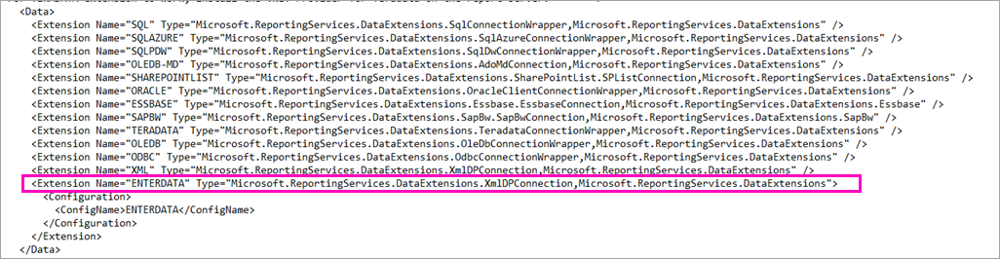

# <a name="enter-data-directly-in-a-paginated-report-in-report-builder---power-bi"></a>Ввод данных непосредственно в отчет с разбивкой на страницы в построителе отчетов — Power BI

В этой статье вы узнаете о функции новой версии Microsoft Power BI Report Builder, которая позволяет вводить данные непосредственно в отчет RDL как внедренный набор данных.  Аналогичная функция реализована в Power BI Desktop. Можно ввести значение непосредственно в набор данных в отчете или вставить его из другой программы, например из Microsoft Excel. После создания набора данных путем ввода данных его можно использовать так же, как и любой другой созданный вами внедренный набор данных. Кроме того, вы можете добавить несколько таблиц и использовать одну таблицу в качестве фильтра для других. Эта функция особенно удобна для небольших и статичных наборов данных, которые может потребоваться использовать в отчете, таких как параметры отчета.
 
## <a name="prerequisites"></a>Предварительные требования

- Чтобы ввести данные непосредственно в отчет с разбивкой на страницы, [скачайте и установите Power BI Report Builder](https://aka.ms/pbireportbuilder). 
- Чтобы сохранить отчет с разбивкой на страницы в службе Power BI, вам потребуется [учетная запись Power BI Pro](../fundamentals/service-self-service-signup-for-power-bi.md) и доступ на запись для рабочей области в [емкости Power BI Premium](../admin/service-premium-what-is.md).
- Чтобы сохранить отчет с разбивкой на страницы на сервере отчетов, необходимы разрешения на [изменение файла RsReportServer.config](#upload-the-paginated-report-to-a-report-server).

## <a name="create-a-data-source-and-dataset"></a>Создание источника данных и набора данных

После загрузки и установки построителя отчетов вы выполните ту же процедуру, которая использовалась для добавления внедренного источника данных и набора данных в отчет. В следующей процедуре в разделе **Источники данных** доступен новый вариант: **Ввод данных**.  Этот источник данных потребуется настроить в отчете только один раз. После, с помощью этого одного источника данных, можно создать несколько таблиц с введенными данными в качестве отдельных наборов данных.

1. В области **данных отчета** выберите **Создать** > **Набор данных**.

    

1. В диалоговом окне **Свойства набора данных** выберите **Использовать набор данных, внедренный в отчет**.

1. В поле **Источник данных** выберите **Создать**.

    

1. В диалоговом окне **Свойства источника данных** выберите **Использовать соединение, внедренное в отчет**.
2. В поле **Выберите тип подключения** выберите **ВВОД ДАННЫХ** > **ОК**.

    

1. Вернитесь в диалоговое окно **Свойства набора данных** и выберите **Конструктор запросов**.
2. В области **конструктора запросов** щелкните правой кнопкой мыши и вставьте данные в таблицу.

    

1. Чтобы задать имена столбцов, дважды щелкните каждый столбец **NewColumn** и введите имя столбца.

    

1. Если первая строка содержит заголовки столбцов из исходных данных, щелкните ее правой кнопкой мыши и удалите.
    
9. По умолчанию типом данных для каждого столбца является строка. Чтобы изменить тип данных, щелкните правой кнопкой мыши заголовок столбца, выберите **Изменить тип** и присвойте значение другого типа данных, например "Дата" или "Число с плавающей запятой".

    

1. Завершив создание таблицы, нажмите кнопку **ОК**.  

    Создаваемый запрос совпадает с тем, который бы отображался с источником данных XML. На самом деле мы используем XML как поставщик данных.  Он используется для разных целей, в том числе для реализации этого сценария.

    

12. В диалоговом окне **Свойства набора данных** нажмите кнопку **ОК**.

13. Источник данных и набор данных отображаются в области **Данные отчета**.

    

Набор данных можно использовать как основу для визуализаций данных в отчете. Можно также добавить другой набор данных и использовать для него тот же источник данных.

## <a name="design-the-report"></a>Создание отчета

Теперь, когда у вас есть источник и набор данных, можно приступать к созданию отчета. Следующая процедура описывает создание простого отчета на основе данных из предыдущего раздела.

1. В меню **Вставка** выберите **Таблица** > **Мастер таблиц**.

    :::image type="content" source="media/paginated-reports-enter-data/paginated-table-wizard.png" alt-text="Снимок экрана: выбор параметра мастера таблиц":::

1. Выберите только что созданный набор данных и нажмите кнопку **Далее**.

    :::image type="content" source="media/paginated-reports-enter-data/paginated-choose-dataset.png" alt-text="Снимок экрана: диалоговое окно "Выбор набора данных"":::

2.  На странице "Размещение полей" перетащите поля, по которым хотите выполнить группирование, из раздела **Доступные поля** в раздел **Группы строк**. В этом примере:

    - CountryRegion
    - SalesYear

3.  Перетащите поля, по которым нужно выполнить статистическое вычисление, из раздела **Доступные поля** в раздел **Значения**. В этом примере:

    - SalesAmount

    По умолчанию Report Builder суммирует поля в разделе **Значения**, но можно выбрать другой агрегат.

    :::image type="content" source="media/paginated-reports-enter-data/paginated-select-aggregation.png" alt-text="Снимок экрана: различные агрегаты для выбора":::
 
1. Нажмите кнопку **Далее**.
4.  На странице **Выбор макета** сохраните все параметры по умолчанию, но снимите флажок **Развернуть или свернуть группы**. Как правило, развертывание и свертывание групп отлично работает, но на этот раз необходимо просмотреть все данные.

5.  Нажмите кнопку **Далее** > **Готово**. Таблица отображается в области конструктора.

    :::image type="content" source="media/paginated-reports-enter-data/paginated-design-view-matrix.png" alt-text="Снимок экрана: отчет в представлении конструирования":::

### <a name="run-the-report"></a>Выполнение отчета

Чтобы просмотреть фактические значения и отчет, запустите его.

1. Выберите **Запуск** на ленте **Главная**.

    :::image type="content" source="media/paginated-reports-enter-data/paginated-run-report.png" alt-text="Снимок экрана: выбор команды "Запуск" на ленте "Главная"":::

    Здесь вы увидите все значения. Матрица содержит больше строк, чем отображалось в представлении конструирования.  Можно либо отформатировать страницу, либо использовать параметры по умолчанию перед сохранением на локальном компьютере или публикацией в службе.

1. Чтобы увидеть, как отчет будет выглядеть при печати, выберите **Разметка страницы**.

    :::image type="content" source="media/paginated-reports-enter-data/paginated-select-print.png" alt-text="Снимок экрана: выбор параметра "Разметка страницы"":::

    Теперь он отображается в том виде, в котором будет распечатан на странице.

    :::image type="content" source="media/paginated-reports-enter-data/paginated-print-layout.png" alt-text="Снимок экрана: отчет в режиме разметки":::

## <a name="upload-the-paginated-report-to-the-power-bi-service"></a>Отправка отчета с разбивкой на страницы в службу Power BI

Теперь, когда в службе Power BI поддерживаются отчеты с разбивкой на страницы, вы можете отправить отчет с разбивкой на страницы в емкость Premium. Подробные сведения см. в разделе [Отправка отчета с разбивкой на страницы](paginated-reports-save-to-power-bi-service.md).

## <a name="upload-the-paginated-report-to-a-report-server"></a>Отправка отчета с разбивкой на страницы на сервер отчетов

Отчет с разбивкой на страницы можно также отправить на сервер отчетов Power BI или сервер отчетов SQL Server Reporting Services 2016 или 2017. Однако перед этим необходимо добавить следующий элемент в файл RsReportServer.config как дополнительное расширение данных. Создайте резервную копию файла RsReportServer.config перед внесением изменений на случай возникновения проблем.

```xml
<Extension Name="ENTERDATA" Type="Microsoft.ReportingServices.DataExtensions.XmlDPConnection,Microsoft.ReportingServices.DataExtensions">
    <Configuration>
        <ConfigName>ENTERDATA</ConfigName>
    </Configuration>
</Extension>
```

Когда вы закончите редактирование файла, список поставщиков данных в файле конфигурации должен выглядеть следующим образом:



Вот и все. Теперь отчеты, использующие эти новые функции, можно публиковать на сервере отчетов.

## <a name="next-steps"></a>Дальнейшие действия

- [Сведения об отчетах с разбивкой на страницы в Power BI Premium](paginated-reports-report-builder-power-bi.md)
- [Что такое Сервер отчетов Power BI?](../report-server/get-started.md)
