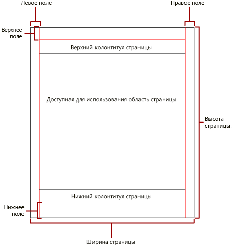
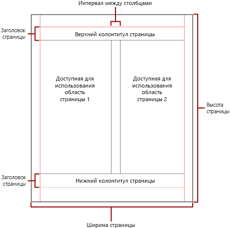

# Разбивка на страницы в отчетах Power BI с разбивкой на страницы

 При *разбивке на страницы* определяется количество страниц в отчете, а также порядок размещения элементов отчета на этих страницах. Разбивка на страницы в отчетах Power BI с разбивкой на страницы осуществляется в зависимости от модуля подготовки, который используется для просмотра и доставки отчета. Если отчет запущен на сервере отчетов, используется модуль подготовки HTML. В формате HTML определен набор правил разбивки на страницы. Если экспортировать тот же отчет в формат PDF, например с помощью отрисовщика PDF, будет использовать другой набор правил. В связи с этим результаты разбивки на страницы могут отличаться. Необходимо понимать правила, применяемые для управления разбивкой на страницы в отчетах Power BI с разбивкой на страницы. Это позволит разрабатывать эффективные и удобные для чтения отчеты, оптимизированные для отрисовщика, который вы планируете использовать при доставке отчета.  
  
 В этой статье рассматривается влияние физического размера страницы и макета отчета на отображение в отчете принудительных разрывов страниц. Чтобы настраивать свойства, определяющие физический размер страницы и поля, а также разбивать отчет на столбцы, используйте область **Свойства отчета**, область **Свойства** или диалоговое окно **Параметры страницы**. Чтобы открыть область **Свойства отчета**, щелкните в синей области за пределами тела отчета. Чтобы открыть диалоговое окно **Параметры страницы**, нажмите кнопку **Выполнить** на вкладке "Главная" и затем щелкните **Параметры страницы** на открывшейся вкладке.  
  
> [!NOTE]  
>  Если вы создавали отчет шириной в одну страницу, но он отображается на нескольких страницах, убедитесь, что ширина тела отчета с полями не превышает физическую ширину страницы. Чтобы предотвратить добавление пустых страниц к отчету, можно уменьшить размер контейнера, перетащив его угол влево.  

## Тело отчета  
 Тело отчета заключено в прямоугольный контейнер и отображается в виде белого пространства в области конструктора. Размеры тела могут увеличиваться и уменьшаться в зависимости от элементов, присутствующих в отчете. Тело отчета не обязательно соответствует физическому размеру страницы и может выходить за ее границы, отображаясь на нескольких страницах отчета. В некоторых модулях подготовки, таких как Microsoft Excel, Word, HTML и MHTML, отображаемый размер отчета изменяется в зависимости от содержимого страницы. Отчеты, отображаемые в таких форматах, оптимизируются для просмотра на экране, например в браузере. По мере необходимости эти модули подготовки добавляют вертикальные разрывы страниц.  
  
 Для тела отчета можно изменить цвет, стиль и ширину границ. Кроме того, можно добавить фоновый цвет и фоновое изображение.  
  
## Физическая страница  
 Физический размер страницы представляет собой размер бумаги. От указанного для отчета размера страницы зависит, каким образом он будет преобразован для просмотра. В отчетах, отображаемых в форматах с принудительными разрывами страниц, на основании физического размера страницы вставляются горизонтальные и вертикальные разрывы страниц. Они обеспечивают оптимальный внешний вид отчета при печати или просмотре. В отчетах, отображаемых в форматах с мягкими разрывами страниц, на основании физического размера страницы вставляются горизонтальные разрывы страниц. Они также обеспечивают оптимальный внешний вид отчета при просмотре в веб-браузере.  
  
 По умолчанию размер страницы составляет 8,5 x 11 дюймов. При необходимости вы можете изменить его в области **Свойства отчета** или диалоговом окне **Параметры страницы**, либо с помощью свойств PageHeight и PageWidth в области **Свойства**. Размер страницы не изменяется в соответствии с содержимым тела отчета. Если необходимо, чтобы отчет появился на единственной странице, все содержимое текста отчета должно быть подогнано к одной физической странице. В противном случае при использовании формата с принудительными разрывами страниц отчет будет размещаться на нескольких страницах. Если тело отчета выходит за правый край физической страницы, вставляется горизонтальный разрыв. Если тело отчета выходит за нижний край физической страницы, вставляется вертикальный разрыв.  
  
 Переопределить физический размер страницы, определенный для отчета, можно в параметрах сведений об устройстве для конкретного модуля подготовки, который используется для экспорта отчета. Полный список см. в статье [Параметры сведений об устройстве для модулей подготовки отчетов](https://docs.microsoft.com/sql/reporting-services/device-information-settings-for-rendering-extensions-reporting-services?view=sql-server-2017) в документации по службам SQL Server Reporting Services.  
  
### Margins

 Поля выводятся от края физической страницы внутрь до указанной ширины поля. Если элемент отчета попадает в область поля, он обрезается и его перекрывающаяся с полем часть не отображается. Если заданы такие размеры полей, что ширина страницы по горизонтали или по вертикали получается равной нулю, по умолчанию устанавливаются нулевые размеры полей. Чтобы задать размеры полей, используйте область **Свойства отчета**, диалоговое окно **Параметры страницы** или свойства TopMargin, BottomMargin, LeftMargin и RightMargin в области **Свойства**. Переопределить размер полей, определенный для отчета, можно в параметрах сведений об устройстве для конкретного модуля подготовки, который используется для экспорта отчета.  
  
 Область физической страницы, которая остается свободной после выделения пространства для полей, интервалов между колонками, а также верхнего и нижнего колонтитулов, называется *полезной*. Поля применяются только в том случае, если вы отображаете и печатаете отчеты в форматах с принудительными разрывами страниц. На следующем рисунке показаны поля и полезная область физической страницы.  
  
 
  
### Колонки в газетном стиле  

 Отчет можно разбить на колонки в газетном стиле. Колонки рассматриваются как *логические* страницы, отображаемые на одной *физической* странице. Они размещаются слева направо и сверху вниз. Для разделения колонок используется белое пространство. Если отчет разделен на несколько колонок, каждая физическая страница разбивается по вертикали на колонки, а каждая колонка рассматривается как логическая страница. Допустим, на физической странице размещается две колонки. Содержимое отчета сначала добавляется в первую колонку и затем во вторую. Если содержимое отчета не умещается в двух колонках, оно аналогичным образом добавляется в колонки на следующей странице. Колонки заполняются слева направо и сверху вниз до тех пор, пока не будут отображены все элементы отчета. Если заданы такие размеры колонок,что ширина по горизонтали или вертикали получается равной нулю, по умолчанию устанавливается нулевой интервал между колонками.  
  
 Чтобы задать размеры колонок, используйте область **Свойства отчета**, диалоговое окно **Параметры страницы** или свойства TopMargin, BottomMargin, LeftMargin и RightMargin в области **Свойства**. Чтобы задать размер полей, который не был определен, используйте параметры сведений об устройстве для конкретного модуля подготовки, который используется для экспорта отчета. Столбцы могут применяться только при подготовке к просмотру и печати отчетов в формате PDF или формате изображения. На следующем рисунке показана полезная область физической страницы, содержащей колонки.  
  

  
## Разрывы страниц и имена страниц

 Чтобы сделать отчет более наглядным и удобным для проверки и экспорта, можно присвоить страницам отчета имена. В службах Reporting Services предусмотрены свойства отчетов, таблиц, матриц, областей данных списков, групп и прямоугольников, с помощью которых можно определять параметры разбивки на страницы, изменять нумерацию и указывать новые имена страниц на разрывах между ними. Эти возможности могут улучшить отчет независимо от формата подготовки отчета, однако, они особенно полезны при экспорте отчетов в формат Excel.

> [!NOTE]
> Области таблицы, матрицы и данных списка фактически основываются на одном виде области данных, который называется *табликс*. Возможно, вы уже встречались с этим названием. 

 В свойстве InitialPageName содержится начальное имя страницы отчета. Если в вашем отчете не используются имена страниц на разрывах страниц, для всех новых страниц, создаваемых с использованием разрывов, будет использоваться начальное имя страницы. Использовать начальное имя страницы необязательно.  
  
 В отображаемом отчете может использоваться новое имя страницы для новой страницы, создаваемой с использованием разрыва. Для предоставления имени страницы нужно установить свойство PageName для таблиц, матриц, списков, групп и прямоугольников. Указывать имена страниц на разрывах необязательно. Если они не указаны, вместо них используется значение InitialPageName. Если InitialPageName также не имеет значения, новая страница не будет иметь имени.  
  
 Области таблицы, матрицы и списка данных, группы и прямоугольники поддерживают разрывы страниц.  
  
 Разрыв страницы имеет следующие свойства:  
  
- Свойство **BreakLocation** определяет расположение разрыва для элемента, поддерживающего разрывы страниц: в начале, в конце или в начале и в конце. Для групп BreakLocation может указывать на разрыв между группами.  
  
- Свойство **Disabled** указывает, применяется ли разрыв страницы к этому элементу отчета. Если это свойство имеет значение true, разрыв страницы игнорируется. Это свойство используется для динамического отключения разрывов страниц на основе выражений во время выполнения отчета.  
  
- Свойство **ResetPageNumber** указывает, должна ли нумерация страниц в месте вставки разрыва начинаться с 1. Если это свойство имеет значение true, нумерация страниц начинается заново.  
  
 Свойство BreakLocation можно задать в диалоговых окнах **Свойства табликса**, **Свойства прямоугольника** или **Свойства группы**. Свойства Disabled, ResetPageNumber и PageName задаются в области свойств построителя отчетов. Если свойства в области свойств упорядочены по категориям, найти эти свойства можно в категории **PageBreak**. Категория **PageBreak** для групп находится в категории **Группа**.  
  
 Для установки значений свойств Disabled и ResetPageNumber можно использовать константы, а также простые и сложные выражения. Тем не менее для свойства BreakLocation выражения использовать нельзя. Дополнительные сведения о написании и использовании выражений см. в статье [Выражения в построителе отчетов Power BI](report-builder-expressions.md).  
  
 В отчете можно использовать выражения, которые ссылаются на текущие имена и номера страниц, с помощью коллекции **Глобальные**. Дополнительные сведения см. в статье [Ссылки на встроенные глобальные объекты и пользователей](https://docs.microsoft.com/sql/reporting-services/report-design/built-in-collections-built-in-globals-and-users-references-report-builder?view=sql-server-2017) в документации по построителю отчетов и службам Reporting Services.
  
### Именование вкладок листа Excel

 Эти свойства используются при экспорте отчетов в формате книги Excel. Используйте свойство InitialPage для задания имени по умолчанию для вкладки листа при экспорте отчета и примените разрывы страниц и свойство PageName для предоставления разных имен для каждого листа. Каждая новая страница отчета, определяемая разрывом страницы, экспортируется на новый лист, имя которого определяется значением свойства PageName. Если значение PageName не задано, но для отчета определено начальное имя страницы, всем листам в книге Excel будет присваиваться начальное имя страницы.  
  
 Дополнительные сведения об использовании этих свойств при экспорте отчетов в Excel см. в статье [Экспорт в Microsoft Excel](https://docs.microsoft.com/sql/reporting-services/report-builder/exporting-to-microsoft-excel-report-builder-and-ssrs) в документации по построителю отчетов и службам Reporting Services.  
  
## Дальнейшие действия

- [Просмотр отчета с разбивкой на страницы в службе Power BI](../consumer/paginated-reports-view-power-bi-service.md)
- [Избегайте пустых страниц при печати отчетов с разбивкой на страницы](../guidance/report-paginated-blank-page.md)
- У вас имеются и другие вопросы? [Ответы на них см. в сообществе Power BI.](https://community.powerbi.com/)
