# Руководство. Создание отчета с разбивкой на страницы и его отправка в службу Power BI

При работе с этим руководством вы подключитесь к тестовой базе данных Azure SQL. Затем вы примените мастер построителя отчетов Power BI, чтобы создать отчет с разбивкой на страницы, содержащий многостраничную таблицу. Полученный отчет с разбивкой на страницы вы отправите в рабочую область емкости Premium в службе Power BI.

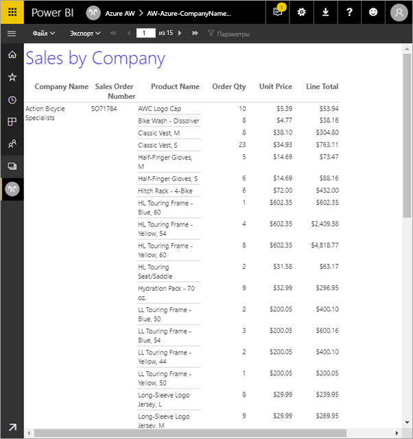

В рамках этого руководства вы выполните следующие шаги:

> [!div class="checklist"]
> * создание тестовой базы данных Azure;
> * создание матрицы в построителе отчетов Power BI с помощью мастера;
> * настройка для отчета таких параметров, как заголовок, номера страниц и заголовки столбцов на каждой странице;
> * форматирование валюты;
> * отправка отчета в службу Power BI.

Если у вас нет подписки Azure, перед началом работы [создайте бесплатную учетную запись](https://azure.microsoft.com/free/?WT.mc_id=A261C142F).
 
## Предварительные требования  

Ниже перечислены предварительные требования для создания отчетов с разбивкой на страницы.

- Установите [построитель отчетов Power BI из Центра загрузки Майкрософт](https://go.microsoft.com/fwlink/?linkid=2086513). 

- Выполните краткое руководство [по созданию тестовой базы данных Azure SQL на портале Azure](https://docs.microsoft.com/azure/sql-database/sql-database-get-started-portal). Скопируйте и сохраните значение из поля **Имя сервера** на вкладке **Обзор**. Запомните имя пользователя и пароль, созданные в Azure.

Ниже приведены предварительные требования для отправки отчета с разбивкой на страницы в службу Power BI.

- [Лицензия Power BI Pro](../service-admin-power-bi-pro-in-your-organization.md).
- Рабочая область в службе с [емкостью Power BI Premium](../service-premium-what-is.md). Такие рабочие области отмечены значком в виде бриллианта  рядом с именем рабочей области.

## Создание матрицы с помощью мастера
  
1.  Откройте построитель отчетов Power BI на своем компьютере.  
  
     Откроется диалоговое окно **Приступая к работе**.  
  
     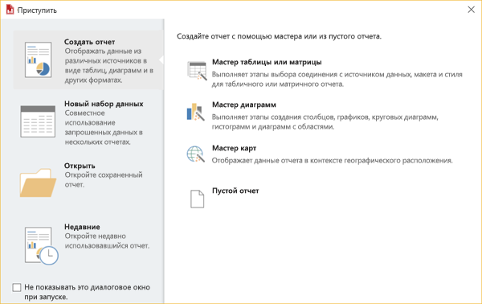
  
1.  В области слева выберите элемент **Новый отчет**, затем в области справа щелкните **Мастер таблицы или матрицы**.  
  
4.  На странице **Выбор набора данных** щелкните **Создание набора данных** > **Далее**.  

    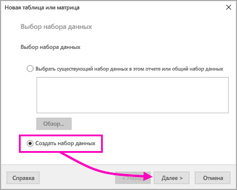
  
5.  На странице **Выбор соединения с источником данных** щелкните **Создать**. 

    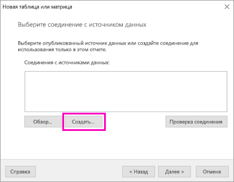
  
     Откроется диалоговое окно **Свойства источника данных**.  
  
6.  Этому источнику данных можно задать любое имя, содержащее символы и знаки подчеркивания. В рамках этого руководства введите в поле **Имя** значение **MyAzureDataSource**.  
  
7.  В поле **Выберите тип подключения** выберите **База данных SQL Microsoft Azure**.  
  
8.  Щелкните **Построить** рядом с полем **Строка подключения**. 

    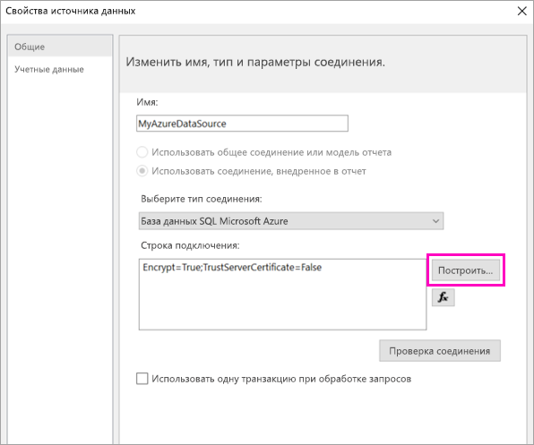

9. **В Azure:** вернитесь на портал Azure и выберите **Базы данных SQL**.

1. Выберите базу данных SQL Azure, которую вы создали при работе с кратким руководством по созданию базы данных SQL Azure на портале Azure в качестве **предварительного требования** для этой статьи.

1. На вкладке **Обзор** скопируйте и сохраните значение из поля **Имя сервера**.

2. **В построителе отчетов**: в диалоговом окне **Свойства соединения** вставьте в поле **Имя сервера** только что скопированное имя сервера. 

1. Убедитесь, что в разделе **Вход на сервер** выбран вариант **Использовать проверку подлинности SQL Server**. Затем введите имя пользователя и пароль, которые вы создали для тестовой базы данных в Azure.

1. В разделе **Соединение с базой данных** щелкните стрелку раскрывающегося списка и выберите имя базы данных, которую вы создали в Azure.
 
    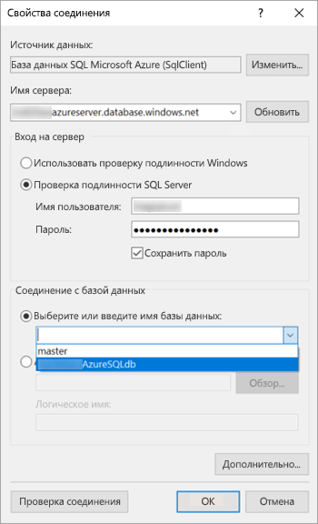

1. Щелкните **Проверить подключение**. Вы увидите окно **Результаты теста** с сообщением **Проверка соединения завершилась успешно**.

1. Щелкните **ОК** > **ОК**. 

   Теперь в поле **Строка подключения** построитель отчетов отобразит только что созданную строку подключения. 

    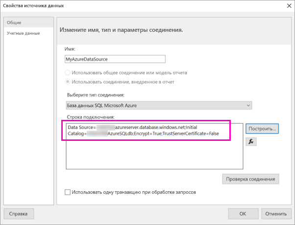

1. Выберите **ОК**.
  
9. На странице **Выбор соединения с источником данных** вы увидите строку "(в этом отчете)" прямо под созданным подключением к источнику данных. Выберите этот источник данных и щелкните **Далее**.  

    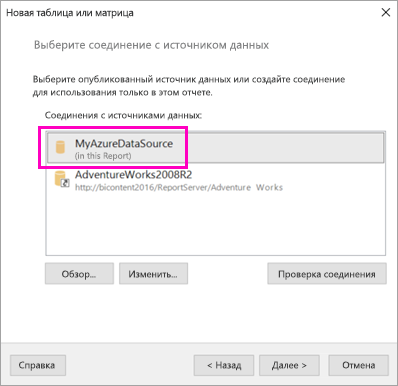

10. Введите в это поле те же имя пользователя и пароль. 
  
10. На странице **Проектирование запроса** разверните узел SalesLT, затем Tables (Таблицы) и выберите следующие таблицы:

    - Адрес
    - Клиент
    - Продукт
    - ProductCategory
    - SalesOrderDetail
    - SalesOrderHeader

     Так как выбраны элементы **Связи** > **Автоматическое обнаружение**, построитель отчетов автоматически обнаруживает связи между этими таблицами. 
    
    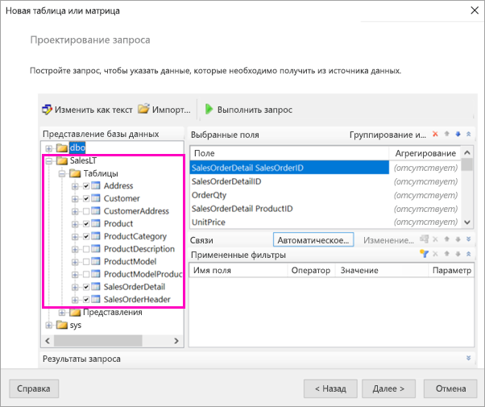
 
1.  Выберите **Выполнить запрос**. Построитель отчетов отобразит **результаты запроса**. 
 
     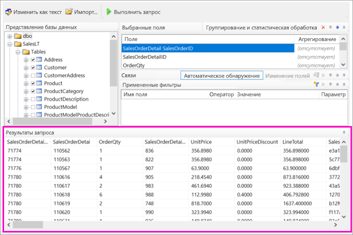

18. Нажмите кнопку **Далее**. 

19. На странице **Выбор набора данных** выберите только что созданный набор данных и щелкните **Далее**.

    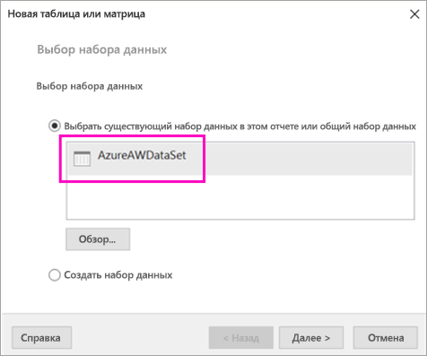

1. На странице **Размещение полей** перетащите из раздела **Доступные поля** в раздел **Группы строк** следующие поля:

    - CompanyName
    - SalesOrderNumber;
    - Product_Name.

1. Перетащите из раздела **Доступные поля** в раздел **Значения** следующие поля:

    - OrderQty;
    - UnitPrice
    - LineTotal

    Построитель отчетов автоматически включит суммирование для полей в разделе **Значения**.

    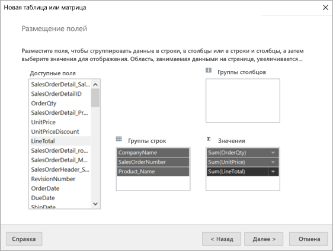

24. На странице **Выбор макета** сохраните все параметры по умолчанию, но снимите флажок **Развернуть или свернуть группы**. Обычно функция разворачивания и сворачивания групп работает отлично, но для этого примера нужно, чтобы таблица занимала несколько страниц.

1. Нажмите кнопку **Далее** > **Готово**. Таблица отображается в области конструктора.
 
## Вот что мы создали

Теперь сделайте небольшую паузу и изучите результаты работы мастера.

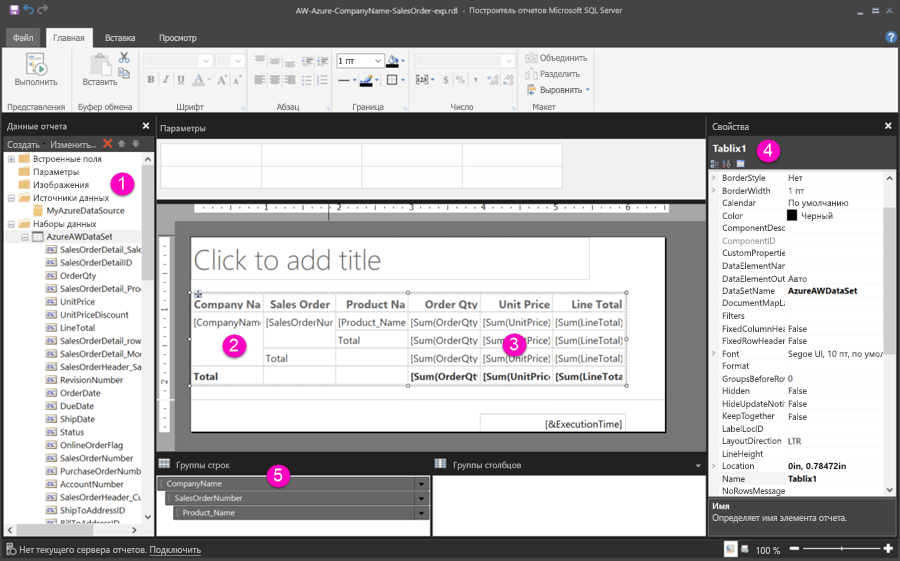

1. В области данных отчета вы увидите внедренный источник данных Azure и основанный на нем внедренный набор данных, которые вы создали. 

2. Область конструктора имеет ширину около 15 см. В этой области конструктора отображается матрица с заголовками столбцов и значениями заполнителей. Эта матрица имеет шесть столбцов и всего пять строк. 

3. Значения в столбцах Order Qty, Unit Price и Line Total автоматически суммируются, и по каждой группе строк представлен промежуточный итог. 

    Вы не увидите здесь фактические значения данных. Чтобы просмотреть их, нужно запустить отчет.

4. На панели "Свойства" эта выбранная матрица обозначена именем Tablix1. В построителе отчетов объект *табликса* обозначает любую область данных, которая отображает данные в строках и столбцах. Сюда входят как таблицы, так и матрицы.

5. На панели группирования вы видите три группы строк, созданные в мастере: 

    - CompanyName
    - Заказ на продажу
    - Название продукта

    Эта матрица не имеет ни одной группы столбцов.

### Выполнение отчета

Чтобы просмотреть фактические значения данных, необходимо запустить отчет.

1. Выберите **Запуск** на панели инструментов **Главная**.

   Здесь вы увидите все значения. Как вы сразу заметите, матрица имеет гораздо больше строк, чем отображалось в представлении конструктора! Обратите внимание, что построитель отчетов присвоил странице номер **1** из **2?** . Дело в том, что построитель отчетов стремится загрузить отчет как можно скорее и поэтому за один раз извлекает данные только для нескольких страниц. Вопросительный знак обозначает, что построитель отчетов пока загрузил не все данные.

   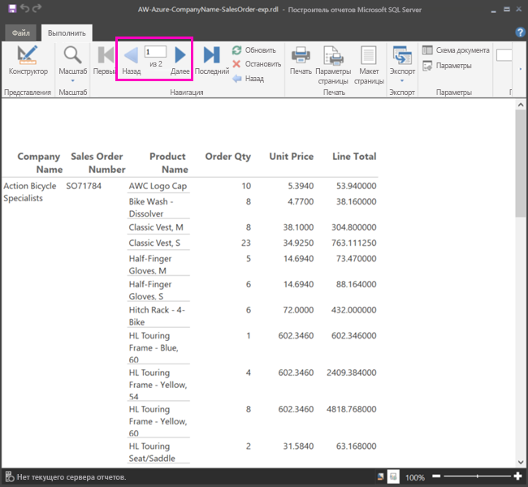

2. Выберите **Настройка печати**. Отобразится формат отчета для печати. Теперь построитель отчетов выяснил, что отчет содержит 33 страницы, и автоматически добавил в нижний колонтитул отметку даты и времени.

## Форматирование отчета

Итак, у вас есть отчет с матрицей, развернутой на 33 страницы. Давайте добавим еще несколько функций и улучшим внешний вид отчета. Если вы хотите наблюдать результат каждого изменения, снова запускайте отчет после каждого шага.

- На вкладке **Запуск** на ленте команд выберите **Конструктор**, чтобы продолжить изменение отчета.  

### Настройка ширины страницы

Обычно отчет с разбивкой на страницы форматируется для печати на стандартной странице размером ANSI A (216×280 мм). 

1. Перетащите линейку, чтобы ширина области конструктора составляла 178 мм. По умолчанию поля составляют 25 мм с каждой стороны, а значит нам их нужно уменьшить.

1. Щелкните серую область вокруг области конструктора, чтобы отобразить свойства **отчета**.

    Если панель свойств не отображается, щелкните вкладку **Вид** и выберите **Свойства**.

2. Разверните область **Поля** и измените значения **Слева** и **Справа** с 25 до 19 мм. 

    
  
### Добавление заголовка отчета  

1. Выделите слова **Щелкните для добавления заголовка** в верхней части страницы, затем введите строку **Sales by Company** (Объемы продаж компании).  

2. Выделите текст заголовка и на панели свойств в разделе **Шрифт** установите для параметра **Цвет** значение **Синий**.
  
### Добавление номера страницы

Вы уже наверняка заметили, что в колонтитуле отчета указаны метки даты и времени. Вы можете добавить в этот колонтитул еще и номера страниц.

1. В нижней части области конструктора найдите строку [&ExecutionTime] справа в нижнем колонтитуле. 

2. В области данных отчета разверните папку "Встроенные поля". Перетащите поле **Номер страницы** в левую часть нижнего колонтитула, разместив его на одной высоте с полем [&ExecutionTime].

3. Перетащите правый край поля [&PageNumber] так, чтобы оно имело форму квадрата.

4. На вкладке **Вставка** выберите **Текстовое поле**.

5. Щелкните мышью справа от поля [&PageNumber], введите строку "из", а затем сделайте это текстовое поле квадратным.

6. Перетащите в нижний колонтитул поле **Overall Total Pages** (Общее число страниц), поместив его справа от поля "из", а затем перетащите его правый край, чтобы это поле тоже стало квадратным.

    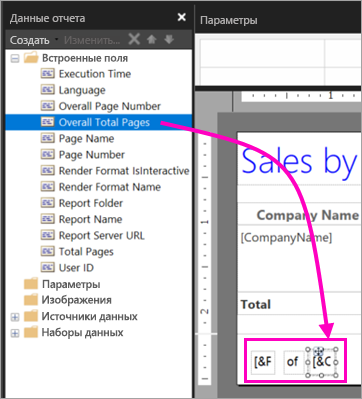

### Увеличение ширины таблицы  

Теперь вы можете увеличить ширину матрицы, чтобы заполнить всю страницу и увеличить текстовые столбцы, чтобы избавиться от лишней прокрутки в них. 
 
1. Выберите матрицу, затем выберите столбец "Company Name".

3. Наведите указатель мыши на серую панель в верхней части матрицы на правом краю столбца "Company Name". Перетащите ее вправо, чтобы ширина столбца составила 35 мм. 

    

4. Перетащите правый край столбца "Product name" до ширины 95 мм.   

Теперь ширина матрица почти точно соответствует области печати.

### Форматирование валюты

Вы могли заметить, что при запуске отчета денежные суммы пока не форматируются как валюта.

1. Выберите ячейку [Sum(OrderQty)] вверху слева, нажмите клавишу SHIFT и, удерживая ее нажатой, выберите ячейку [Sum(LineTotal)] внизу справа.

    

2. На вкладке **Главная** выберите знак доллара ( **$** ) как символ валюты, затем щелкните стрелку рядом с полем **Символ заполнителя** > **Образцы значений**.
 
    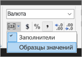

    Теперь эти значения будут отображаться в формате валюты.

    

### Добавление заголовков столбцов на каждой странице

Нам осталось внести последнее улучшение в формат отчета перед его публикацией в службе Power BI: пускай заголовки столбцов отображаются на каждой странице отчета.

1. В правом конце полосы, расположенной сверху на панели группирования, щелкните стрелку раскрывающегося списка и выберите **Расширенный режим**.

    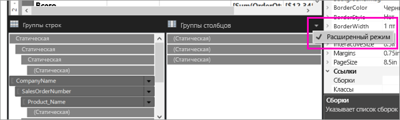

2. Выберите линейку **Static** (Статическая) вверху в разделе **Группы строк**. В матрице будет выбрана ячейка "Company Name".

   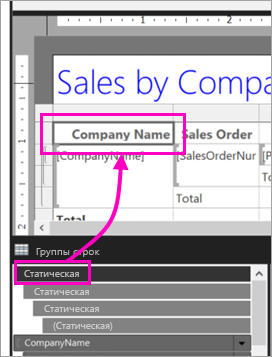

3. На панели **Свойства** вам нужно найти свойства **элемента табликса**. Для параметра **KeepWithGroup** (Сохранить с группой) установите значение **After** (После), а для **RepeatOnNewPage** (Повторять на новой странице) — значение **True**.

    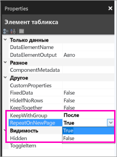

    Пришло время запустить отчет и посмотреть, как он теперь выглядит.

5. Выберите **Запуск** на вкладке **Главная**.

6. Выберите **Макет страницы**, если он еще не выбран. Теперь отчет содержит 29 страниц. Пролистайте несколько страниц. Как вы видите, валюта теперь отображается в правильном формате, на каждой странице отображаются заголовки столбцов и нижний колонтитул с номерами страниц и метками даты и времени.
 
    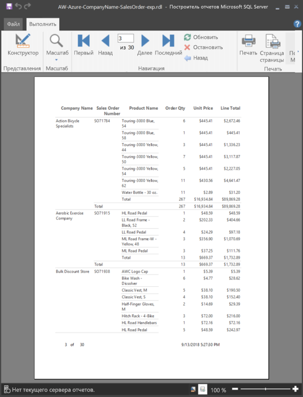

7. Сохраните этот отчет на компьютере.
 
##  Отправка отчета в службу

Итак, вы создали отчет с разбивкой на страницы. Теперь можете отправить его в службу Power BI.

1. В службе Power BI (`https://app.powerbi.com`) в области навигации выберите **Рабочие области** > **Создать рабочую область**.

2. Присвойте рабочей области имя **Azure AW** или другое уникальное имя. Сейчас вы единственный участник этой области. 

3. Щелкните стрелку рядом с полем **Дополнительно** и включите параметр **Выделенная емкость**. 

    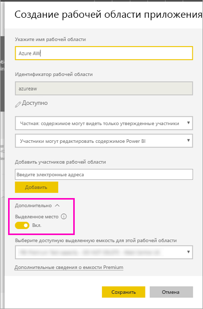

    Если вы не можете включить этот параметр, обратитесь к администратору Power BI, чтобы он предоставил права на добавление рабочей области в выделенной емкости Premium.

4. Если нужно, выберите **доступную выделенную емкость для этой рабочей области** и щелкните **Сохранить**.
    
    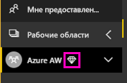

    Если рабочая область не находится в емкости Premium, при попытке отправить отчет вы получите сообщение "Не удалось отправить отчет с разбивкой на страницы". В этом случае свяжитесь с администратором Power BI и переместите рабочую область.

1. В новой рабочей области щелкните **Получить данные**.

2. В поле **Файлы** выберите **Получить**.

3. Выберите **Локальный файл**, перейдите к расположению, в котором вы его сохранили, и щелкните **Открыть**.

   Power BI импортирует файл и вы увидите его в списке **Отчеты** на странице со списком приложений.

    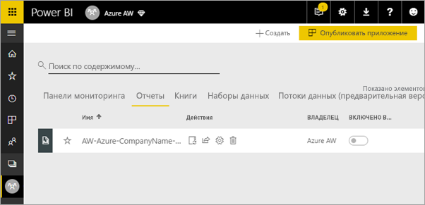

4. Выберите отчет, чтобы просмотреть его.

5. Если отобразится сообщение об ошибке, попробуйте повторно ввести учетные данные. Щелкните значок **Управление**.

    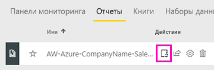

6. Выберите **Изменить учетные данные** и введите учетные данные, которые вы использовали в Azure при создании базы данных Azure.

    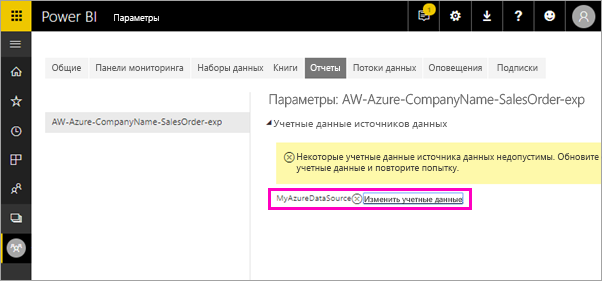

7. Теперь вы можете просмотреть отчет с разбивкой на страницы в службе Power BI.

    

## Дальнейшие действия

[Сведения об отчетах с разбивкой на страницы в Power BI Premium](paginated-reports-report-builder-power-bi.md)

