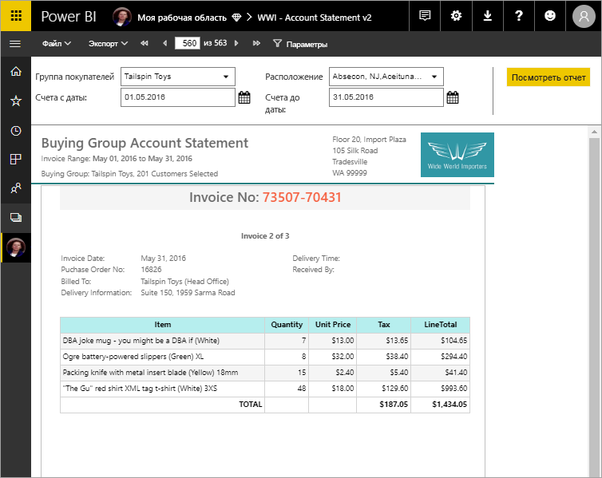

# Сведения об отчетах с разбивкой на страницы в Power BI Premium

*Отчеты с разбивкой на страницы* создаются специально для печати или совместного использования. Под термином *с разбивкой на страницы* подразумевается то, что формат отчетов подбирается с учетом отображения на странице. Можно настроить отображение всех данных отчета в таблице, даже если для этого потребуется много страниц. В качестве названия для таких отчетов также употребляют описательное выражение *с точностью до пикселя*, которое указывает на возможность точно настраивать макет отчета. Построитель отчетов Power BI — это автономное средство для создания отчетов с разбивкой на страницы. Отчеты с разбивкой на страницы создаются на основе технологии RDL (языка определения отчетов), которая уже давно является стандартным форматом отчетов в SQL Server Reporting Services. 

Отчеты с разбивкой на страницы часто имеют много страниц. Например, этот отчет содержит 563 страницы. Для каждой страницы соблюдается точное форматирование: на каждой странице размещен строго один счет и повторяются стандартные колонтитулы.

Вы можете просмотреть такой отчет в Построителе отчетов, а затем опубликовать его в службе Power BI `https://app.powerbi.com`. Для публикации отчета в службе нужна лицензия Power BI Pro. Вы можете публиковать и совместно использовать отчеты с разбивкой на страницы в разделе "Моя рабочая область" или в рабочей области, которая находится в емкости Power BI Premium. Кроме того, администратору Power BI нужно включить функцию отчетов с разбивкой на страницы в [разделе емкостей Premium](../admin/service-admin-premium-workloads.md#paginated-reports) на портале администрирования Power BI. 

## Сравнение отчетов Power BI и отчетов с разбивкой на страницы

Основным преимуществом отчетов с разбивкой на страницы является возможность печати всех данных в таблице, какой бы большой она ни была. Представьте, что вы добавляете таблицу в отчет Power BI. Некоторые строки таблицы отображаются на странице, а для просмотра остальных имеется полоса прокрутки. Если напечатать страницу или экспортировать ее в PDF, будут включены только те строки, которые видны на странице. 

Теперь предположим, что ту же таблицу вы добавляете в отчет с разбивкой на страницы. При печати или экспорте в формат PDF отчет с разбивкой на страницы будет содержать столько страниц, сколько необходимо для печати всех строк в таблице. 

В приведенном ниже видеоролике специалист по платформам данных со статусом Microsoft Most Valued Professional Питер Майерс (Peter Myers) и главный руководитель по программам Крис Финлан (Chris Finlan) демонстрируют печать похожих таблиц в двух форматах отчета. 

<iframe width="560" height="315" src="https://www.youtube.com/embed/jXTiYJKw1Rs?list=PL1N57mwBHtN1icIhpjQOaRL8r9G-wytpT" frameborder="0" allowfullscreen></iframe>

Это видео является частью видеокурса из восьми модулей [Отчеты с разбивкой на страницы в Power BI за один день](../learning-catalog/paginated-reports-online-course.md). Он предназначен для того, чтобы предоставить разработчикам отчетов технические знания, необходимые для создания, публикации и распространения отчетов Power BI с разбивкой на страницы.

## Создание отчетов в построителе отчетов Power BI

Для отчетов с разбивкой на страницы есть специальное средство проектирования — построитель отчетов Power BI. Это новое средство, которое основано на той же платформе, что и другие средства, которые вы ранее использовали для создания отчетов с разбивкой на страницы для Сервера отчетов Power BI или SQL Server Reporting Services (SSRS). Более того, все отчеты с разбивкой на страницы, локально созданные для SSRS 2016 и 2017 или для Сервера отчетов Power BI, полностью совместимы со службой Power BI. Служба Power BI поддерживает обратную совместимость. То есть вы сможете переносить все отчеты в следующие версии и свободно обновлять отчеты с разбивкой на страницы, созданные в любой предыдущей версии. Не все функции отчетов доступны при запуске. Подробные сведения см. в разделе [Рекомендации и ограничения](#limitations-and-considerations) этой статьи.
     
## Отчеты по нескольким источникам данных

Один отчет с разбивкой на страницы может иметь несколько разных источников данных. В отличие от отчетов Power BI здесь не используется базовая модель данных. В первой версии компонента отчетов с разбивкой на страницы в службе Power BI вы создавали внедренные источники данных и наборы данных в самом отчете. Сейчас нельзя использовать общие источники данных или наборы данных. Отчеты создаются в Построителе отчетов на локальном компьютере. Если отчет подключается к локальным данным, после его загрузки в службу Power BI следует создать шлюз для перенаправления подключения к данным. Ниже приведены источники данных, к которым можно подключиться на данный момент:

- База данных SQL и хранилище данных Azure (с помощью обычной проверки и oAuth)
- Azure Analysis Services (с помощью единого входа)
- SQL Server через шлюз;
- SQL Server Analysis Services через шлюз.
- Наборы данных Power BI
- Oracle;
- Teradata

## Создание отчета  

### Создание отчетов с разбивкой на страницы с помощью макета матрицы, диаграммы или свободной формы

Табличные отчеты отлично подходят для данных на основе столбцов. Матричные отчеты, например отчеты на основе перекрестных или сводных таблиц хорошо подходят для сводных данных. Отчеты с диаграммами отображают данные в графическом формате, а произвольные отчеты со *списками* могут представлять практически все остальные данные, например счета. 
  
Для начала работы можно воспользоваться любым мастером Построителя отчетов. Мастеры таблиц, матриц и диаграмм предоставляют пошаговый интерфейс для подключения к внедренному источнику данных и внедренного набора данных. Завершив этот процесс, вы можете перетащить нужные поля, чтобы создать запрос к набору данных, а затем выбрать макет, стиль и другие параметры отчета.  
  
Мастер карты позволяет создавать отчеты, в которых отображаются статистические данные на географическом или геометрическом фоне. Для карты можно использовать пространственные данные из запроса Transact-SQL или файл фигуры ESRI (Environmental Systems Research Institute, Inc.). Также вы можете добавить в качестве фона карту Microsoft Bing.  

### Добавление элементов в отчет

Вы можете изменять данные с помощью фильтрации, группировки, сортировки и (или) добавления формул и выражений. Можно улучшить визуальное представление данных, добавив диаграммы, датчики, спарклайны и индикаторы.  Используйте параметры и фильтры, чтобы отобрать нужные данные для пользовательских представлений. Внедряйте изображения и другие ресурсы, в том числе внешнее содержимое, напрямую или по ссылкам.  

Вы можете настраивать параметры всех элементов отчета с разбивкой на страницы, начиная со свойств самого отчета и заканчивая всеми текстовыми полями, изображениями, таблицами и диаграммами, чтобы отображаемый результат в точности соответствовал вашим пожеланиям.

## Создание определения отчета

При разработке отчета с разбивкой на страницы вы, по сути, создаете *определение отчета*. Оно не содержит никаких данных. В нем лишь указано, где получить нужные данные, какие данные следует отобразить и как именно. Когда вы запускаете отчет, обработчик отчетов анализирует созданное вами определение отчета, затем извлекает нужные данные и объединяет их с макетом отчета, чтобы получить отображение отчета. Определение отчета вы передаете в службу Power BI `https://app.powerbi.com` и размещаете в личной рабочей области или в корпоративной рабочей области, используемой совместно с коллегами. Если источник данных отчета находится на локальном компьютере, после отправки отчета следует перенаправить на шлюз подключение к этому источнику данных. 

## Просмотр отчета с разбивкой на страницы
Размещенный в службе Power BI отчет с разбивкой на страницы можно просматривать в браузере и в мобильных приложениях Power BI. В службе Power BI вы можете экспортировать отчет в несколько форматов, например HTML, MHTML, PDF, XML, CSV, TIFF, Word и Excel. Вы также можете использовать отчет совместно с другими.  

## Создание подписки на ваш отчет

Теперь вы можете настроить для себя и других пользователей подписки электронной почты на отчеты с разбивкой на страницы в службе Power BI. В общем случае эта процедура аналогична подписке на отчеты и панели мониторинга в службе Power BI. Настроив подписки, можно указать частоту получения сообщений электронной почты: ежедневно, еженедельно или каждый час. Подписка содержит вложение в формате PDF со всеми выходными данными отчета.

Дополнительные сведения см. в статье [Создание подписки на отчет с разбивкой на страницы в службе Power BI для себя и других пользователей](../consumer/paginated-reports-subscriptions.md). 

## Ограничения и рекомендации

Ниже описаны некоторые другие функции, которые не поддерживаются в первоначальном выпуске.

- Закрепление страниц отчета или визуальных элементов на информационных панелях Power BI. Вы можете по-прежнему закреплять визуализации на панели мониторинга Power BI, полученные из локальных отчетов с разбивкой на страницы на Сервере отчетов Power BI или SQL Server Reporting Services. См. руководство по [закреплению элементов Reporting Services на панелях мониторинга в Power BI](https://docs.microsoft.com/sql/reporting-services/pin-reporting-services-items-to-power-bi-dashboards).
- Карты документов.
- Детализированные отчеты.  Воспользуйтесь параметрами URL-адресов с отчетами с разбивкой на страницы для сценариев детализации.
- Общие источники данных и общие наборы данных.

 
## Дальнейшие действия

- [Установка построителя отчетов Power BI из Центра загрузки Майкрософт](https://aka.ms/pbireportbuilder)
- [Руководство. Создание отчета с разбивкой на страницы](paginated-reports-quickstart-aw.md)
- [Онлайн-курс: отчеты с разбивкой на страницы в Power BI за один день](../learning-catalog/paginated-reports-online-course.md)
- [Ввод данных непосредственно в отчет с разбивкой на страницы](paginated-reports-enter-data.md)
- [Руководство. Внедрение отчетов Power BI с разбивкой на страницы в приложение для клиентов](../developer/embedded/embed-paginated-reports-customers.md)
