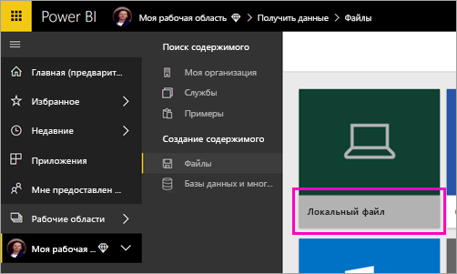

# Публикация отчета с разбивкой на страницы в службе Power BI

Из этой статьи вы узнаете, как опубликовать отчет с разбивкой на страницы в службе Power BI, передав его с локального компьютера. Отчеты с разбивкой на страницы можно передавать в личную рабочую область или в любую другую рабочую область, размещенную в емкости Premium. Найдите значок в виде бриллианта  рядом с именем рабочей области. 

Если источник данных отчета находится на локальном компьютере, после отправки отчета необходимо создать шлюз. См. раздел [Создание шлюза](#create-a-gateway) далее в этой статье.

## Добавление рабочей области в емкость Premium

Если рабочая область не имеет значка с бриллиантом  рядом с именем, ее следует добавить в емкость Premium. 

1. Выберите **Рабочие области**, щелкните многоточие ( **...** ) рядом с именем рабочей области и выберите **Изменить рабочую область**.

    

1. В диалоговом окне **Изменение рабочей области** разверните узел **Дополнительно**, затем переместите ползунок **Dedicated capacity** (Выделенная емкость) в положение **Вкл.**

    

   Возможно, вы не сможете внести такое изменение. В этом случае обратитесь к администратору емкости Power BI Premium, чтобы он предоставил вам права назначения для добавления рабочей области в емкость Premium.

## В построителе отчетов опубликуйте отчет с разбивкой на страницы

1. Создайте отчет с разбивкой на страницы в построителе отчетов и сохраните этот отчет на локальный компьютер.

1. В построителе отчетов в меню **Файл** выберите **Сохранить как**.

    

    Если вы еще не вошли в Power BI, войдите в систему или создайте учетную запись. В правом верхнем углу построителя отчетов выберите **Вход** и выполните требуемые действия.

2. В списке рабочих областей слева выберите рабочую область со значком ромба  рядом с именем. Заполните поле **Имя файла** и нажмите **Сохранить**. 

    

4. Откройте службу Power BI в браузере и перейдите к рабочей области Premium, где требуется опубликовать отчет с разбивкой на страницы. Отчет будет представлен на вкладке **Отчеты**.

    

5. Выберите отчет с разбивкой на страницы, чтобы открыть его в службе Power BI. Если отчет имеет параметры, выберите их, чтобы перейти к просмотру отчета.

    

6. Если источник данных для отчета находится на локальном компьютере, узнайте из этой статьи о том, как [создать шлюз](#create-a-gateway) для доступа к источнику данных.

## Отправка отчета с разбивкой на страницы в службе Power BI

Можно также перейти в службу Power BI и отправить отчет с разбивкой на страницы.

1. Создайте отчет с разбивкой на страницы в построителе отчетов и сохраните этот отчет на локальный компьютер.

1. Откройте службу Power BI в браузере и перейдите к рабочей области Premium, где вы намерены опубликовать отчет. Теперь здесь есть значок бриллианта  рядом с именем рабочей области. 

1. Выберите **Получить данные**.

    

1. В поле **Файлы** выберите **Получить**.

    

1. Выберите **Локальный файл**, перейдите к отчету с разбивкой на страницы и щелкните **Открыть**.

    

1. Щелкните **Продолжить** > **Изменить учетные данные**.

    

1. Введите учетные данные и щелкните **Вход**.

    

   Отчет будет представлен на вкладке **Отчеты**.

    

1. Выберите отчет, чтобы открыть его в службе Power BI. Если отчет имеет параметры, выберите их, чтобы перейти к просмотру отчета.
 
    

6. Если источник данных для отчета находится на локальном компьютере, узнайте из этой статьи о том, как [создать шлюз](#create-a-gateway) для доступа к источнику данных.

## Создание шлюза

Как и с любым другим отчете Power BI, если источник данных размещен на локальном компьютере, для доступа к этим данным следует создать или выбрать существующий шлюз.

1. Щелкните **Управление** рядом с именем отчета.

   

1. Подробное описание процесса и дальнейшие действия см. в статье [Что такое локальный шлюз данных](../connect-data/service-gateway-onprem.md).

## Дальнейшие действия

- [Просмотр отчета с разбивкой на страницы в службе Power BI](../consumer/paginated-reports-view-power-bi-service.md)
- [Сведения об отчетах с разбивкой на страницы в Power BI Premium](paginated-reports-report-builder-power-bi.md)
- [Руководство. Внедрение отчетов Power BI с разбивкой на страницы в приложение для клиентов](../developer/embedded/embed-paginated-reports-customers.md)
