# Создание отчета с разбивкой на страницы на основе общего набора данных Power BI

Вы можете использовать набор данных, созданный в Power BI Desktop, в качестве источника данных для отчетов с разбивкой на страницы в построителе отчетов Power BI. Представьте себе следующий сценарий. Вы создали отчет Power BI в Power BI Desktop. Вы потратили много сил на проектирование модели данных, а затем создали отличный отчет Power BI с разнообразными визуальными элементами. Отчет содержит матрицу с большим количеством строк, поэтому для их просмотра нужно осуществлять прокрутку. Читателям вашего отчета нужна возможность его печати с выводом всех строк в этой матрице. Отчет с разбивкой на страницы Power BI позволяет сделать следующее: распечатать таблицу или матрицу, которая занимает несколько страниц, с верхними и нижними колонтитулами, а также оптимальным макетом страницы, который вы разработали. Он будет дополнять собой отчет Power BI Desktop. Вы хотите, чтобы они основывались на одних и тех же данных без расхождений, поэтому используете один набор данных.

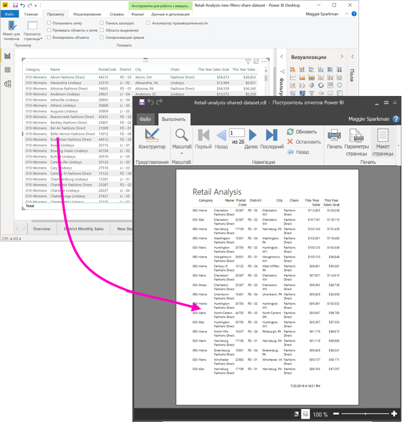

Набор данных необязательно должен находиться в рабочей области в емкости Premium и быть членом этой рабочей области. Вам нужно просто [разрешение на сборку](../connect-data/service-datasets-build-permissions.md) для набора данных. Для публикации отчета с разбивкой на страницы требуется лицензия Power BI Pro. Кроме того, для рабочей области в емкости Premium требуется по меньшей мере роль участника.

## Что нужно

Ниже приведен список нужных и ненужных компонентов для использования общего набора данных в построителе отчетов Power BI.

- Построитель отчетов Power BI. [Скачайте и установите построитель отчетов Power BI](https://aka.ms/pbireportbuilder).
- Чтобы обратиться к набору данных, вам требуется разрешение на сборку для него. См. описание [разрешения на сборку](../connect-data/service-datasets-build-permissions.md).
- Для создания отчета с разбивкой на страницы в построитель отчетов лицензия Power BI Pro не требуется. 
- А для публикации отчета с разбивкой на страницы лицензия Power BI Pro нужна. Кроме того, для рабочей области в емкости Premium требуется по меньшей мере роль участника. 
- Необязательно: если вы хотите следовать процедуре, описанной в этой статье, скачайте файл [Retail Analysis sample.pbix](https://download.microsoft.com/download/9/6/D/96DDC2FF-2568-491D-AAFA-AFDD6F763AE3/Retail%20Analysis%20Sample%20PBIX.pbix) для Power BI Desktop, откройте его в Power BI Desktop и добавьте таблицу со множеством столбцов. В области **Формат** отключите параметр **Итоги**. Затем опубликуйте его в рабочей области в службе Power BI.

    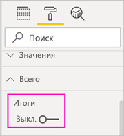

## Подключение к набору данных Power BI

1. Откройте построитель отчетов Power BI.
1. Выберите **Войти** в правом верхнем углу построителя отчетов, чтобы войти в учетную запись Power BI.
1. В области данных отчета выберите **Создать** > **Подключение к набору данных Power BI**.

    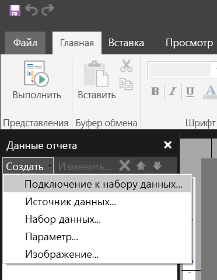

    > [!NOTE]
    > Вы не можете создать источник данных или набор данных для набора данных Power BI с помощью мастеров матриц, диаграмм или таблиц построителя отчетов. Создав их, вы можете использовать эти мастеры для создания на их основе таблиц, матриц или диаграмм.

1. Найдите набор данных или рабочую область, где он находится, и щелкните **Выбрать**.
    Построитель отчетов заполняет имя набора данных.

    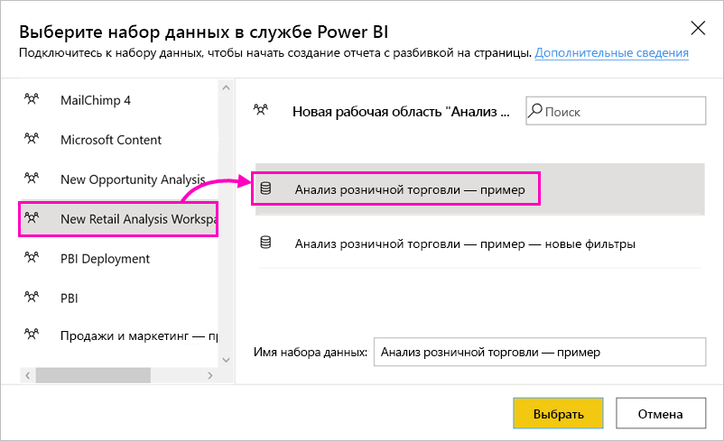
    
1. Набор данных отображается в списке "Источники данных" в области данных отчета.

    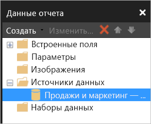

    Помните, что в одном отчете с разбивкой на страницы можно подключиться к нескольким наборам данных Power BI и другим источникам данных.

## Получение запроса DAX для набора данных

Если требуется, чтобы данные в отчете Power BI и в отчете построителя отчетов совпадали, подключения к набору данных недостаточно. Вам также нужен запрос, основанный на этом наборе данных.

### Видео. Получение запроса DAX

В следующем видео Крис Финлан демонстрирует, как получить запрос DAX, необходимый для отчета с разбивкой на страницы.

<iframe width="400" height="450" src="https://www.youtube.com/embed/NfoOK4QRkhI" frameborder="0" allowfullscreen></iframe>

### Шаги получения запроса DAX

Ниже приведены шаги получения запроса.

1. Откройте отчет Power BI (PBIX-файл) в Power BI Desktop.
1. Убедитесь, что в отчете есть таблица, содержащая все необходимые данные, которые должны присутствовать в отчете с разбивкой на страницы. Таблица должна удовлетворять следующим двум требованиям.
    - Она должна быть плоской таблицей, а не матрицей или другим визуальным элементом. Если это не таблица, преобразуйте ее в таблицу, выполните приведенные ниже шаги для анализатора производительности, а затем преобразуйте ее обратно в нужный визуальный элемент.
    - Для числовых полей необходимо использовать *предопределенные меры*. Рядом с ними есть символ калькулятора. Прочитайте о [создании мер](../transform-model/desktop-measures.md). 

        

1. На ленте **Вид** выберите **Анализатор производительности**.

    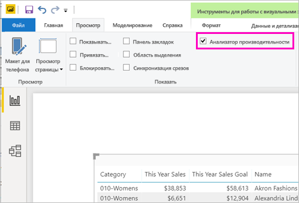

1. В области **Анализатор производительности** выберите **Начать запись** и затем **Обновить визуальные элементы**.

    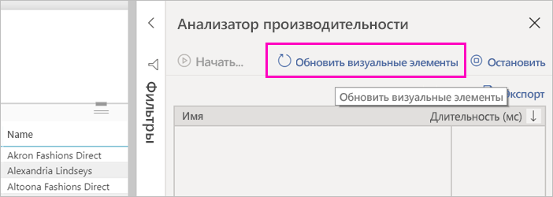

1. Разверните знак "плюс" ( **+** ) рядом с именем таблицы и выберите **Копировать запрос**. Запрос представляет собой формулу DAX, необходимую для набора данных в построителе отчетов Power BI.

    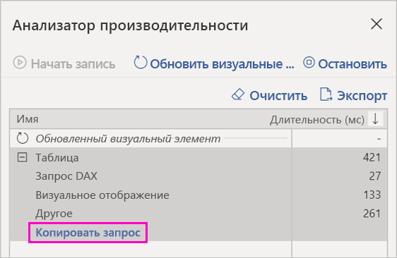

## Создание набора данных с использованием запроса

1. Вернитесь в построитель отчетов Power BI.
1. Щелкните правой кнопкой мыши набор данных в разделе **Источники данных** и выберите **Добавить набор данных**.

    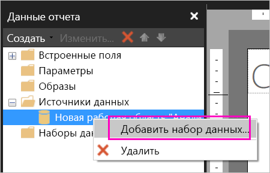

1. В свойствах набора данных присвойте ему имя и выберите **Конструктор запросов**.

4. Убедитесь, что выбран параметр **DAX**, и отмените выбор значка **Режим конструктора**.

    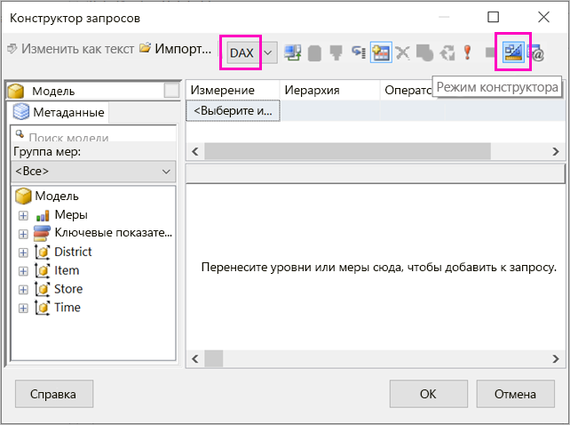

1. В верхней области вставьте запрос, скопированный из Power BI Desktop.

1. Выберите **Выполнить запрос** (красный восклицательный знак — !), чтобы убедиться, что запрос работает. 

    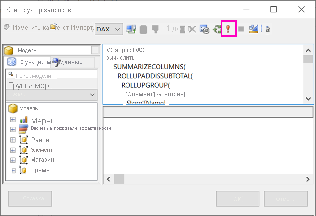

    Результаты запроса отображаются в нижней области.

    

1. Выберите **ОК**.

    Запрос отображается в окне **Запрос** диалогового окна **Свойства набора данных**.

    

1. Выберите **ОК**.

    Теперь вы увидите новый набор данных со списком его полей в области данных отчета.

    

## Создание таблицы в отчете

Один из быстрых способов создания таблицы заключается в использовании мастера таблиц.

1. На ленте **Вставка** выберите **Таблица** > **Мастер таблиц**.

    

1. Выберите набор данных, созданный с помощью запроса DAX, и нажмите кнопку **Далее**.

    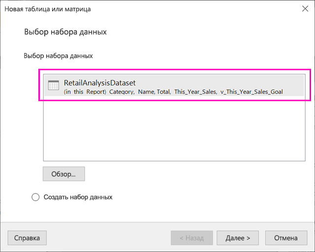

1. Чтобы создать плоскую таблицу, выберите нужные поля в списке **Доступные поля.** Можно выбрать несколько полей за раз. Для этого выберите первое из них, нажмите и удерживайте клавишу Shift и выберите последнее поле.

    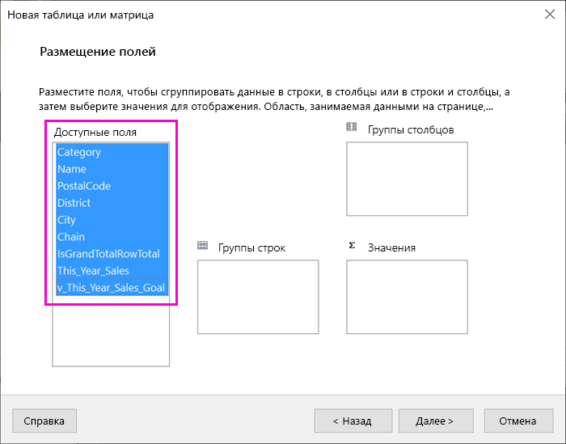

1. Перетащите поля в поле **Значения** и нажмите кнопку **Далее**.

    

1. Выберите нужные параметры макета и нажмите кнопку **Далее.**

1. Нажмите кнопку **Завершить**.
    Таблица отображается в представлении конструирования.

    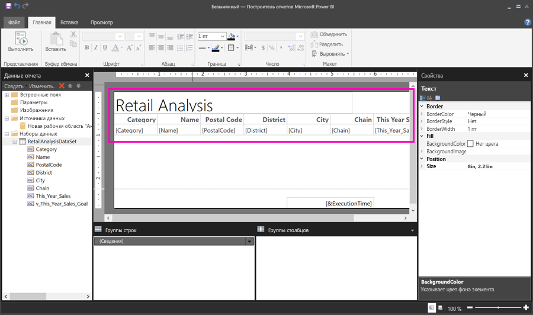

1. Выберите **Щелкните для добавления заголовка** и добавьте заголовок.

1. Выберите **Запустить**, чтобы посмотреть отчет.

    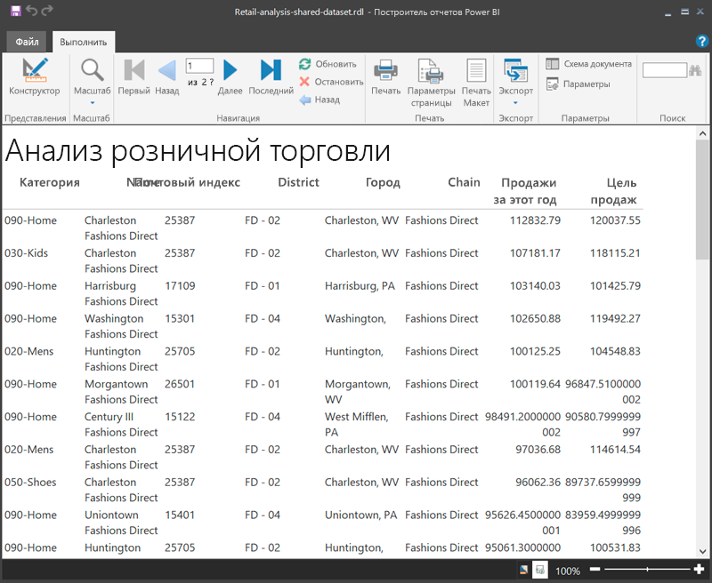

1. Выберите **Разметка страницы**, чтобы увидеть, как будет выглядеть отчет. 

    Этот макет отчета требует некоторой доработки. Он содержит 54 страницы, так как из-за столбцов и полей таблица занимает две страницы по ширине.

    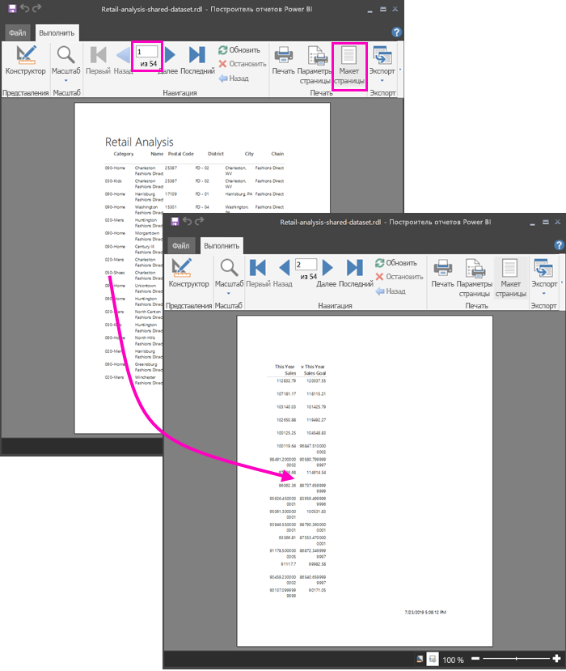

## Форматирование отчета

Существует несколько вариантов форматирования, позволяющих уместить таблицу на одной странице. 

1. Можно уменьшить поля страницы на панели "Свойства". Если панель свойств не отображается, установите флажок **Свойства** на ленте **Вид**.

1. Выберите отчет, а не таблицу или заголовок.
1. На панели **Свойства отчета** в области **Страница** разверните пункт **Поля** и измените каждое из них на **0,75 дюйма**.

    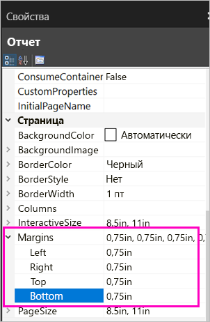

1. Также можно сузить столбцы. Выберите границу столбца и перетащите ее правую часть влево.

    

1. Кроме того, можно обеспечить правильность форматирования числовых значений. Выберите ячейку с числовым значением. 
    > [!TIP]
    > Можно отформатировать несколько ячеек за раз, удерживая клавишу SHIFT при выборе других ячеек.

    

1. На ленте **Главная** в разделе **Число** измените формат **По умолчанию** на числовой формат, такой как **Валюта**.

    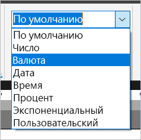

1. Измените стиль **Заполнитель** на **Образцы значений**, чтобы можно было просматривать форматирование в ячейке. 

    

1. При необходимости уменьшите число десятичных знаков в разделе **Число**, чтобы сэкономить место.

### Избавление от пустых страниц

Даже если вы сузили поля и столбцы таблицы, каждая вторая страница может оказаться пустой. Почему? Все дело в математике. 

Сумма заданных вами полей страницы и ширины *текста* отчета должна быть меньше ширины в формате отчета.

Предположим, что ваш отчет имеет формат 8,5 X 11 дюймов и вы задали боковые поля по 0,75 дюйма каждое. Вместе два этих поля составляют 1,5 дюйма, поэтому ширина текста должна быть меньше 7 дюймов.

1. Выберите правый край области конструктора отчета и перетащите его, чтобы его положение было меньше требуемого числа на линейке. 

    > [!TIP]
    > Более точно его можно настроить в свойствах **Текст**. В разделе **Размер** задайте свойство **Ширина**.

    

1. Выберите **Выполнить**, чтобы просмотреть отчет и убедиться, что вы избавились от пустых страниц. Теперь этот отчет содержит всего 26 страниц, а не 54, как раньше. Готово!

    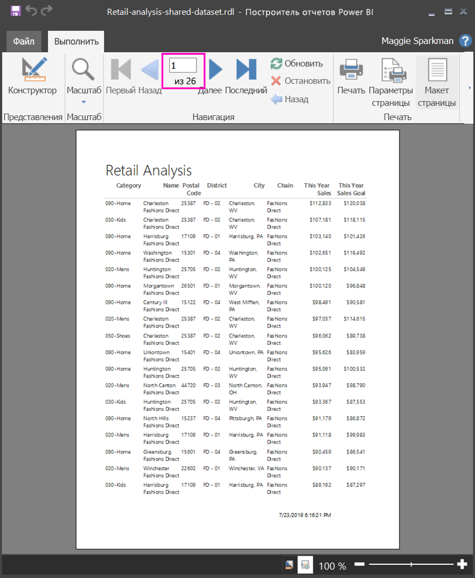

## Рекомендации и ограничения 

- Для наборов данных, использующих активное подключение к Analysis Services, можно подключиться напрямую, используя базовое соединение Analysis Services, а не общий набор данных.
- Наборы данных с повышенными или сертифицированными подтверждениями отображаются в списке доступных наборов данных, но они не помечены как таковые. 
- Невозможно внедрять отчеты с разбивкой на страницы, основанные на общих наборах данных Power BI, если данные принадлежат приложению.

## Дальнейшие действия

- [Сведения об отчетах с разбивкой на страницы в Power BI Premium](paginated-reports-report-builder-power-bi.md)
