# Изменение размера страницы отчета (руководство)
В [предыдущей статье и видео](power-bi-report-display-settings.md) вы узнали о двух разных способах управления отображением страницы в отчетах Power BI: **вид** и **размер страницы**. Теперь попробуем поработать с ними.

## Во-первых, изменим параметры представления страницы
1. Откройте отчет в режиме чтения или редактирования. В этом примере используется страница "Новые магазины" примера [Анализ розничной торговли](sample-retail-analysis.md).  Эта страница отображается с использованием параметра **По размеру страницы**.  В этом случае страница отчета отображается по размеру страницы без полос прокрутки, однако при этом некоторые детали и заголовки могут стать слишком мелкими и неразборчивыми.
   
   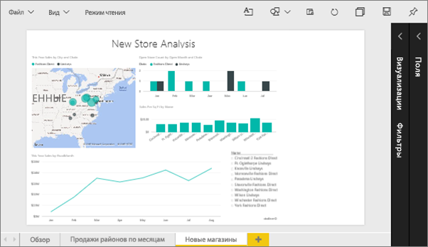
2. Убедитесь, что на холсте не выбраны визуализации. Выберите **Вид** и просмотрите параметры отображения.

* В режиме чтения вы увидите следующее:
  
     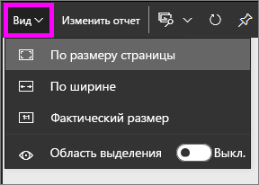
* В режиме правки вы увидите следующее:
  
    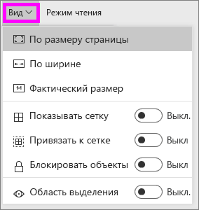

1. Давайте посмотрим, как будет выглядеть страница при использовании режима **Фактический размер**.
   
   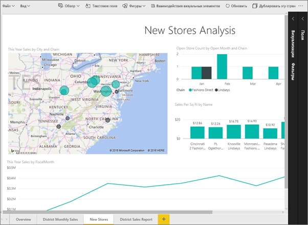
   
   Выглядит не очень. Панели мониторинга теперь содержит двойные полосы прокрутки.
2. Выберите режим **По ширине**.
   
   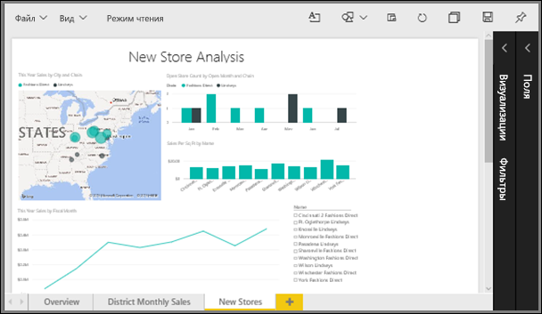
   
   Уже лучше. Появились полосы прокрутки, но читать данные стало проще.

## Изменение представления по умолчанию для страницы отчета
По умолчанию все отчеты Power BI отображаются в режиме **По размеру страницы**. Но что делать, если необходимо, чтобы страница отчета всегда открывалась в представлении **Фактический размер**?

1. На странице отчета **Новые магазины** снова включите представление **Фактический размер**.
   
   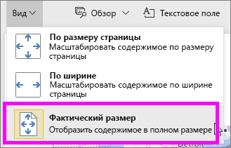
2. Сохраните отчет под другим именем, выбрав пункты **Файл > Сохранить как**. Теперь у вас есть 2 копии этого отчета. В исходном отчете страница **Новые магазины** будет открываться в представлении по умолчанию, как и раньше, а в новом отчете — в представлении **Фактический размер**. Давайте посмотрим.
   
   
3. В верхней области навигации выберите имя текущей рабочей области, чтобы вернуться к ней.  
   
   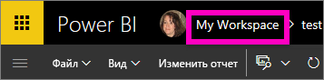
4. Перейдите на вкладку **Отчеты** и выберите только что созданный отчет (он будет отмечен желтой звездочкой).
   
    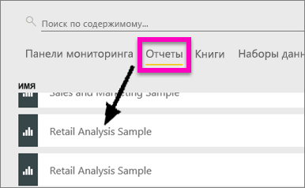
5. Отчет откроется в представлении **Фактический размер**.
   
   

## Теперь давайте ознакомимся с параметром *размера страницы*
Параметры размера страницы доступны только в [режиме редактирования](service-interact-with-a-report-in-editing-view.md). Чтобы открыть отчет в режиме редактирования, необходимо иметь разрешения владельца для него. Если вы подключились к любому из наших [образцов](sample-datasets.md), вы будете иметь разрешения владельца для этих отчетов.

1. В отчете [Анализ розничной торговли — пример](sample-retail-analysis.md) откройте страницу "Ежемесячные продажи по району" в режиме правки.
2. Убедитесь, что на холсте не выбраны визуализации.  В области **Визуализации** выберите значок валика .
3. Выберите **Размер страницы** &gt; **Тип**, чтобы отобразить варианты размера страницы.
   
   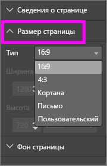
4. Выберите формат **Letter**.  На белой части холста останется только то содержимое, которое входит в область 816 x 1056 пикселей (формат Letter).
   
   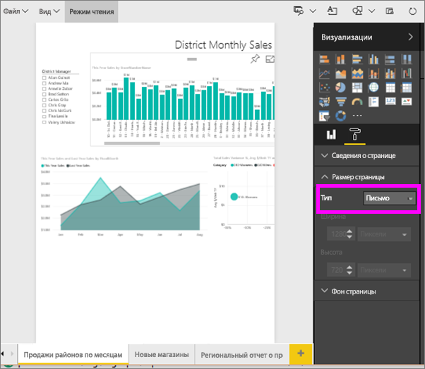
5. Если изменить режим **представления** на "По ширине", на полотне будет отображаться только то содержимое страницы, которое соответствует формату Letter.
   
   
6. Выберите **Размер страницы** с соотношением сторон **16:9**.
   
   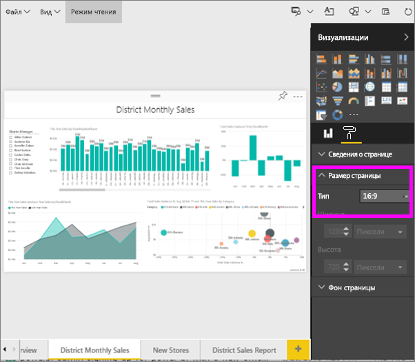
   
   Страница отчета будет отображаться в соотношении 16 (ширина) на 9 (высота). Чтобы узнать фактический используемый размер в пикселях, посмотрите на неактивные поля ширины и высоты (1280 x 720). Вокруг холста отчета много пустого пространства. Это связано с тем, что мы ранее задали режим **представления** "По ширине".
7. Попробуйте поработать с другими параметрами **размера страницы**.

## Совместное использование представления и размера страницы
Используйте настройки представления и размера страницы вместе, чтобы создать отчет, который будет хорошо выглядеть, если его встроить в другое приложение.

В этом упражнении вы создадите страницу отчета, которая будет отображаться в приложении с пространством размером 500 пикселей в ширину и 750 пикселей в высоту.

На предыдущем шаге мы видели, что сейчас страница отчета отображается размером 1280 пикселей в ширину и 720 пикселей в высоту. В таком случае нам нужно выполнить много действий для изменения размера и реорганизации, чтобы все визуальные элементы отображались как следует.

1. Измените размер визуальных элементов и переместите их так, чтобы они вместились в такую часть текущего полотна, которая меньше его половины.
   
    
2. Выберите **Размер страницы** &gt; **Пользовательский**.
3. Установите для ширины значение 500, а для высоты — 750.
   
    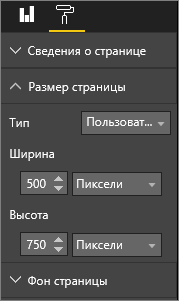
4. Настройте страницу отчета так, чтобы она выглядел наилучшим образом. Откорректируйте страницу, переключаясь между параметрами **Представление > Фактический размер** и **Представление > По размеру страницы**.
   
    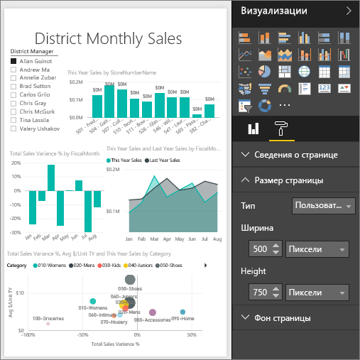

## Дальнейшие действия
[Создание пользовательской страницы ответов для Кортаны в Power BI](service-cortana-answer-cards.md)

Назад к статье [Параметры отображения страницы в отчете Power BI](power-bi-report-display-settings.md)

Дополнительные сведения об [отчетах в Power BI](service-reports.md).

Появились дополнительные вопросы? [Ответы на них см. в сообществе Power BI.](http://community.powerbi.com/)

