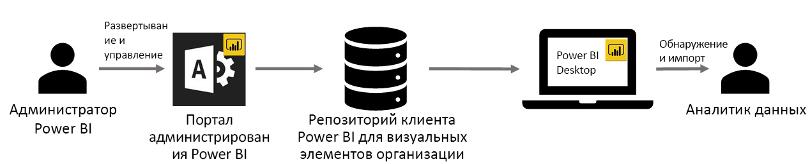

# Применение пользовательских визуальных элементов организации в Power BI

С помощью пользовательских визуальных элементов в Power BI вы можете создать уникальную визуализацию, которая соответствует вашим требованиям или аналитическим данным, которые нужно передать. Часто эти пользовательские визуальные элементы создаются разработчиками. Они создают их, когда многие визуальные элементы в Power BI не соответствуют их требованиям. 

Для некоторых организаций пользовательские элементы имеют еще большее значение. Они могут пригодиться для передачи данных или аналитических сведений, уникальных для организации. Организации могут иметь особые требования к данным или уделять большое внимание методам частного бизнеса. Таким организациям нужна разработка пользовательских визуальных элементов, их распространение по всей организации и правильное обслуживание. С помощью пользовательских визуальных элементов Power BI в организации можно выполнять все эти задачи.

На следующем рисунке показан путь пользовательских визуальных элементов в Power BI: передача от администратора на разработку и обслуживание, а затем к специалисту по анализу данных.

Визуальные элементы организации развертываются и управляются администратором Power BI с портала администратора. После того как пользовательские визуальные элементы организации развернуты в репозиторий организации, пользователи в организации могут легко находить и импортировать их непосредственно из Power BI Desktop в свои отчеты.

## Применение пользовательских визуальных элементов организации

Дополнительные сведения о применении созданных вами пользовательских визуальных элементов организации см. в статье [Пользовательские визуальные элементы в Power BI](power-bi-custom-visuals.md).
 
## Администрирование пользовательских визуальных элементов организации

Дополнительные сведения о способах администрирования и развертывания пользовательских визуальных элементов организации, а также управления ими см. в [этом разделе](https://go.microsoft.com/fwlink/?linkid=866790).

> [!WARNING]
> Пользовательский визуальный элемент может содержать код, подвергающий риску безопасность или конфиденциальность. Прежде чем развертывать пользовательский визуальный элемент в репозиторий организации, убедитесь в надежности его автора и источника. 
> 

## Рекомендации и ограничения
 
Есть некоторые рекомендации и ограничения, которые нужно учитывать.
 
Администратор

* Устаревшие пользовательские визуальные элементы (например, пользовательские визуальные элементы, которые созданы не на основе API новых версий) не поддерживаются.

* Если пользовательский визуальный элемент удален из репозитория, все отчеты, в которых использовался этот элемент, перестанут отображаться. Удаление из репозитория необратимо. Чтобы на время отключить пользовательский визуальный элемент, используйте функцию "Отключить".
 
Пользователь

* Коллекция рабочих областей Power BI не поддерживается для визуальных элементов организации.

* Визуальные элементы Visio, PowerApps и GlobeMap из магазина AppSource не будут отображаться, если они развернуты в репозиторий организации.
