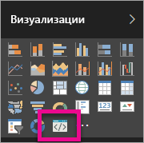

# Устранение неполадок с настраиваемыми визуальными элементами Power BI

## Отладить

**Команда pbiviz не найдена (или похожие ошибки)**

При запуске `pbiviz` в командной строке терминала вы увидите экран справки. Если этого не произойдет, значит, имеются проблемы с установкой. Убедитесь, что на компьютере установлен NodeJS версии 4.0.

**Не удается найти визуальный элемент отладки на вкладке "Визуализации"**

Визуальный элемент отладки выглядит как значок запроса на вкладке **Визуализации**.

Если он не отображается, убедитесь, что он включен в параметрах Power BI.

> [!NOTE]
> В настоящее время визуальный элемент отладки доступен только в службе Power BI, а не в Power BI Desktop или мобильном приложении. Однако упакованный визуальный элемент можно будет использовать везде.

**Не удается связаться с сервером визуальных элементов**

Запустите сервер визуальных элементов с помощью команды `pbiviz start` в командной строке терминала из корня вашего проекта визуальных элементов. Если сервер не запускается, скорее всего, SSL-сертификаты не установлены должным образом.

## Дальнейшие действия

Дополнительные сведения и ответы на вопросы: [Часто задаваемые вопросы о пользовательских визуальных элементах Power BI](power-bi-custom-visuals-faq.md#organizational-custom-visuals).
