# Пользовательские визуальные элементы в Power BI

При создании или редактировании отчета Power BI доступно множество различных визуальных элементов. Эти визуальные элементы отображаются в области **Визуализации**. Когда вы скачиваете [Power BI Desktop](https://powerbi.microsoft.com/en-us/desktop/) или открываете службу [Power BI](https://app.powerbi.com), этот предварительно упакованный набор визуальных уже входит в комплект поставки.

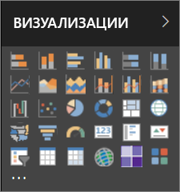

Но вам не обязательно использовать именно этот набор. Нажав кнопку с многоточием, можно открыть другой источник визуальных элементов для отчета: *Настраиваемые визуальные элементы*.

Разработчики создают пользовательские визуальные элементы с помощью пакета SDK для этих элементов, чтобы бизнес-пользователи могли просматривать свои данные в формате, который больше всего подходит для организации. В дальнейшем авторы отчетов смогут импортировать файлы пользовательских визуальных элементов в свои отчеты и использовать эти визуальные элементы как любые другие в Power BI. Настраиваемые визуальные элементы в Power BI являются объектами высшего класса. Их можно фильтровать, выделять, изменять, совместно использовать и т. д.

Для настраиваемых визуальных элементов используется один из трех форматов каналов развертывания:

* Файлы пользовательских визуальных элементов
* Визуальные элементы организации
* Визуальные элементы из Marketplace

## Файлы пользовательских визуальных элементов

Пользовательские визуальные элементы представляют собой пакеты с кодом для отображения данных, предназначенных для этих элементов. Любой пользователь может создать настраиваемый визуальный элемент и упаковать его в один `.pbiviz`-файл, который можно импортировать в отчет Power BI.

> [!WARNING]
> Пользовательский визуальный элемент может содержать код, угрожающий безопасности или конфиденциальности. Перед импортом в отчет убедитесь в надежности автора и источника пользовательского визуального элемента.

## Визуальные элементы организации

Администраторы Power BI могут развернуть пользовательские визуальные элементы в своей организации, чтобы авторы отчетов могли легко найти и работать с ними, если администратор утвердил их для использования в организации. Администратор может выбирать, какие пользовательские визуальные элементы будут развернуты в организации, и легко управлять этими элементами, например включать и отключать их или обновлять их версии. Авторам отчетов предоставляется простой способ поиска уникальных для организации визуальных элементов и полная поддержка в их обновлении.

Дополнительные сведения о пользовательских визуальных элементах организации см. в [этой статье](power-bi-custom-visuals-organization.md).

## Визуальные элементы из Marketplace

Члены сообщества и специалисты Майкрософт создали свои пользовательские визуальные элементы и опубликовали их в магазине [AppSource](https://appsource.microsoft.com/en-us/marketplace/apps?product=power-bi-visuals), чтобы каждый мог работать с ними. Эти визуальные элементы можно загрузить и добавлять в отчеты Power BI. Все эти пользовательские визуальные элементы протестированы на предмет функциональности и качества и утверждены корпорацией Майкрософт.

Что такое [AppSource](developer/office-store.md)? Это место, где можно найти приложения, надстройки и расширения для программного обеспечения корпорации Майкрософт. [AppSource](https://appsource.microsoft.com/en-us/) позволяет миллионам пользователей таких продуктов, как Office 365, Azure, Dynamics 365, Cortana и Power BI, находить решения, с помощью которых можно выполнять работу более эффективно, продуманно или элегантно.

### Сертифицированные визуальные элементы

Сертифицированные визуальные элементы Power BI — это визуальные элементы из Marketplace, которые прошли дополнительную тщательную проверку качества. Все они поддерживаются в дополнительных сценариях, таких как [подписка по электронной почте](https://docs.microsoft.com/power-bi/service-report-subscribe) и [экспорт в PowerPoint](https://docs.microsoft.com/power-bi/service-publish-to-powerpoint).
Просмотреть список сертифицированных пользовательских визуальных элементов или отправить свои визуальные элементы можно [здесь](https://docs.microsoft.com/power-bi/power-bi-custom-visuals-certified).

Вы являетесь веб-разработчиком и заинтересованы в том, чтобы создавать собственные визуальные элементы и добавлять их в AppSource? См. статью [Разработка пользовательского визуального элемента Power BI](developer/custom-visual-develop-tutorial.md) и узнайте, как [публиковать пользовательские визуальные элементы в AppSource](https://appsource.microsoft.com/en-us/marketplace/apps?product=power-bi-visuals).

### Импорт настраиваемого визуального элемента из файла

1. В нижней части панели "Визуализации" нажмите кнопку с многоточием.

    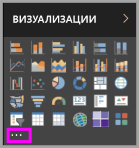

2. В раскрывающемся списке выберите **Импортировать из файла**.

    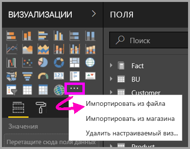

3. В меню "Открыть файл" выберите `.pbiviz`-файл для импорта и нажмите кнопку "Открыть". В нижнюю часть области "Визуализации" добавляется значок настраиваемого визуального элемента, а это значит, что теперь он доступен для использования в отчете.

    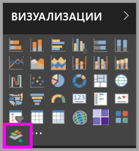

### Импорт визуальных элементов организации

1. В нижней части панели "Визуализации" нажмите кнопку с многоточием.

    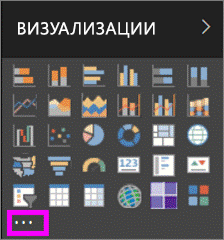

2. В раскрывающемся списке выберите "Импорт из магазина".

    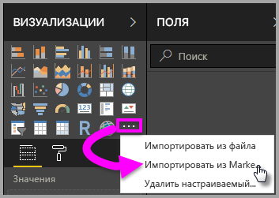

3. Выберите **MY ORGANIZATION** (Моя организация) в верхней части меню вкладки.

    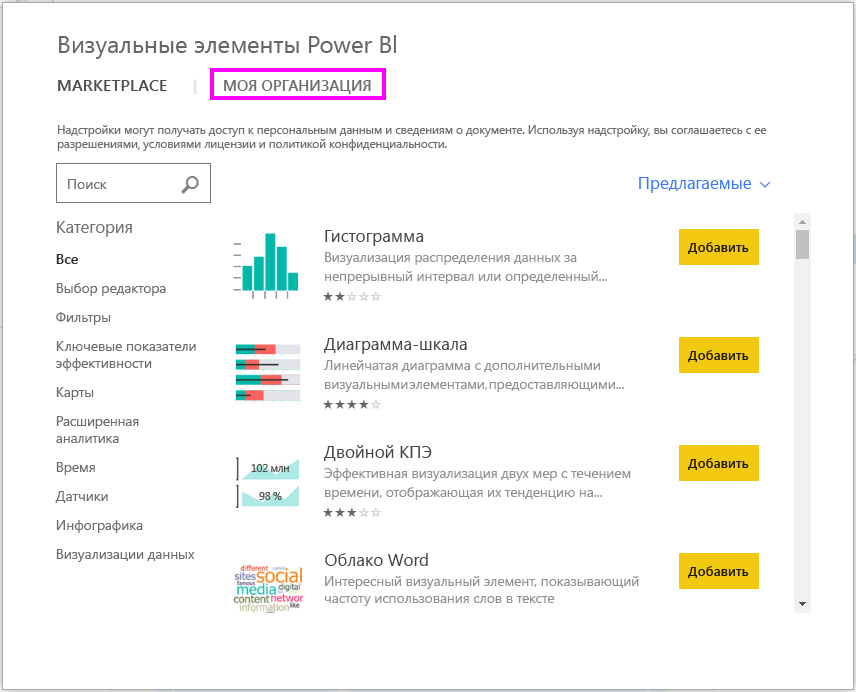

4. Прокрутите список и найдите визуальный элемент для импорта.

    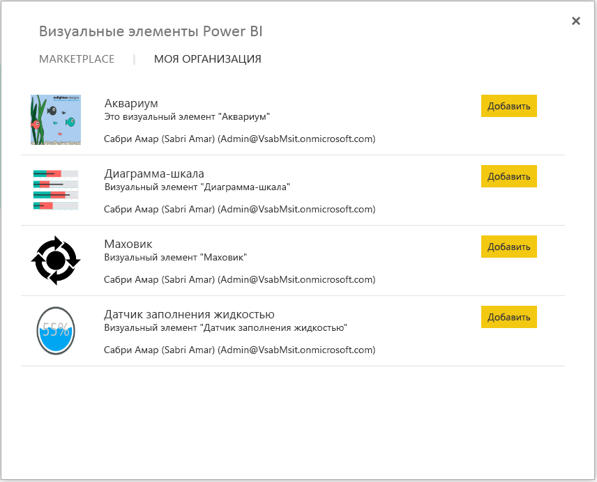

5. Импортируйте настраиваемый визуальный элемент, выбрав **Добавить**. В нижнюю часть области "Визуализации" добавляется значок настраиваемого визуального элемента, а это значит, что теперь он доступен для использования в отчете.

    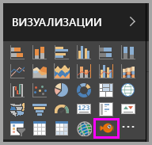

## Скачать или импортировать настраиваемые визуальные элементы из Microsoft AppSource

Вы можете скачать и импортировать настраиваемые визуальные элементы двумя способами: из Power BI и с веб-сайта AppSource.

### Импорт настраиваемых визуальных элементов из Power BI

1. В нижней части панели "Визуализации" нажмите кнопку с многоточием.

    

2. В раскрывающемся списке выберите **Импорт из магазина**.

    

3. Прокрутите список и найдите визуальный элемент для импорта.

    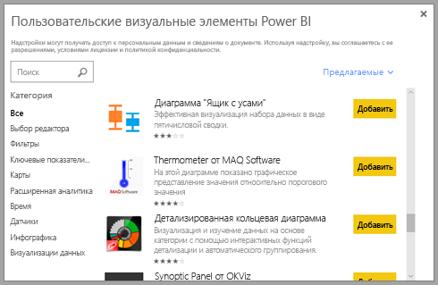

4. Чтобы получить дополнительные сведения об одном из визуальных элементов, выделите и выберите его.

    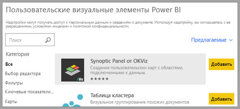

5. На странице сведений могут быть представлены снимки экрана, видео, подробное описание и многое другое.

    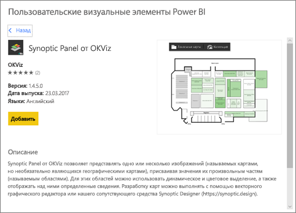

6. Прокрутите вниз, чтобы просмотреть обзоры.

    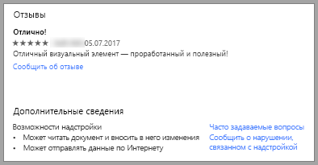

7. Импортируйте пользовательский визуальный элемент, нажав "Добавить". В нижнюю часть области "Визуализации" добавляется значок настраиваемого визуального элемента, а это значит, что теперь он доступен для использования в отчете.

    

### Скачивание и импорт настраиваемых визуальных элементов из Microsoft AppSource

1. Войдите в [Microsoft AppSource](https://appsource.microsoft.com) и выберите вкладку **Приложения**.

    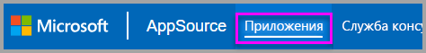

2. Перейдите на [страницу результатов с приложениями](https://appsource.microsoft.com/en-us/marketplace/apps), где показаны лучшие представители каждой категории, включая *приложения Power BI*. Но мы ищем настраиваемые визуальные элементы, так что давайте конкретизируем результаты, выбрав **Power BI visuals** (Визуальные элементы Power BI) в списке на панели навигации слева.

    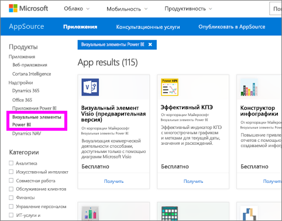

3. В AppSource отобразится плитка для каждого настраиваемого визуального элемента.  Каждая плитка содержит моментальный снимок настраиваемого визуального элемента, краткое описание и ссылку для скачивания. Выберите плитку, чтобы получить дополнительные сведения.

    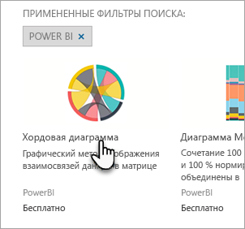

4. На странице сведений могут быть представлены снимки экрана, видео, подробное описание и многое другое. Чтобы скачать настраиваемый визуальный элемент, выберите **Get it now** (Получить) и примите условия использования.

    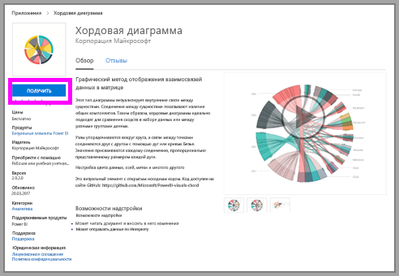

5. Перейдите по этой ссылке для скачивания настраиваемого визуального элемента.

    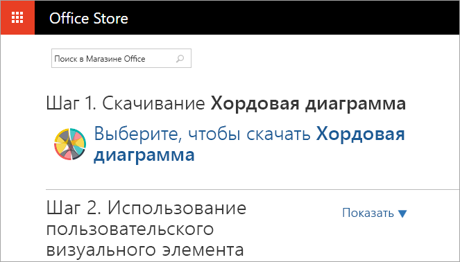

    На странице скачивания также приведены инструкции по импорту пользовательского визуального элемента в Power BI Desktop и службу Power BI.

    Вы также можете скачать пример отчета, в котором используется этот пользовательский визуальный элемент и демонстрируются его возможности.

    

6. Сохраните PBIVIZ-файл и откройте Power BI.

7. Импортируйте PBIVIZ-файл в отчет (см. раздел [Импорт настраиваемого визуального элемента из файла](#import-a-custom-visuals-from-a-file) выше).

## Рекомендации и ограничения

* При импорте пользовательский визуальный элемент добавляется в определенный отчет. Если вы хотите использовать этот визуальный элемент в другом отчете, необходимо также импортировать его в этот отчет. При сохранении отчета с пользовательским визуальным элементом с помощью параметра **Сохранить как** вместе с новым отчетом сохраняется копия пользовательского визуального элемента.

* Если область **Визуализации** не отображается, значит, вы не изменили разрешения для отчета.  Чтобы добавить настраиваемые визуальные элементы в отчеты, необходимо обладать правами на внесение изменений. Вы не можете добавлять их в отчеты, к которым предоставлен общий доступ.

## Устранение неполадок

Сведения об устранении неполадок: [Устранение неполадок с настраиваемыми визуальными элементами Power BI](power-bi-custom-visuals-troubleshoot.md).

## ВОПРОСЫ И ОТВЕТЫ

Дополнительные сведения и ответы на вопросы: [Часто задаваемые вопросы о пользовательских визуальных элементах Power BI](power-bi-custom-visuals-faq.md#organizational-custom-visuals).

## Дальнейшие действия

* [Визуализации в Power BI](visuals/power-bi-report-visualizations.md)

Появились дополнительные вопросы? [Ответы на них см. в сообществе Power BI](http://community.powerbi.com/).
