# Ознакомление с панелью "Фильтры" отчета
Эта статья содержит подробную информацию о панели "Фильтры" отчета. Вы увидите панель в [режиме правки и режиме чтения службы Power BI](service-reading-view-and-editing-view.md) и в [представлении "Отчет Power BI Desktop"](desktop-report-view.md).

Так как в Power BI есть много разных способов фильтрации данных, мы рекомендуем сначала ознакомиться со статьей [О фильтрах и выделении](power-bi-reports-filters-and-highlighting.md).

## Работа с фильтрами
Отчеты можно открывать в [режиме правки или чтения](service-reading-view-and-editing-view.md). В режиме правки владельцы отчета могут [добавлять фильтры в отчет](power-bi-report-add-filter.md); эти фильтры сохраняются вместе с отчетом. Пользователи, просматривающие отчет в режиме чтения, могут взаимодействовать с фильтрами, но не могут сохранять внесенные в отчет изменения.

## Фильтры в режиме чтения
Когда отчет открыт в режиме чтения, панель "Фильтры" отображается на холсте отчета справа. Если область не отображается, разверните ее, щелкнув стрелку в правом верхнем углу.

В этом примере мы выбрали визуализацию с шестью фильтрами. Страница отчета также содержит фильтры, перечисленные в разделе **Фильтры уровня страницы**. В отчете используется один [фильтр детализации](power-bi-report-add-filter.md), и весь отчет также содержит фильтр: **FiscalYear is 2013 or 2014** (ФинГод (2013 или 2014)).

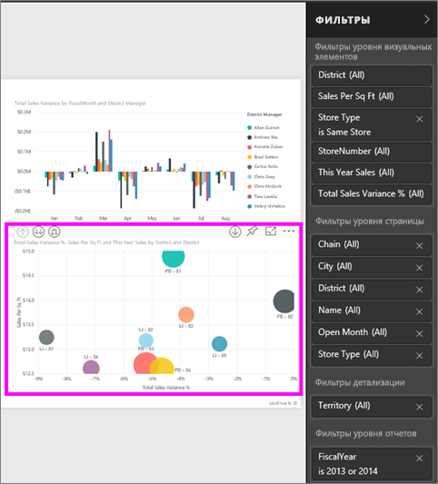

Напротив некоторых фильтров отображается слово **All**. Это значит, что все значения включены в фильтр.  Например, поле **Chain(All)**, изображенное на снимке экрана ниже, означает, что эта страница отчета включает данные обо всех сетях магазинов.  С другой стороны, фильтр уровня отчета **FiscalYear is 2013 or 2014** означает, что в отчет включены только данные за финансовые года 2013 и 2014.

Вот как пользователи, просматривающие этот отчет, могут взаимодействовать с этими фильтрами

* (чтобы просмотреть данные о фильтре, наведите курсор мыши и выберите стрелку рядом с фильтром):
  
   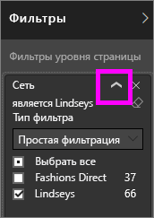
* измените фильтр, например выберите **Lindseys** вместо **Fashions Direct**;
  
     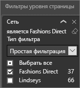
* фильтр можно удалить, выбрав значок **x** рядом с именем фильтра.
  
  Если удалить фильтр, он исчезнет из списка, но данные из отчета не удаляются.  Например, если удалить фильтр **FiscalYear is 2013 or 2014**, данные о фискальных годах останутся в отчете, но фильтрация больше не будет выполняться только по 2013 и 2014 годам. Отобразятся данные по всем фискальным годам.  При этом удаленный фильтр больше нельзя изменять, так как он исчезает из списка. Лучше удалить фильтр с помощью значка ластика .
  
  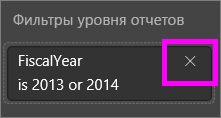

## Фильтры в режиме правки
Когда отчет открыт в режиме правки, панель "Фильтры" отображается на холсте отчета справа в нижней части **панели визуализации**. Если область не отображается, разверните ее, щелкнув стрелку в правом верхнем углу.

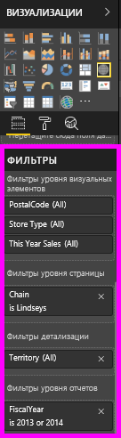.  

Если на полотне не выбран визуальный элемент, на панели "Фильтры" отображаются только фильтры, применяемые ко всей странице отчета или ко всему отчету, и любые фильтры детализации (если они настроены). В следующем примере визуальный элемент не выбран, фильтры детализации и фильтры уровня страницы отсутствуют, но есть фильтр уровня отчета.  

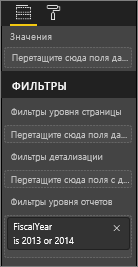  

Если на холсте выбран визуальный элемент, также будут отображены фильтры, применяемые только к этому визуальному элементу:   

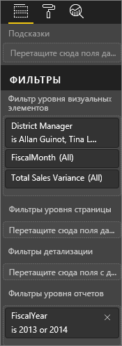

Чтобы отобразить параметры для определенного фильтра, щелкните стрелку вниз возле имени фильтра.  В следующем примере для фильтра на уровне отчета заданы значения "2013" и "2014". Это пример **основной фильтрации**.  Чтобы отобразить дополнительные параметры, выберите **расширенную фильтрацию**.

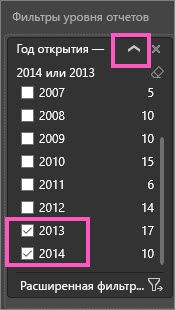

## Очистка фильтра
 Чтобы сбросить настройки фильтра, в основном или расширенном режиме фильтрации выберите значок с изображением ластика . 

## Добавление фильтра
* В режиме правки добавьте фильтр для визуализации, страницы, детализации или отчета, выбрав поле на панели "Поле" и перетащив его в соответствующую область фильтра, где отображаются слова **Перетащите сюда поля**. Когда поле будет добавлено в качестве фильтра, настройте его с помощью базовых и расширенных элементов управления фильтрацией (см. ниже).

- **Когда вы перетаскиваете поле в область фильтров уровня визуальных элементов, вы не добавляете его в визуализацию**, но это позволяет фильтровать визуализацию с помощью этого нового поля. В примере ниже элемент **Chain** добавляется в визуализацию в качестве нового фильтра. Обратите внимание, что само по себе добавление элемента **Chain** в качестве фильтра не изменяет визуализацию. Для этого требуется использовать базовые или расширенные элементы управления фильтрацией.

    

* Все поля, которые используются для создания визуализации, также доступны в качестве фильтров. Сначала выберите визуализацию, чтобы сделать ее активной. Все поля, используемые визуализацией, определены на панели "Поля" (если выбрано представление редактирования) и перечислены на панели "Фильтры" в разделе **Фильтры уровня визуальных элементов**.
  
   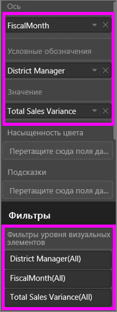  
  
   Настройте любое из этих полей с помощью базовых и расширенных элементов управления фильтрацией (см. ниже).

## Типы фильтров: фильтры текстовых полей
### Режим списка
Установка или снятие флажка позволяет выбирать или отменять выбор значения. Флажок **Все** может использоваться для включения или отключения флажков. Флажки представляют все доступные значения для этого поля.  При настройке фильтра формулировка обновляется, отражая сделанный выбор. 

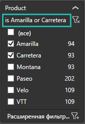

Обратите внимание, что теперь используется формулировка "Amarilla или Carretera".

### Расширенный режим
Выберите **Расширенная фильтрация** , чтобы переключиться в расширенный режим. С помощью раскрывающихся списков и текстовых полей определите включаемые поля. Выбрав **И** или **Или**, можно создать сложные выражения фильтрации. Задав нужные значения, нажмите кнопку **Применить фильтр**.  

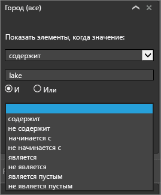

## Типы фильтров: фильтры числовых полей
### Режим списка
Если значения являются конечными, при выборе имени поля отображается список.  Сведения об использовании флажков см. выше, в подразделе **Фильтры текстовых полей** &gt; **Режим списка**.   

### Расширенный режим
Если значения являются бесконечными или представляют диапазон, при выборе имени поля открывается расширенный режим фильтрации. С помощью раскрывающихся списков и текстовых полей укажите нужный диапазон значений. 

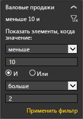

Выбрав **И** или **Или**, можно создать сложные выражения фильтрации. Задав нужные значения, нажмите кнопку **Применить фильтр**.

## Типы фильтров: дата и время
### Режим списка
Если значения являются конечными, при выборе имени поля отображается список.  Сведения об использовании флажков см. выше, в подразделе **Фильтры текстовых полей** &gt; **Режим списка**.   

### Расширенный режим
Если значения поля представляют дату или время, при использовании фильтров даты и времени можно указать начальное и конечное время.  

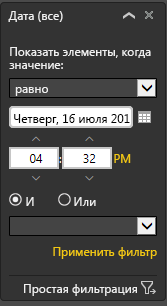

## Дальнейшие действия
[Фильтры и выделение в отчетах](power-bi-reports-filters-and-highlighting.md)  
[Взаимодействие с отчетом в режиме чтения в Power BI](service-reading-view-and-editing-view.md)  
[Создание фильтров в режиме правки отчета](power-bi-report-add-filter.md)  
[Взаимодействие с визуализациями в отчете Power BI](service-reports-visual-interactions.md)

Дополнительные сведения об [отчетах в Power BI](service-reports.md)  
[Power BI — основные понятия](service-basic-concepts.md)

Появились дополнительные вопросы? [Ответы на них см. в сообществе Power BI.](http://community.powerbi.com/)

