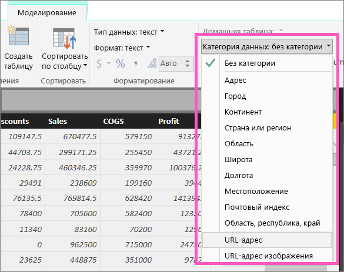
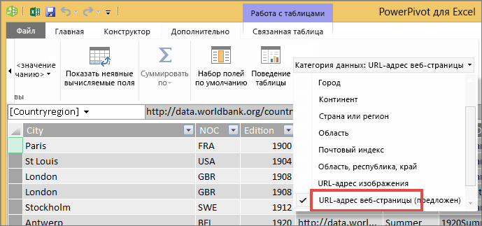

# Гиперссылки в таблицах
В этой статье объясняется, как использовать Power BI Desktop для создания гиперссылок. Используйте Power BI Desktop или службу Power BI, чтобы добавить созданные гиперссылки в таблицы отчета и матрицы. 

> **Примечание.** Гиперссылки на [плитках](service-dashboard-edit-tile.md) и в [текстовых полях информационных панелей](service-dashboard-add-widget.md) можно моментально создать с помощью службы Power BI. Гиперссылки в [текстовых полях в отчетах](service-add-hyperlink-to-text-box.md) можно моментально создать с помощью службы Power BI и Power BI Desktop.
> 
> 

## Создание гиперссылки в таблице или матрице с использованием Power BI Desktop
Гиперссылки в таблицах и матрицах можно создавать в Power BI Desktop, но не в службе Power BI. Кроме того, их можно создавать в Excel Power Pivot перед импортом книги в Power BI. Оба способа описаны ниже.

## Создание гиперссылки в таблице или матрице в Power BI Desktop
Процедура добавления гиперссылки зависит от того, были ли данные импортированы или подключены с помощью DirectQuery. Оба сценария описаны ниже.

### Для данных, импортированных в Power BI
1. Если гиперссылка еще не существует как поле в наборе данных, добавьте ее как [пользовательский столбец](desktop-common-query-tasks.md) с помощью приложения Power BI Desktop.
2. В представлении данных выделите столбец, а затем на вкладке **Моделирование** выберите раскрывающийся список **Категория данных**.
   
    
3. Выберите **URL-адрес веб-сайта**.
4. Переключитесь в представление отчета и создайте таблицу или матрицу, используя поле с категорией "URL-адрес веб-сайта". Гиперссылки будут выделены синим цветом и подчеркиванием.
   
    
5. Вместо длинного URL-адреса в таблице можно отобразить значок гиперссылки . Обратите внимание, что значки в матрицах невозможно отобразить.
   
   * Выберите диаграмму, чтобы сделать ее активной.
   * Откройте вкладку форматирования, щелкнув значок валика .
   * Разверните узел **Значения**, найдите **значок URL-адреса** и установите для него значение **Вкл.**
6. (Необязательно.) [Опубликуйте отчет с Power BI Desktop в службе Power BI](guided-learning/publishingandsharing.yml?tutorial-step=2) и откройте его в этой службе. Гиперссылки там также будут работать.

### Для данных, подключенных с помощью DirectQuery
В режиме DirectQuery нельзя создать новый столбец.  Но если данные уже содержат URL-адреса, то их можно превратить в гиперссылки.

1. В представлении отчета создайте таблицу с помощью поля, которое содержит URL-адреса.
2. Выделите столбец, а затем на вкладке **Моделирование** выберите раскрывающийся список **Категория данных**.
3. Выберите **URL-адрес веб-сайта**. Гиперссылки будут выделены синим цветом и подчеркиванием.
4. (Необязательно.) [Опубликуйте отчет с Power BI Desktop в службе Power BI](guided-learning/publishingandsharing.yml?tutorial-step=2) и откройте его в этой службе. Гиперссылки там также будут работать.

## Создание гиперссылки в таблице или матрице в Excel Power Pivot
Другим способом добавления гиперссылок в таблицы и матрицы Power BI является создание гиперссылок в наборе данных перед подключением к набору данных и его импортом из Power BI. В этом примере используется книга Excel.

1. Откройте книгу в Excel.
2. Перейдите на вкладку **PowerPivot** , а затем выберите **Управление**.
   
   
3. В открывшемся окне Power Pivot выберите вкладку **Дополнительно**.
   
   
4. Поместите курсор в столбец, содержащий URL-адреса, которые вы хотите преобразовать в гиперссылки в таблицах Power BI.
   
   > **ПРИМЕЧАНИЕ.** URL-адреса должны начинаться с **http://, https://** или **www**.
   > 
   > 
5. В группе **Свойства отчетов** щелкните раскрывающийся список **Категория данных** и выберите **URL-адрес веб-сайта**. 
   
   
6. В службе Power BI или Power BI Desktop подключитесь к этой книге или импортируйте ее.
7. Создайте визуализацию таблицы, содержащую поле URL-адреса.
   
   

## Рекомендации и устранение неполадок
Вопрос. Можно ли использовать настраиваемый URL-адрес в качестве гиперссылки в таблице или матрице?    
Ответ. Нет. Можно использовать значок ссылки. Если вам нужен настраиваемый текст для гиперссылок и ваш список URL-адресов короткий, попробуйте использовать текстовое поле.

## Дальнейшие действия
[Визуализации в отчетах Power BI](power-bi-report-visualizations.md)

[Power BI — основные понятия](service-basic-concepts.md)

Появились дополнительные вопросы? [Ответы на них см. в сообществе Power BI.](http://community.powerbi.com/)

