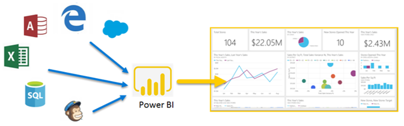

# Что такое Power BI?
**Power BI** — это коллекция программных служб, приложений и соединителей, которые взаимодействуют друг с другом, чтобы превратить разрозненные источники данных в согласованные, визуально иммерсивные и интерактивные аналитические данные. Ваши данные могут быть представлены в виде таблицы Excel или коллекции облачных и локальных гибридных хранилищ данных. Power BI позволяет легко подключиться к источникам данных, визуализировать и обнаружить, что является важным и видеозаписях любой пользователь или каждый из.

Power BI может быть простой и быстрый, которая позволяет создавать быстрый анализ данных из электронной таблицы Excel или локальной базы данных. Но Power BI также является надежным продуктом корпоративного уровня, все готово для масштабного моделирования и аналитика в реальном времени, а также разработки. Его можно личных отчеты и средства визуализации и также служить ядро анализа и принятия решений для групповых проектов, подразделений или целых корпораций.

## Компоненты Power BI
Power BI состоит из: 
- Вызывается классического приложения Windows **Power BI Desktop**
- Online SaaS (*программное обеспечение как услуга*) служба, которая называется **службе Power BI** 
- Power BI **мобильных приложений** для Windows, iOS и Android

Эти три элемента&mdash;Power BI Desktop, служба и мобильных приложениях&mdash;позволяют пользователям создавать, совместно использовать и использовать бизнес-инсайты с точки зрения личных их, или их роли, наиболее эффективно.

Четвертый элемент — **Сервер отчетов Power BI** — позволяет публиковать отчеты Power BI, созданные в Power BI Desktop, на локальным сервере отчетов. См. дополнительные сведения о [сервере отчетов Power BI](#on-premises-reporting-with-power-bi-report-server).

## Как Power BI соотносится с вашей ролью или должностью
Подход к использованию Power BI может зависеть от вашей роли в проекте или в рабочей группе. Другие люди, занимающие другие должности, могут использовать Power BI по-разному.

Например, вы можете использовать преимущественно **службу Power BI**. Ваш коллега, занимающийся обработкой числовых данных и составлением бизнес-отчетов, может активно использовать **Power BI Desktop** для создания и публикации таких отчетов в службу Power BI, чтобы вы могли их просматривать. Другой коллеге, продажи, главным образом использовать в своих **приложение Power BI** для отслеживания хода выполнения на своих продаж и чтобы просмотреть соответствующие подробные сведения о новом потенциальных покупателей.

Разработчики могут применять API-интерфейсы Power BI для отправки данных в наборы данных и для внедрения панелей мониторинга и отчетов в пользовательские приложения. Вы придумали новый визуальный элемент? Создайте его для себя и поделитесь с другими.  

Вы также можете использовать Power BI каждый элемент в разное время в зависимости от того, что вы пытаетесь добиться или вашей роли для данного проекта.

Вы можете выбрать подходящий вариант использования Power BI в зависимости от того, какой компонент или служба Power BI лучше подходит для решения конкретной задачи. Например Power BI Desktop можно использовать для создания отчетов для своей команды о статистике взаимодействия клиента и просмотре складских и производственных хода выполнения на панели мониторинга в режиме реального времени в службе Power BI. Вы получаете доступ сразу ко всем возможностям Power BI, что и делает этот инструмент таким универсальным и привлекательным.

Изучите документы, которые относятся к вашей роли:
- Power BI для [***дизайнеров***](desktop-what-is-desktop.md)
- Power BI для [***потребителей***](consumer/end-user-consumer.md)
- Power BI для [***разработчиков***](developer/what-can-you-do.md)
- Power BI для [***администраторов***](service-admin-administering-power-bi-in-your-organization.md)

## Поток работы в Power BI
Общий поток работы в Power BI начинается с подключения к источникам данных и создания отчета в Power BI Desktop. Затем опубликовать этот отчет из Power BI Desktop в службе Power BI и совместно использовать его, чтобы конечных пользователей в службе Power BI и мобильные устройства могли просматривать и взаимодействовать с отчетом.
Это стандартный рабочий процесс, который демонстрирует то, как три основных компонента Power BI дополняют друг друга.

В этой статье приведено подробное [сравнение Power BI Desktop и службы Power BI](service-service-vs-desktop.md).

Что делать, если вы еще не готовы перейти в облако и хотите оставить отчеты под защитой корпоративного брандмауэра?  Читайте дальше.

## Локальные отчеты с сервера отчетов Power BI
Создание, развертывание и управление отчетами Power BI мобильные и с разбиением на страницы в локальной среде с спектр готовых к использованию средств и служб, которые предоставляет сервер отчетов Power BI.

Сервер отчетов Power BI развертывается под защитой брандмауэра и предоставляет пользователям доступ к отчетам разными способами, например для просмотра в веб-браузере, в приложении на мобильном устройстве или для получения по электронной почте. Так как решение "Сервер отчетов Power BI" совместимо с Power BI в облаке, вы можете легко перейти в облако в любой удобный момент. 

См. дополнительные сведения о [сервере отчетов Power BI](report-server/get-started.md).

## Дальнейшие действия
- [Краткое руководство. Вы можете познакомиться в службе Power BI](service-the-new-power-bi-experience.md)   
- [Руководство. Начало работы со службой Power BI](service-get-started.md)
- [Краткое руководство. Подключение к данным в Power BI Desktop](desktop-quickstart-connect-to-data.md)
