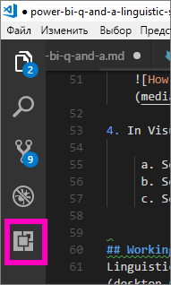
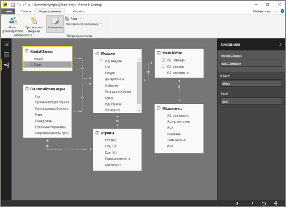

# <a name="language-modeling-and-the-linguistic-schema"></a>Моделирование языка и лингвистическая схема 
Эффективный обработчик позволяет задавать вопросы о данных с помощью обычных фраз и естественного языка. Еще больше впечатляет, когда от данных поступает ответ. Именно эту возможность предоставляет функция "Вопросы и ответы" в Power BI. Когда вы задаете вопрос функции "Вопросы и ответы" в Power BI, она пытается дать максимально правильный ответ. 

Но чтобы сделать работу с функцией "Вопросы и ответы" еще эффективнее, есть способы сделать ответы точнее. Один из них — изменение лингвистической схемы. 

В основе всего лежат корпоративные данные.  Чем качественнее модель данных, тем проще будет пользователям получать полезные ответы. Один из способов улучшить модель — добавить лингвистическую схему, которая определяет и систематизирует терминологию и связи между именами таблиц и столбцов в наборе данных. Управление лингвистическими схемами осуществляется в Power BI Desktop. 

## <a name="what-is-a-linguistic-schema"></a>Что такое лингвистическая схема
Лингвистическая схема определяет термины и фразы, касающиеся объектов в наборе данных, которые должна понимать функция "Вопросы и ответы". Сюда относятся части речи, синонимы и выражения, связанные с набором данных. Когда вы импортируете набор данных или подключаетесь к нему, Power BI создает лингвистическую схему на основе его структуры. Когда пользователь задает вопрос, функция "Вопросы и ответы" ищет совпадения и связи в данных, чтобы определить цель вопроса. Например, она ищет существительные, глаголы, прилагательные, выражения и другие элементы. Кроме того, она ищет связи, например, какие столбцы представляют дополнения глагола. 

Части речи вам, скорее всего, знакомы (если нет, см. информацию ниже), но выражения могут быть новым понятием для вас.  Выражение описывает ("выражает") связь между объектами. Например, чтобы описать связь между клиентами и продуктами, можно сказать "клиенты покупают продукты". Чтобы описать связь между клиентами и возрастом, можно сказать "возраст указывает на то, сколько лет клиентам". Чтобы описать связь между клиентами и номерами телефонов, можно сказать просто "у клиентов есть номера телефонов".

Выражения могут иметь разные формы и размеры. Некоторые из них напрямую соответствуют связям в модели данных. Некоторые соотносят столбцы с содержащими их таблицами. Другие выражают сложные связи между несколькими таблицами и столбцами. В любом случае они описывают связи между объектами с помощью обычных слов.

Лингвистические схемы сохраняются в формате YAML. Он связан с очень популярным форматом JSON, однако обладает более гибким и удобным для восприятия синтаксисом. Лингвистические схемы можно изменять, экспортировать и импортировать в Power BI Desktop.

## <a name="prerequisites"></a>Предварительные требования
- Если вы еще не прочитали статью об [оптимизации модели данных для функции "Вопросы и ответы"](desktop-qna-in-reports.md), возможно, следует сначала сделать это. В ней приводится множество советов по проектированию и улучшению модели данных, а также содержится важный раздел о добавлении синонимов.  

- Работа с функцией "Вопросы и ответы" состоит из двух аспектов.  Первый — это подготовка или "моделирование" данных.  Второй заключается в задании вопросов и изучении данных, то есть их "потреблении". В некоторых организациях формированием наборов данных, созданием моделей данных и публикацией наборов данных в Power BI занимается отдельная группа сотрудников — разработчики моделей данных или ИТ-администраторы.  "Потребляются" же данные другими сотрудниками.  В других организациях эти роли могут сочетаться. 

    Эта статья предназначена для разработчиков моделей данных, то есть тех, кто оптимизирует наборы данных, чтобы обеспечить максимально эффективное использование функции "Вопросы и ответы". 

- [Образцы файлов YAML и PBIX](https://go.microsoft.com/fwlink/?linkid=871858)    
- Редактор файлов YAML. Мы рекомендуем [Visual Studio Code](https://code.visualstudio.com/).


### <a name="set-up-an-editor-for-yaml-files"></a>Настройка редактора для работы с YAML-файлами
Мы рекомендуем использовать Visual Studio Code для изменения YAML-файлов лингвистических схем. В редакторе Visual Studio Code есть встроенная поддержка файлов YAML, и в нем можно настроить проверку формата лингвистических схем Power BI.
1. Установите [Visual Studio Code](https://code.visualstudio.com/).    

2. Выберите ранее сохраненный образец лингвистической схемы: [файл YAML](https://go.microsoft.com/fwlink/?linkid=871858) (SummerOlympics.lsdl.yaml).    
4. Выберите пункт **Visual Studio Code** и установите флажок **Всегда открывать файлы YAML в этом приложении**.

    

4. В Visual Studio Code установите расширение "YAML Support by Red Hat".    
    а. Перейдите на вкладку **Расширения** (первая слева) или нажмите клавиши CTRL+SHIFT+X.    
        
    б. Выполните поиск по запросу "yaml" и выберите в списке элемент **YAML Support by Red Hat**.    
    в. Последовательно выберите **Установить > Перезагрузить**.


## <a name="working-with-linguistic-schemas"></a>Работа с лингвистическими схемами
Лингвистические схемы можно изменять, экспортировать и импортировать в [представлении связей](desktop-relationship-view.md) в Power BI Desktop. Одним из способов изменения лингвистической схемы является [добавление синонимов в область **Синонимы**](desktop-qna-in-reports.md). Открывать файл YAML при этом не нужно.




 Другим способом изменения лингвистической схемы является экспорт файла YAML и его редактирование напрямую.  Когда вы редактируете YAML-файл лингвистической схемы, вы помечаете столбцы в таблице как разные грамматические элементы и определяете слова, которые ваши коллеги могут использовать для формулирования вопросов. Например, можно определить столбцы как содержащие подлежащее и дополнение глагола, а затем добавить слова, с помощью которых пользователи могут ссылаться на таблицы, столбцы и меры в модели. 


Перед изменением лингвистической схемы ее необходимо открыть (экспортировать) из Power BI Desktop. Сохранение YAML-файла в исходном расположении называется импортом.  Импортировать можно и другие файлы YAML.  Например, вы уже потратили немало времени на добавление частей речи, определение связей, создание выражений и синонимов, и у вас есть похожий набор данных. 

Функция "Вопросы и ответы" может использовать всю эту информацию вместе с настроенными вами улучшениями с целью предоставления более точных ответов, автоматического завершения и составления сводки вопросов.


## <a name="edit-a-linguistic-schema"></a>Изменение лингвистической схемы
Когда вы впервые экспортируете лингвистическую схему из Power BI Desktop, все содержимое файла или большая его часть создается модулем "Вопросы и ответы" автоматически. Автоматически созданные сущности, слова (синонимы), связи и выражения получают тег **State: Generated** (Состояние: создано) и включаются в файл главным образом в информационных целях, но могут служить отправной точкой для дальнейших изменений. 

> [!NOTE]
> Образец YAML-файла, представленный в этом учебнике, не содержит тегов **State:Generated** (Состояние: создано) или **State:Deleted** (Состояние: удалено), так как он был специально подготовлен. Чтобы увидеть эти теги, откройте файл PBIX в представлении связей и экспортируйте лингвистическую схему, не внося изменений.


При импорте файла лингвистической схемы обратно в Power BI Desktop все элементы с тегом **State: Generated** игнорируются (и заново создаются позднее). Поэтому если вам нужно внести изменения в автоматически созданное содержимое, удалите соответствующие теги **State: Generated**. Аналогичным образом, если вам нужно удалить автоматически созданное содержимое, измените тег **State: Generated** на **State: Deleted**, чтобы оно не создавалось повторно при импорте файла лингвистической схемы.

1. Откройте набор данных в *представлении связей* в Power BI Desktop. 
2. Перейдите на вкладку **Моделирование** и выберите команду **Экспорт лингвистической схемы**.
3. Выберите Visual Code (или другой редактор).
4. Внесите изменения и сохраните файл YAML.
5. В Power BI Desktop последовательно выберите **Представление связей > Моделирование > Лингвистическая схема > Импорт лингвистической схемы**.
6. Перейдите в расположение, в котором был сохранен отредактированный YAML-файл, и выберите его. Должно появиться сообщение об успешном импорте YAML-файла лингвистической схемы.

    

### <a name="add-phrasings-to-the-linguistic-schema"></a>Добавление выражений в лингвистическую схему
Выражение описывает ("выражает") связь между объектами. Например, чтобы описать связь между клиентами и продуктами, можно сказать "клиенты покупают продукты". Чтобы описать связь между клиентами и возрастом, можно сказать "возраст указывает на то, сколько лет клиентам". Чтобы описать связь между спортсменами и медалями, можно сказать просто "спортсмены завоевывают медали".

Выражения могут иметь разные формы и размеры. Некоторые из них напрямую соответствуют связям в семантической модели. Некоторые соотносят столбцы с содержащими их таблицами. Другие выражают сложные связи между несколькими таблицами и столбцами. В любом случае они описывают связи между объектами с помощью обычных слов.

## <a name="where-do-phrasings-come-from"></a>Откуда берутся выражения?
Многие простые выражения добавляются в лингвистическую схему автоматически на основе структуры модели и предположений, сделанных исходя из имен столбцов. Например:
- Большинство столбцов будут связаны с содержащей их таблицей с помощью простых выражений такого вида: "у продуктов есть описания".
- На основании отношений в модели создаются выражения по умолчанию для обоих направлений, например "в заказах есть продукты" и "на продукты есть заказы".
- Для некоторых связей исходя из имен столбцов могут строиться более сложные выражения по умолчанию, например: "заказы отправляются в города".

Однако пользователи могут формулировать вопросы множеством других способов, которые функция "Вопросы и ответы" не сможет разобрать. В таких случаях может потребоваться добавить собственные выражения вручную.


## <a name="why-should-i-add-phrasings"></a>Зачем добавлять выражения?
Первая причина для добавления выражения — необходимость определить новый термин. Например, чтобы можно было получить ответ на запрос "список самых старых клиентов", сначала следует сообщить функции "Вопросы и ответы", что имеется в виду под словом "старый". Для этого можно добавить такое выражение, как "возраст указывает, сколько лет клиенту".

Вторая причина для добавления выражения — устранение неоднозначности. При базовом поиске по ключевым словам необходимо учитывать, что слова могут иметь несколько значений. Например, фразы "рейсы в Красноярск" и "рейсы из Красноярска" имеют разный смысл, но функция "Вопросы и ответы" не распознает, что вы имеете в виду, пока вы не добавите выражения "рейсы совершаются из городов отправления" и "рейсы совершаются в города прибытия". Аналогичным образом, разница между фразами "автомобили, которые Сергей продал Анне" и "автомобили, которые Сергей купил у Анны" будет понятна, только если добавить выражения "клиенты покупают автомобили у сотрудников" и "сотрудники продают автомобили клиентам".

Последняя причина — повышение точности переформулирования. Ответ на запрос "показать клиентов и их продукты" будет более точным, если перефразировать его как "показать клиентов и купленные ими продукты" или "показать клиентов и просмотренные ими продукты" в зависимости от того, как функция "Вопросы и ответы" поняла вопрос. Добавление пользовательских выражений позволяет переформулировать вопросы более точно и однозначно.


## <a name="what-kinds-of-phrasings-are-there"></a>Какие типы выражений существуют?
Чтобы разобраться в различных типах выражений, сначала следует вспомнить ряд простейших грамматических терминов.
- *Существительное* называет предмет, живое существо или явление. 
    - Примеры: автомобиль, подросток, Артем, радость.
- *Глагол* называет действие или состояние. 
    - Примеры: готовить, взрываться, находиться, извлекать.
- *Прилагательное* называет признак существительного. 
    - Примеры: эффективный, волшебный, золотой, краденый.
- *Предлог* — это слово, которое стоит перед существительным и обозначает его связь с другим существительным, глаголом или прилагательным. 
    - Примеры: от, для, возле, из.
-  *Атрибут* — это признак или качество чего-либо.
-  *Имя* — это слово или словосочетание, называющее человека, живое существо, предмет или явление.   


## <a name="attribute-phrasings"></a>Атрибутивные выражения
Атрибутивные выражения используются при работе с функцией "Вопросы и ответы" чаще всего и применяются, когда один предмет является атрибутом другого. Они просты, понятны и решают большинство задач, если не определены более конкретные выражения. Атрибутивные выражения описываются с помощью глаголов "иметь" или "быть" ("продукты имеют категории", "в стране-организаторе есть города проведения"), а также позволяют задавать вопросы с использованием предлогов ("заказы на продукты") и родительного падежа ("категории продуктов", "заказы Сергея"). Атрибутивные выражения используются, например, в следующих вопросах:
- У каких клиентов есть заказы?
- Список городов проведения по странам в порядке возрастания
- Показать заказы, включающие чай
- Список клиентов с заказами
- Какова категория каждого продукта?
- Число заказов Виктора Игнатьева    

Подавляющее большинство атрибутивных выражений, требуемых в модели, создается автоматически на основе вхождения столбцов в таблицы и связей внутри модели, поэтому, как правило, создавать их самостоятельно не нужно.
Ниже приведен пример того, как выглядит атрибутивное выражение внутри лингвистической схемы.

```json
product_has_category:
  Binding: {Table: Products}
  Phrasings:
  - Attribute: {Subject: product, Object: product.category}
```
 
## <a name="name-phrasings"></a>Выражения с именами
Именные выражения полезны в том случае, если в модели данных есть таблица, содержащая именованные объекты, например имена спортсменов или клиентов. Например, выражение "наименования продуктов — это названия, присвоенные продуктам" необходимо для использования наименований продуктов в вопросах. Хотя в именных выражениях можно использовать глагол "звать" или "называть" (например, "Список клиентов, которых зовут Виталий Токарев"), в первую очередь они применяются в сочетании с другими выражениями для связывания значения имени с определенной строкой таблицы. Так, если получен запрос "Клиенты, которые купили чай", функция "Вопросы и ответы" может определить, что значение "чай" указывает на всю строку в таблице продуктов, а не на отдельное значение в столбце с наименованиями продуктов. Именные выражения используются, например, в следующих вопросах:    
- Кого из сотрудников зовут Виктор Игнатьев
- Кого зовут Никита Жданов
- Вид спорта, которым занимается Фернан де Монтиньи
- Число спортсменов по имени Мария
- Что купил Виктор Игнатьев?

При условии использования разумного соглашения об именовании для столбцов в модели (например, "Название" или "НазваниеПродукта" вместо "НазвПрд") большая часть именованных выражений, требуемых в модели, создается автоматически, поэтому, как правило, создавать их самостоятельно не нужно.

Ниже приведен пример того, как выглядит именное выражение внутри лингвистической схемы.

```json
employee_has_name:
  Binding: {Table: Employees}
  Phrasings:
  - Name:
      Subject: employee
      Name: employee.name
```

 
## <a name="adjective-phrasings"></a>Выражения с прилагательными
Выражения с прилагательными определяют новые прилагательные для описания сущностей в модели. Например, выражение "довольные клиенты — это клиенты, поставившие оценку > 6" требуется для ответа на такой вопрос, как "список довольных клиентов в Самаре". Существует несколько видов выражений с прилагательными, предназначенных для разных ситуаций.

*Простые выражения с прилагательными* определяют новые характеристики на основе некоторого условия, например "снятые с производства продукты — это продукты со статусом D". Простые выражения с прилагательными используются, например, в следующих вопросах:
- Какие продукты являются снятыми с производства?
- Список снятых с производства продуктов
- Список золотых медалистов
- Недопоставленные продукты

Ниже приведен пример того, как выглядит простое выражение с прилагательным внутри лингвистической схемы. product_is_discontinued:

```json
Binding: {Table: Products}
  Conditions:
  - Target: product.discontinued
    Operator: Equals
    Value: true
  Phrasings:
  - Adjective:
      Subject: product
      Adjectives: [discontinued]
```

*Количественные выражения с прилагательными* определяют новые характеристики на основе числового значения, указывающего степень признака, например "длина определяет то, насколько протяженной является река" и "небольшой регион имеет малую площадь". Количественные выражения с прилагательными используются, например, в следующих вопросах:
- Список длинных рек
- Какие реки самые длинные?
- Список самых небольших регионов, завоевывавших золото в баскетболе
- Какова длина реки Рио-Гранде?

Ниже приведен пример того, как выглядит количественное выражение с прилагательным внутри лингвистической схемы. river_has_length:

 ```json
Binding: {Table: Rivers}
  Phrasings:
  - Adjective:
      Subject: river
      Adjectives: [long]
      Antonyms: [short]
      Measurement: river.length
```

*Динамические выражения с прилагательными* определяют набор новых характеристик на основе значений одного из столбцов в модели, например "цвета описывают продукты" и "соревнования делятся по полу". Динамические выражения с прилагательными используются, например, в следующих вопросах:
- Список красных продуктов
- Какие продукты зеленые?
- Показать женские конькобежные соревнования
- Число активных проблем

Ниже приведен пример того, как выглядит динамическое выражение с прилагательным внутри лингвистической схемы. product_has_color:
```json
Binding: {Table: Products}
  Phrasings:
  - DynamicAdjective:
      Subject: product
      Adjective: product.color
```

 
## <a name="noun-phrasings"></a>Выражения с существительными
Выражения с существительными определяют новые существительные, описывающие подмножества объектов в модели. Они часто включают в себя характерную для модели меру или условие. Например, для модели данных по Олимпийским играм может потребоваться добавить выражения для различения чемпионов и медалистов, спортивных игр с мячом и водных видов спорта, командных и индивидуальных соревнований, возрастных категорий спортсменов и т. д. Для базы данных по кинофильмам можно добавить выражение "провалившийся в прокате фильм — это фильм с чистой прибылью < 0", чтобы можно было задать такой вопрос, как "число провалившихся в прокате фильмов по годам". Существует два вида выражений с существительными, предназначенных для разных ситуаций.

*Простые выражения с существительными* определяют новые существительные на основе условия, например "внештатный работник — это работник, для которого включение в штат = ложь" и "чемпион — это спортсмен, у которого число медалей > 5". Простые выражения с существительными используются, например, в следующих вопросах:

- Какие сотрудники являются внештатными?
- Число внештатных сотрудников в Казани
- Число чемпионов в 2016 году

Ниже приведен пример того, как выглядит простое выражение с существительным внутри лингвистической схемы. employee_is_contractor:

```json
Binding: {Table: Employees}
  Conditions:
  - Target: employee.full_time
    Operator: Equals
    Value: false
  Phrasings:
  - Noun:
      Subject: employee
      Nouns: [contractor]
```

*Динамические выражения с существительными* определяют набор новых существительных на основе значений одного из столбцов в модели, например "должности определяют подмножества сотрудников". Динамические выражения с существительными используются, например, в следующих вопросах:

- Список кассиров в Новосибирске
- Какие сотрудники являются буфетчиками?
- Список арбитров в 1992 году

Ниже приведен пример того, как выглядит динамическое выражение с существительным внутри лингвистической схемы. employee_has_job:

 ```json
Binding: {Table: Employees}
  Phrasings:
  - DynamicNoun:
      Subject: employee
      Noun: employee.job
```

## <a name="preposition-phrasings"></a>Выражения с предлогами
Выражения с предлогами служат для описания того, как связаны сущности в модели, с помощью предлогов. Например, выражение "города находятся в странах" улучшает понимание таких вопросов, как "число городов в Брянской области". Некоторые выражения с предлогами создаются автоматически, когда столбец распознается как содержащий географические сущности. Выражения с предлогами используются, например, в следующих вопросах:

- Число клиентов в Москве
- Список книг по лингвистике
- В каком городе живет Джон Голт?
- Сколько книг от Стивена Пинкера?
 
Ниже приведен пример того, как выглядит выражение с предлогом внутри лингвистической схемы. customers_are_in_cities:

 ```json
Binding: {Table: Customers}
  Phrasings:
  - Preposition:
      Subject: customer
      Prepositions: [in]
      Object: customer.city
```

 
## <a name="verb-phrasings"></a>Выражения с глаголами
Выражения с глаголами служат для описания того, как связаны сущности в модели, с помощью глаголов. Например, выражение "клиенты покупают продукты" улучшает понимание таких вопросов, как "кто купил сыр?" и "что купил Владимир?" Выражения с глаголами — наиболее гибкий из всех типов выражений. Они часто связывают друг с другом более двух сущностей, например "сотрудники продают продукты клиентам". Выражения с глаголами используются, например, в следующих вопросах:

- Кто что кому продал?
- Кто из сотрудников продал чай Владимиру?
- Скольким клиентам продала чай Мария?
- Список продуктов, которые Мария продала Владимиру.
- Какие снятые с производства продукты были проданы клиентам в Новосибирске сотрудниками в Красноярске?

Выражения с глаголами могут также содержать предложные словосочетания, что еще более повышает их гибкость, например "атлеты завоевывают медали на соревнованиях" или "клиенты получают возмещение за продукты". Выражения с глаголами, содержащие предложные словосочетания, используются, например, в следующих вопросах:

- Сколько спортсменов завоевали золотые медали на Чемпионате по спортивной гимнастике?
- Кому из клиентов было предоставлено возмещение за сыр?
- На каком соревновании Данелл Лейва завоевал бронзовую медаль?

Некоторые выражения с глаголами создаются автоматически, когда столбец распознается как содержащий глагол и предлог.

Ниже приведен пример того, как выглядит выражение с глаголом внутри лингвистической схемы. customers_buy_products_from_salespeople:

```json
Binding: {Table: Orders}
  Phrasings:
  - Verb:
      Subject: customer
      Verbs: [buy, purchase]
      Object: product
      PrepositionalPhrases:
      - Prepositions: [from]
        Object: salesperson
```

## <a name="relationships-with-multiple-phrasings"></a>Связи с несколькими выражениями
Зачастую одну связь можно описать несколькими способами. В таком случае связь может иметь несколько выражений. Нередко связь между сущностью таблицы и сущностью столбца имеет как атрибутивное выражение, так и выражение другого типа. Например, для связи между клиентом и именем клиента может требоваться как атрибутивное выражение ("клиенты имеют имена"), так и именное выражение ("имена клиентов — это имена, принадлежащие клиентам"), что позволяет задавать оба типа вопросов.

Ниже приведен пример того, как выглядит связь с двумя выражениями внутри лингвистической схемы. customer_has_name:

  ```json
Binding: {Table: Customers}
  Phrasings:
    - Attribute: {Subject: customer, Object: customer.name}
    - Name:
        Subject: customer
        Object: customer.name
```

Другим примером может служить добавление альтернативного выражения "сотрудники продают продукты клиентам" к связи "клиенты покупают продукты у сотрудников". Обратите внимание на то, что добавлять вариант в страдательном залоге ("продукты продаются клиентам **сотрудниками**") не нужно, так как он выводится функцией "Вопросы и ответы" автоматически.

## <a name="considerations-and-troubleshooting"></a>Рекомендации и устранение неполадок
Если в файл .lsdl.yaml внесены изменения, не соответствующие формату лингвистической схемы, выявленные в результате проверки проблемы будут подчеркнуты волнистой линией: 

    


Появились дополнительные вопросы? [Ответы на них см. в сообществе Power BI.](http://community.powerbi.com/)
