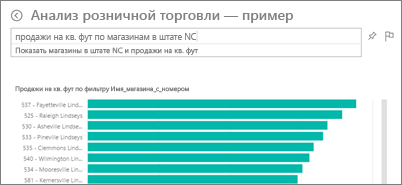
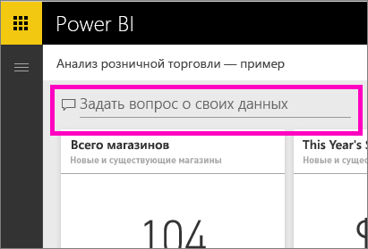
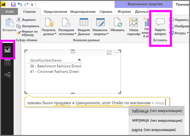

# "Вопросы и ответы" в службе Power BI и Power BI Desktop
## Что такое вопросы и ответы?
Иногда самый быстрый способ получить ответ по данным — задать вопрос, используя естественный язык. Например, «каков объем продаж за прошлый год».  Функцию "Вопросы и ответы" можно использовать для исследования данных с помощью интуитивно понятных возможностей, основанных на естественном языке, получая ответы в виде диаграмм и графиков. Компонент "Вопросы и ответы" отличается от подсистемы поиска: он выдает результаты только о данных в Power BI.

Эта статья содержит общие сведения о функции "Вопросы и ответы" на разных платформах. Ссылки ниже позволяют узнать, как эта функция работает в службе Power BI (панели мониторинга и отчеты), Power BI Desktop (отчеты), Power BI Embedded и Power BI Mobile.  

> [!NOTE]
> **"Вопросы и ответы" в Power BI** поддерживают взаимодействие на естественном языке, только если используется английский. Вы также можете попробовать функцию ответов на вопросы на испанском языке, доступную в предварительной версии. В **Power BI Desktop** перейдите в раздел **Файл**, **Параметры и настройки**, **Параметры** и найдите вкладку **Предварительная версия функций**. Установите флажок **Поддержка испанского языка для модуля "Вопросы и ответы"**.  
>
>

Задать вопрос — это только начало.  Вы можете очень интересно провести время, уточняя данные или расширяя вопрос, обнаруживая новые надежные данные, фокусируясь на деталях и увеличивая поле зрения, чтобы получить более широкое представление. Вас наверняка порадует, какие полезные данные вы можете найти и какие открытия сделать.

Взаимодействие действительно интерактивное... и очень быстрое. Благодаря тому что функция основана на хранилище в памяти, ответ приходит почти мгновенно.

##  Вопросы и ответы для *потребителей*
Если коллега предоставит вам панель мониторинга, в этой панели обязательно будет окно для функции "Вопросы и ответы". В службе Power BI (app.powerbi.com) оно расположено прямо на панели мониторинга, в Power BI — внизу панели мониторинга, а в Power BI Embedded — над визуализацией. Если владелец панели не предоставил вам разрешений на редактирование, вы сможете только изучать здесь информацию, но не сможете сохранить визуализации, созданные с помощью функции "Вопросы и ответы".

## "Вопросы и ответы" для *создателей*
Если вы являетесь *создателем* отчета Power BI или у вас есть разрешения на редактирование набора данных, окно для функции "Вопросы и ответы" будет размещаться не только на панели мониторинга службы Power BI, но и на каждой странице отчета в Power BI и Power BI Desktop. Все визуализации, созданные с помощью функции "Вопросы и ответы", можно сохранить на информационной панели и (или) в отчете.

Помимо изучения данных, создатели и владельцы наборов данных могут использовать функцию "Вопросы и ответы" для улучшения взаимодействия с пользователями, например [изменять наборы данных](service-prepare-data-for-q-and-a.md), добавлять [популярные вопросы](service-q-and-a-create-featured-questions.md) или [включать и отключать вопросы и ответы](service-q-and-a-direct-query.md) для локальных наборов данных с активным подключением. В сценариях [встроенной аналитики](developer/qanda.md) разработчики могут выбрать один из двух режимов: **Интерактивный** или **Только результаты**.

## Как функция "Вопросы и ответы" узнает, как отвечать на вопросы?
### Какие наборы данных использует функция "Вопросы и ответы"?
Как вопросы и ответы узнают, как ответить на вопросы о конкретных данных? Функция использует имена таблиц, столбцов и вычисляемых полей в соответствующем наборе данных. Поэтому важно то, как владелец набора данных их называет. Если вы не можете найти ответ с помощью компонента "Вопросы и ответы", обратитесь к владельцу набора данных. Возможно, он сможет сделать имена элементов набора данных более понятными.

Компонент "Вопросы и ответы" может ответить на вопросы, которые определяются порядком организации набора данных. Как это будет работать для данных в Salesforce? При подключении к учетной записи salesforce.com Power BI автоматически создает панель мониторинга.  Прежде чем начать задавать вопросы в функции "Вопросы и ответы", взгляните на данные, отображаемые в визуализациях панели мониторинга, а также на данные, отображаемые в раскрывающемся списке вопросов и ответов.

* Если подписи и значения оси визуализации включают "продажи", "учетная запись", "месяц" и "возможности", то можно уверенно задавать такие вопросы, как: "у какой *учетной записи* максимальные *возможности*" или "показать *продажи* по месяцам как линейчатую диаграмму".
* Если раскрывающийся список содержит слова "продавец", "состояние" и "год", то можно задать такие вопросы, как: "у какого *продавца* самые низкие *продажи* во *Флориде* в *2013*."

При наличии данных о производительности веб-сайта в Google Analytics можно задавать вопросы о времени, проведенном на веб-странице, количестве уникальных посещений страницы и уровне вовлечения пользователей. Или, если выполняется запрос демографических данных, можно задать вопросы о возрасте и доходе семьи по расположению.

### Какие визуализации использует компонент "Вопросы и ответы"?
Компонент "Вопросы и ответы" выбирает наиболее оптимальную визуализацию на основе отображаемых данных. Иногда данные в соответствующем наборе данных определяются как конкретный тип или категория, и это помогает функции "Вопросы и ответы" понять, как их следует отображать. Например, если данные определены как тип даты, скорее всего, они будут отображаться в виде графика. Данные, которые отнесены к категории "Города", скорее всего, будут отображаться как карта.

Кроме того, вы можете указать компоненту, какую визуализацию необходимо использовать, добавив ее в свой вопрос. Однако помните, что функция "Вопросы и ответы" не всегда может отображать данные в запрошенном вами типе визуализации.

Сведения о ключевых словах, которые распознает компонент "Вопросы и ответы", см. в статье [Советы по составлению вопросов](service-q-and-a-tips.md).

## Дополнительные сведения о функции "Вопросы и ответы" Power BI
[Overview: How to use Q&A in Power BI dashboards and reports](power-bi-tutorial-q-and-a.md) (Использование функции "Вопросы и ответы" в панелях мониторинга и отчетах Power BI). Пошаговые инструкции по использованию функции "Вопросы и ответы", а также общие сведения о принципах ее работы.

[Microsoft Power BI mobile app](mobile-apps-ios-qna.md) (Мобильное приложение Microsoft Power BI). Для устройств iPad, iPhone и iPod Touch под управлением iOS.

[Microsoft Power BI Embedded](developer/qanda.md). Сведения о включении функции "Вопросы и ответы" в приложение.

[Советы по запросам в функцию "Вопросы и ответы"](service-q-and-a-tips.md). Узнайте, как взаимодействовать с функцией "Вопросы и ответы", чтобы получить наилучшие результаты.

[Добавление избранных вопросов в наборы данных](service-q-and-a-create-featured-questions.md). Функция "Вопросы и ответы" предложит эти вопросы вашим коллегам.

[Включение функции вопросов и ответов для активных подключений](service-q-and-a-direct-query.md). Если для подключения к набору данных нужен шлюз, используйте настройки Power BI для включения и отключения функции "Вопросы и ответы".

[Руководство: использование компонента "Вопросы и ответы" в службе Power BI с примером "Розничные продажи"](power-bi-visualization-introduction-to-q-and-a.md). Используйте компонент на примере, приближенном к реальной жизни.

Появились дополнительные вопросы? [Ответы на них см. в сообществе Power BI.](http://community.powerbi.com/)
