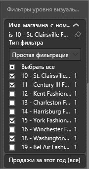
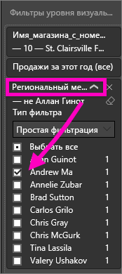

# Добавление фильтра в отчет службы Power BI (в режиме правки)
> [!TIP]
> Мы рекомендуем сначала прочитать статью [О фильтрах и выделении в отчетах Power BI](power-bi-reports-filters-and-highlighting.md).

Примеры в этой статье показывают службу Power BI. Однако действия в Power BI Desktop практически идентичны.
> 
> 

## Какая разница между фильтрами в режиме правки и фильтрами в режиме чтения
Существует два режима взаимодействия с отчетами: [режим чтения](service-reading-view-and-editing-view.md) и [режим правки](service-interact-with-a-report-in-editing-view.md).  Доступные возможности фильтрации зависят от используемого в настоящий момент режима.

* В режиме правки можно добавлять фильтры страниц, отчетов и визуализаций. При сохранении отчета фильтры сохраняются вместе с ним. Пользователи, просматривающие отчет в режиме чтения, могут работать с добавленными вами фильтрами.
* В режиме чтения можно взаимодействовать с уже существующими в отчете фильтрами отчетов, детализаций, страниц и визуальных элементов, но добавлять новые фильтры запрещено. Однако изменения, вносимые в области "Фильтры", сохраняются вместе с отчетом, даже если он открыт в мобильном приложении и даже если вы закрываете отчет и возвращаетесь к нему позже.  

> [!NOTE]
> В этой статье описывается создание фильтров в отчете в **режиме правки**.  Дополнительные сведения о фильтрах в режиме чтения см. в статье [о взаимодействии с фильтрами в режиме чтения](service-reading-view-and-editing-view.md).

## Фильтры, доступные на панели *Фильтры* в Power BI
При использовании классической версии или службы Power BI панель "Фильтры" отображается на холсте отчетов справа. Если панель "Фильтры" отсутствует, разверните ее, щелкнув значок ">" в правом верхнем углу.

Существует четыре типа фильтров.

- **Фильтр страницы** применяется ко всем визуальным элементам на странице отчета.     
- **Фильтр визуального элемента** применяется к одному элементу на странице отчета.    
- **Фильтр детализации** применяется к одной сущности в отчете.    
- **Фильтр отчета** применяется ко всем страницам в отчете.    

    

Так как фильтры *сохраняются* при выходе из отчета, в Power BI сохраняются изменения, внесенные в фильтры, срезы, и другие изменения, касающиеся представления данных. Поэтому, вернувшись к отчету, вы сможете продолжить с того места, где закончили. Чтобы изменения фильтров не сохранялись, в верхней строке меню нажмите **Вернуться к значениям по умолчанию**.

## Добавление фильтра к конкретной визуализации (так называемый фильтр визуализации)
Это можно сделать двумя способами: 

* используя фильтрацию поля, которое уже используется в визуализации;
* указав поле, которое уже не используется в визуализации, и добавив его непосредственно в контейнер **Фильтры уровня визуальных элементов**.

### Фильтрация полей, уже имеющихся в визуализации
1. Откройте [отчет в режиме правки](service-reading-view-and-editing-view.md).
   
   
2. Откройте панели "Визуализации" и "Фильтры" и панель "Поля" (если они еще не открыты).
   
   
3. Выберите визуальный элемент, чтобы сделать его активным. Все поля, используемые элементом, определены на панели **Поля** и перечислены на панели **Фильтры** в разделе **Фильтры уровня визуальных элементов**.
   
   
4. На этом этапе мы добавим фильтр к полю, которое уже используется в визуализации. 
   
   * Прокрутите вниз до области **Фильтры уровня визуальных элементов** и щелкните стрелку, чтобы развернуть поле, которое нужно отфильтровать. В этом примере будет выполнена фильтрация **StoreNumberName**.
     
       
   * Выберите элементы управления фильтрации **Основной**, **Дополнительно** или **Top N** (Ведущие N) (см. статью [Ознакомление с панелью "Фильтры" отчета](power-bi-how-to-report-filter.md)). В этом примере мы выберем режим фильтрации "Основной" и установим флажки рядом с числами 10, 11, 15 и 18.
     
       
   * Визуальный элемент изменится в соответствии с новым фильтром. Если отчет сохранен с фильтром, читатели отчета могут взаимодействовать с фильтром в режиме чтения, устанавливая или отменяя установку значений.
     
      
5. Теперь давайте добавим в визуализацию совершенно новое поле в качестве фильтра на уровне визуальных элементов.
   
   * На панели "Поля" выберите поле, которое нужно добавить в качестве нового фильтра на уровне визуальных элементов, и перетащите его в область **Фильтры уровня визуальных элементов**.  В этом примере мы перетащим поле **District Manager** (Региональный менеджер) в контейнер **Фильтры уровня визуальных элементов** и выберем только имя Эндрю Ma (Andrew Ma). 
     
      
   * Обратите внимание, что поле **District Manager** (Региональный менеджер) *не* добавляется к самой визуализации. В визуализации по-прежнему есть параметр **StoreNumberName** (заданный в качестве оси) и **This Year Sales** (Продажи за этот год) (заданный в качестве значения).  
     
      
   * При этом сама визуализация теперь отфильтрована таким образом, чтобы на ней отображались сведения о продажах Эндрю (Andrew) за этот год для указанных магазинов.
     
     

## Добавление фильтра на всю страницу (фильтр представления страницы)
1. Откройте [отчет в режиме правки](service-reading-view-and-editing-view.md).
2. Откройте панели "Визуализации" и "Фильтры" и панель "Поля" (если они еще не открыты).
3. На панели "Поля" выберите поле, которое нужно добавить в качестве нового фильтра уровня страниц, и перетащите его в область **Фильтры уровня страницы**.  
4. Укажите значения для фильтрации и настройте элемент управления **Основной** или **Расширенный** (см. статью [Использование фильтров отчетов](power-bi-how-to-report-filter.md)).
   
   Все визуальные элементы на странице, охватываемые этим фильтром, перерисовываются повторно для отражения изменений. 
   
   

Если отчет сохранен с фильтром, читатели отчета могут взаимодействовать с фильтром в режиме чтения, устанавливая или отменяя установку значений.

## Добавление фильтра детализации
Используя функцию детализации в службе Power BI и Power BI Desktop, вы можете создать *целевую* страницу отчета, посвященную определенной сущности: поставщику, клиенту или производителю. Теперь пользователи могут щелкнуть правой кнопкой мыши точку данных на других страницах отчета и перейти для детализации на страницу определенной сущности.

### Создание фильтра детализации
Чтобы создать фильтр, откройте пример "Рентабельность клиента" в представлении редактирования. Допустим, вам нужно перейти на страницу, на которой представлены направления деятельности руководителя.   

1. Добавьте новую страницу в отчет и назовите ее **Руководитель группы**. Это будет *целевая* страница детализации.
2. Добавьте визуализации, отслеживающие ключевые показатели для направлений деятельности руководителей групп.    
3. Добавьте поля **Руководитель > Имя руководителя** в области фильтров детализации.    
   
    
   
    Обратите внимание, что Power BI добавляет стрелку "Назад" на страницу отчета.  Если пользователь щелкнет эту стрелку, он вернется к *исходной* странице отчета, на которой он выбрал детализацию. Стрелка "Назад" активна только в представлении чтения.
   
     

### Использование фильтра детализации
Давайте посмотрим, как работает фильтр детализации.

1. Начните со страницы **Командная система показателей** отчета.    
2. Предположим, что вас зовут Сергей Зайцев и вы хотите просмотреть страницу отчета "Руководитель группы", отфильтрованную для отображения только ваших данных.  На диаграмме вверху слева щелкните правой кнопкой мыши любую зеленую точку данных, чтобы открыть пункт меню "Детализация".
   
    
3. Выберите **Детализация > Руководитель группы**, чтобы перейти на страницу детализации отчета **Руководитель группы**. Страница отфильтруется, отображая сведения о точке данных, которую вы щелкнули правой кнопкой мыши. В нашем случае — это Сергей Зайцев. На страницу детализации отчета можно перейти только из поля, добавленного в область "Фильтры детализации".  
   
    

## Добавление фильтра ко всему отчету (фильтр отчета)
1. Откройте [отчет в режиме правки](service-reading-view-and-editing-view.md).
2. Откройте панели "Визуализации" и "Фильтры" и панель "Поля" (если они еще не открыты).
3. На панели "Поля" выберите поле, которое нужно добавить в качестве нового фильтра на уровне отчета, и перетащите его в область **Фильтры уровня отчетов**.  
4. Выберите значения для фильтрации (см. статью [Использование фильтров отчетов](power-bi-how-to-report-filter.md)).

    Визуальные элементы на активной странице, а также на всех страницах отчета изменятся в соответствии с новым фильтром. Если отчет сохранен с фильтром, читатели отчета могут взаимодействовать с фильтром в режиме чтения, устанавливая или отменяя установку значений.

1. Щелкните стрелку "Назад", чтобы вернуться на предыдущую страницу отчета.

## Рекомендации и устранение неполадок

- Возможны ситуации, когда фильтр на уровне визуализации и фильтр на уровне страницы выдают различные результаты.  Например, при добавлении фильтра на уровне визуализации Power BI применяет фильтрование к статистическим результатам.  По умолчанию используется сумма данных, но [тип статистической обработки можно изменить](service-aggregates.md).  

    Затем при добавлении фильтра на уровне страницы Power BI применяется фильтрование без статистической обработки.  Это связано с тем, что страница может содержать несколько визуальных элементов, в каждом из которых используются разные типы статического вычисления.  Таким образом, фильтр применяется в каждой строке данных.

- Если область полей не отображается, убедитесь, что вы выбрали [режим редактирования](service-interact-with-a-report-in-editing-view.md) отчета.    
- Если вы внесли множество изменений в фильтры и хотите восстановить параметры отчета по умолчанию, заданные автором, в верхней строке меню выберите команду **Вернуться к значениям по умолчанию**.

## Дальнейшие действия
 [Использование фильтров отчетов](power-bi-how-to-report-filter.md)

  [Фильтры и выделение в отчетах](power-bi-reports-filters-and-highlighting.md)

[Взаимодействие с отчетом в режиме чтения в Power BI](service-reading-view-and-editing-view.md)

[Взаимодействие с визуализациями в отчете Power BI](service-reports-visual-interactions.md)

Появились дополнительные вопросы? [Ответы на них см. в сообществе Power BI.](http://community.powerbi.com/)

