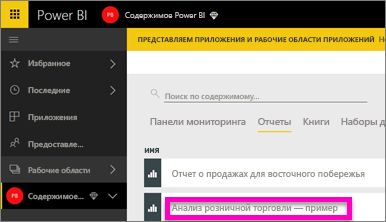
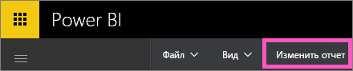
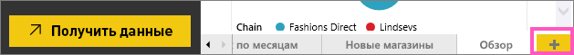
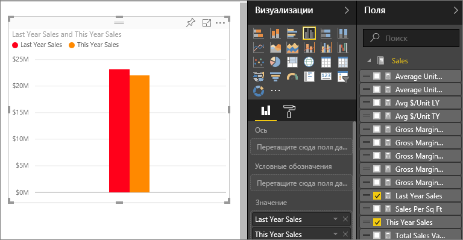
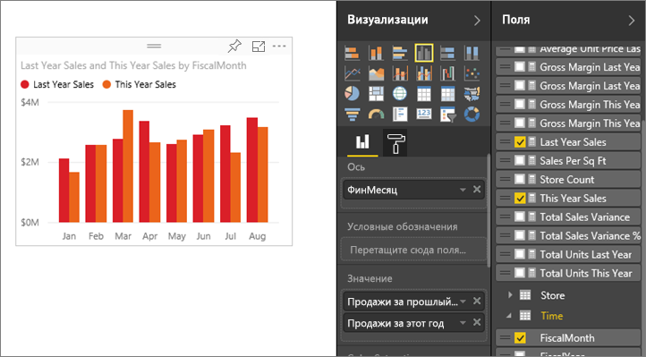
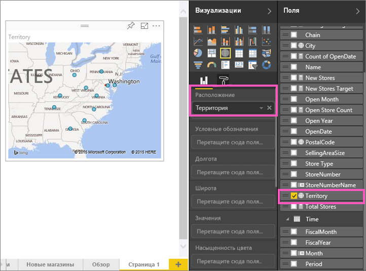
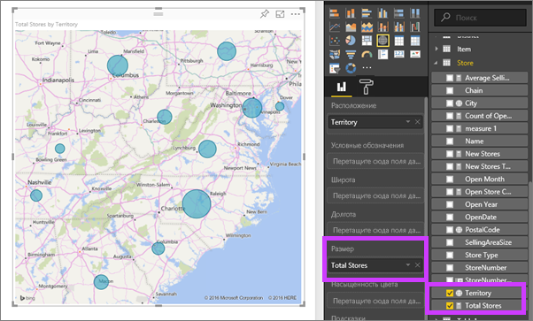
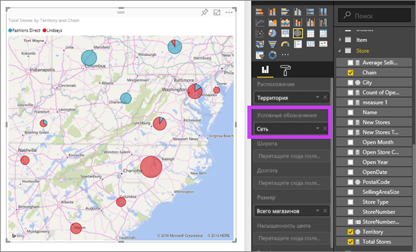

# Часть 2. Добавление визуализаций в отчет Power BI
В [части 1](power-bi-report-add-visualizations-ii.md) вы создали базовую визуализацию, установив флажки рядом с именами полей.  Во второй части вы узнаете, как использовать функцию перетаскивания и полностью реализовать возможности панелей **Поля** и **Визуализации** для создания и изменения визуализаций.

### Предварительные требования
- [Часть 1](power-bi-report-add-visualizations-ii.md)
- Служба Power BI — визуализации, которые можно добавлять в отчеты с помощью службы Power BI или Power BI Desktop. В этом руководстве используется служба Power BI. 
- Анализ розничной торговли — пример

## Создание новой визуализации
В этом руководстве мы подробно рассмотрим набор данных по анализу розничной торговли и создадим несколько ключевых визуализаций.

### Откройте отчет и добавьте в него новую пустую страницу.
1. Откройте рабочую область, где был сохранен пример "Анализ розничной торговли". Выберите **Анализ розничной торговли — пример**, чтобы открыть отчет в режиме чтения.
   
   
2. Выберите пункт **Изменить отчет** , чтобы открыть отчет в режиме редактирования.
   
   
3. [Добавьте новую страницу](power-bi-report-add-page.md), выбрав желтый значок "плюс" в нижней части холста.
   
   

### Добавьте визуализацию с отображением показателей объема продаж текущего года по сравнению с продажами в предыдущем году.
1. В таблице **Продажи** последовательно выберите элементы **Продажи этого года** > **Значение** и **Продажи прошлого года**. Power BI создаст гистограмму.  Она представляет интерес и требует более глубокого анализа. Как продажи распределяются по месяцам?  
   
   
2. Из таблицы времени перетащите **Месяц** в область **Оси**.  
   
3. [Измените визуализацию](power-bi-report-change-visualization-type.md) на диаграмму с областями.  Для выбора доступно множество типов визуализации. Сведения об использовании нужного типа см. в статьях с [описаниями каждого типа, советами, рекомендациями и учебниками](power-bi-visualization-types-for-reports-and-q-and-a.md). На панели "Визуализации" выберите значок диаграммы с областями.
4. Отсортируйте визуальные элементы, нажав кнопку с многоточием и выбрав пункт **Сортировать по месяцам**.
5. [Измените размер визуализации](power-bi-visualization-move-and-resize.md). Для этого выберите визуализацию, щелкните и перетащите один из кругов. Сделайте ее достаточно широкой, чтобы исключить полосу прокрутки, и достаточно небольшой, чтобы оставить место для добавления другой визуализации.
   
   
6. [Сохраните отчет](service-report-save.md).

### Добавьте визуализацию карты для отслеживания продаж по расположению.
1. В таблице **Магазин** выберите **Территория**. Power BI распознает, что территория является расположением, и создает визуализацию карты.  
   
2. Перетащите элемент **Всего магазинов** в область "Размер".  
   
3. Добавьте условные обозначения.  Чтобы просмотреть данные по названию магазина, перетащите элемент **Цепочка** в область условных обозначений.  
   

## Дальнейшие действия
* Дополнительные сведения о панели "Поля" см. в статье [Обзор редактора отчетов](service-the-report-editor-take-a-tour.md).   
* Дополнительные сведения о фильтрации и выделении визуализаций см. в статье [Фильтры и выделение в отчетах Power BI](power-bi-reports-filters-and-highlighting.md).  
* Подробнее о [визуализациях в отчетах Power BI](power-bi-report-visualizations.md).  
* Появились дополнительные вопросы? [Ответы на них см. в сообществе Power BI.](http://community.powerbi.com/)

