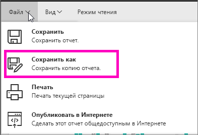

# Создание отчета из существующего (копирование отчета)
Возможно, у вас есть отчет, который уже подключается к набору данных, и в нем есть визуальные элементы, которые вы хотите использовать снова или изменить.  В этом случае вы можете просто скопировать существующий отчет в качестве основы для нового.  Для этого выполните указанные ниже действия.

1. [Открыть отчет](service-report-open.md).
2. В меню **Файл** выберите пункт **Сохранить как**.
   
   
3. Введите имя нового отчета и нажмите кнопку **Сохранить**.
   
   
   
   Сообщение об успешном выполнении информирует вас о сохранении нового отчета в текущую рабочую область Power BI.
   
   
4. Откройте вкладку **Отчеты** рабочей области и щелкните новый отчет, чтобы открыть его. При необходимости удалите визуальные элементы, которые вам не нужны, внесите изменения в другие элементы и добавьте новые.
   
   
5. Теперь вы можете обновлять и изменять новый отчет.

## Дальнейшие действия:
[Создание новых визуализаций](power-bi-report-add-visualizations-ii.md)

[Удаление ненужных визуализаций](service-delete.md)

[Представление отчетов в Power BI Desktop](desktop-report-view.md)
