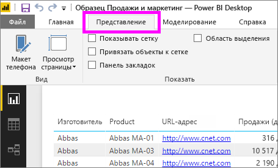
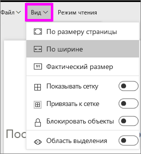
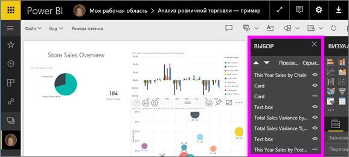
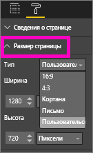

# Параметры отображения страницы в отчете Power BI
Очень важно обеспечить точное и качественное отображение макета отчета. В некоторых случаях это может оказаться сложной задачей, так вы и ваши коллеги просматриваете эти отчеты на экранах разных размеров и с различным соотношением сторон. 

По умолчанию используется представление **Вписать в страницу** , размер экрана по умолчанию — **16:9**. Если требуется заблокировать другие пропорции или по-другому расположить отчет, можно воспользоваться двумя средствами: параметрами ***режима страницы*** и параметрами ***размера страницы***.

<iframe width="560" height="315" src="https://www.youtube.com/embed/5tg-OXzxe2g" frameborder="0" allowfullscreen></iframe>

## Где найти параметры просмотра страницы в службе Power BI и Power BI Desktop
Параметры просмотра страницы доступны как в службе Power BI, так и в Power BI Desktop. Но интерфейс немного отличается. В следующих двух разделах объясняется, где найти параметры просмотра в каждом средстве Power BI.

### Power BI Desktop
В представлении отчетов выберите вкладку **Просмотр**, чтобы открыть параметры просмотра страницы и параметры макета для телефона.

  

### Служба Power BI (app.powerbi.com)
В службе Power BI откройте отчет и выберите **Просмотр** в строке меню в левой верхней части окна.

Параметры просмотра страницы доступны в [режиме чтения и режиме правки](consumer/end-user-reading-view.md). В режиме правки владелец отчета может назначить параметр просмотра для отдельных страниц отчета. Эти параметры сохраняются вместе с отчетом. Когда коллеги открывают отчет в режиме чтения, страницы отчета отображаются с примененными параметрами владельца.  В режиме чтения коллеги могут изменить *некоторые* параметры просмотра страницы, но при закрытии отчета изменения не сохраняются.

##    Параметры просмотра страницы
Первый набор параметров для *просмотра страницы* позволяет управлять отображением страницы отчета относительно окна браузера.  Доступны следующие параметры:

* **По размеру страницы** (по умолчанию): масштаб содержимого подбирается к размеру страницы.
* **По ширине**: масштаб содержимого подбирается к ширине страницы.
* **Фактический размер**: содержимое отображается в полном размере.

Второй набор параметров для *просмотра страницы* позволяет управлять расположением объектов на холсте отчета:

* **Показать линии сетки.** Линии сетки помогут разместить объекты на холсте отчета.
* **Привязать к сетке.** Используйте этот параметр с **отображением линий сетки**, чтобы точно расположить и выровнять объекты на холсте отчета. 
* **Блокировка объектов.** Блокируются все объекты на холсте, чтобы нельзя было изменить их расположение и размер.
* **Область выделения.** В области выделения отображается список всех объектов на холсте. Вы можете решить, какие из них показать, а какие скрыть.

    

## Параметры размера страницы

Параметры *размера страницы* доступны только для владельцев отчетов. В службе Power BI (app.powerbi.com) это означает возможность открыть отчет в [режиме правки](consumer/end-user-reading-view.md). Эти параметры используются для управления соотношением отображения и фактическим размером (в пикселях) холста отчета.   

* Соотношение 4:3
* Соотношение 16:9 (по умолчанию)
* Кортана
* Письмо
* Выборочно (высота и ширина в пикселях)

## Дальнейшие действия
[Узнайте, как использовать параметры просмотра и размера страницы в своих отчетах Power BI](consumer/end-user-report-view.md).

Дополнительные сведения об [отчетах в Power BI](consumer/end-user-reports.md)

[Power BI — основные понятия](consumer/end-user-basic-concepts.md)

Появились дополнительные вопросы? [Ответы на них см. в сообществе Power BI.](http://community.powerbi.com/)

