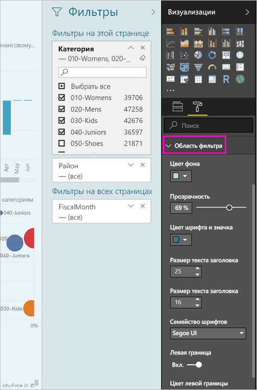

# <a name="the-new-filter-experience-in-power-bi-reports-preview"></a>Новые функции фильтров в отчетах Power BI (предварительная версия)

Фильтры в Power BI имеют новые функциональные возможности и используется новый дизайн. Если вы выбрали в новый интерфейс фильтра, можно форматировать панели "фильтры" для поиска как в остальной части отчета. Блокировка и даже скрыть фильтры. При разработке отчета, вы больше не видите панель старые фильтры вообще на панели визуализаций. Вы все фильтра редактирование и форматирование в одну область фильтров. 


> [!NOTE]
> Новые возможности фильтра доступны в предварительной версии. Новые сборки могут переопределять уже заданное форматирование.

Как конструктор отчетов Вот, что делать в новый единый панель "фильтры":

- Добавлять и удалять поля для фильтрации. 
- Измените состояние фильтра.
- Отформатируйте и настроить панель "фильтры", так, чтобы полагают, что часть отчета.
- Определять, является ли область фильтров развернутой или свернутой по умолчанию, когда пользователь открывает отчет.
- Скрыть панель "фильтры" все или конкретные фильтры, которые требуется запретить пользователям отчетов см. в разделе.
- Элемент управления и даже закладки видимость, откройте и свернутым состоянием новой области фильтров.
- Блокировать фильтры, чтобы пользователи не могли их изменять.

В новой системе фильтра пользователи отчетов также можно навести любой визуальный элемент для просмотра только для чтения список всех фильтров и срезов, влияющие на нем.


## <a name="turn-on-the-new-filter-experience"></a>Включение новых функций фильтров 

Вы может включить новые функции в Power BI Desktop. Затем вы можете изменить фильтры там же или в службе Power BI (https://app.powerbi.com). Так как эти функции предоставляются в предварительной версии, сначала необходимо включить их в Power BI Desktop. Если вы начнете с создания отчета в службе Power BI, в нем не будет новых фильтров.

### <a name="turn-on-new-filters-for-all-new-reports"></a>Включение новых функций фильтров для всех новых отчетов

1. В Power BI Desktop выберите **Файл** > **Параметры и настройки** > **Параметры** > **Функции предварительной версии** и установите флажок **Новые функции фильтров**. 
2. Перезапустите Power BI Desktop, чтобы увидеть новые функции фильтров во всех новых отчетах.

После перезапуска Power BI Desktop новые функции будут включены по умолчанию для всех создаваемых отчетов.  

### <a name="turn-on-new-filters-for-an-existing-report"></a>Включение новых функций фильтров для существующих отчетов

Новые функции фильтров можно включить и для существующих отчетов.

1. В существующем отчете в Power BI Desktop выберите **Файл** > **Параметры и настройки** > **Параметры**.
2. В панели навигации слева в разделе **текущего файла**выберите **параметры отчетов**.
3. В разделе **фильтрацию качества**выберите **включить области обновленный фильтр и Показать фильтры в заголовке visual для этого отчета**.

## <a name="view-filters-for-a-visual-in-reading-mode"></a>Просмотр фильтров для визуального элемента в режиме чтения

В режиме чтения можно навести указатель мыши на значок фильтра для визуального элемента, чтобы отобразить всплывающее окно со всеми фильтрами, срезами и другими компонентами, которые влияют на этот визуальный элемент. Форматирование всплывающем совпадает со значением форматирование области фильтров. 


Ниже приведены типы фильтров, которые отображаются в этом представлении: 
- Базовые фильтры
- Срезы
- Перекрестное выделение 
- Перекрестная фильтрация
- Расширенные фильтры
- Фильтры первых N элементов
- Фильтрация относительных дат
- Синхронизация срезов
- Фильтры включения и исключения
- Фильтры, передаваемые по URL-адресу

## <a name="build-the-new-filters-pane"></a>Создание новой области фильтров

После включения нового панель "фильтры", его просматривать в правой части страницы отчета, в формате по умолчанию в зависимости от текущих параметров отчета. Используйте панель "фильтры" новый для настройки фильтров для включения и обновить существующие фильтры в новой области. Панель "фильтры" новый показано, какие пользователях отчетов появится при публикации отчета. 

1. По умолчанию пользователях отчетов можно увидеть панель "фильтры". Если вы не хотите их, чтобы увидеть его, выберите значок с изображением глаза рядом с полем **фильтры**.

    

2. Чтобы приступить к созданию своей новой области фильтров, либо в качестве страницы visual, перетащите нужные поля в новой области фильтров или фильтры уровня отчета.

При добавлении визуального холст отчета Power BI автоматически добавляет фильтр панель "фильтры" для каждого поля в визуальном элементе. 

## <a name="lock-or-hide-filters"></a>Блокировка или скрытие фильтров

Вы можете заблокировать или скрыть отдельные карточки фильтров. Если заблокировать фильтр, пользователи отчетов смогут его видеть, но не смогут изменять. Если фильтр скрыть, пользователи не будут его видеть. Скрывать карточки фильтров удобно, если нужно скрыть фильтры очистки данных, которые исключают пустые или непредвиденные значения. 

- В панели «новые фильтры» установите или снимите **фильтра блокировки** или **скрыть фильтр** значки в карточке фильтра.

   

Как включить эти параметры включения и отключения в новой области фильтров, вы увидите изменения отражаются в отчете. Скрытые фильтры не будут отображаться во всплывающем окне фильтров для визуального элемента.

Можно также настроить новое состояние области фильтров для потока с помощью закладок отчета. Для всех состояний области (открыто, закрыто, отображается) можно использовать закладки.
 
## <a name="format-the-new-filters-pane"></a>Форматирование новой области фильтров

Важной частью этого нового интерфейса является возможность форматирования панели "фильтры" в соответствии с внешний вид отчета. На панели "фильтры" по-разному для каждой страницы в отчете можно форматировать. Ниже приведены компоненты, которые можно форматировать: 

- Цвет фона
- Прозрачность фона
- Границы и отключение
- Цвет границ
- Заголовок и заголовок размер шрифта, цвет и текст

Вы также можете форматировать эти элементы для карточек фильтров в зависимости от того, применяются ли они (значение указано) или являются доступными (флажок снят): 

- Цвет фона
- Прозрачность фона
- Граница: включение или отключение
- Цвет границ
- Шрифт, цвет и размер текста
- Цвет поля ввода

### <a name="format-the-filters-pane-and-cards"></a>Форматирование панели "фильтры" и карты

1. В отчете щелкните сам отчет или его фон (*фоновый рисунок*), а затем в области **визуализации** выберите **Формат**. 
    Вы увидите параметры форматирования страницы отчета, фоновый рисунок и также панель "фильтры" и карт фильтра.

        

1. Разверните **Область фильтра**, чтобы настроить цвет фона, значок и дополнить страницу отчета.

    

1. Разверните **карточки фильтров**, чтобы **сделать доступным** и **применить** цвет и границу. Если вы выберете для карточек разные цвета, вам будет видно, какие фильтры применяются. 
  
    

## <a name="theming-for-filter-pane"></a>Темы для панели фильтров
Теперь можно изменить параметры по умолчанию в области фильтров с помощью файла темы. Ниже приведен пример фрагмента кода темы для начала работы.

 
```
"outspacePane": [{ 

"backgroundColor": {"solid": {"color": "#0000ff"}}, 

"foregroundColor": {"solid": {"color": "#00ff00"}}, 

"transparency": 50, 

"titleSize": 35, 

"headerSize": 8, 

"fontFamily": "Georgia", 

"border": true, 

"borderColor": {"solid": {"color": "#ff0000"}} 

}], 

"filterCard": [ 

{ 

"$id": "Applied", 

"transparency": 0, 

"backgroundColor": {"solid": {"color": "#ff0000"}}, 

"foregroundColor": {"solid": {"color": "#45f442"}}, 

"textSize": 30, 

"fontFamily": "Arial", 

"border": true, 

"borderColor": {"solid": {"color": "#ffffff"}}, 

"inputBoxColor": {"solid": {"color": "#C8C8C8"}} 

}, 

{ 

"$id": "Available", 

"transparency": 40, 

"backgroundColor": {"solid": {"color": "#00ff00"}}, 

"foregroundColor": {"solid": {"color": "#ffffff"}}, 

"textSize": 10, 

"fontFamily": "Times New Roman", 

"border": true, 

"borderColor": {"solid": {"color": "#123456"}}, 

"inputBoxColor": {"solid": {"color": "#777777"}} 

}] 
```

## <a name="sort-the-filter-pane"></a>Сортировка панели «Фильтр»

Функциональные возможности сортировки входит новый интерфейс панели фильтра. Авторы отчетов можно путем перетаскивания фильтров для расположения их в порядке, в котором они хотят иметь.


Порядок сортировки по умолчанию используется алфавитный для фильтров. Чтобы перейти в режим сортировки, просто перетащите любой фильтр в новую позицию. Можно сортировать только фильтры в пределах уровня, в которой они относятся, например, фильтр уровня visual, страницы или отчета.

## <a name="filters-pane-scaling"></a>Фильтры области масштабирования

Панель "фильтры" новый масштабирование осуществляется на основе страницы отчета и визуальные элементы, поэтому страницы отчета и фильтрует Будьте области пропорционально друг с другом.

## <a name="improved-filters-pane-accessibility"></a>Улучшенные специальные возможности панель фильтров

Мы улучшили навигацию с помощью клавиатуры для новой области фильтров. Можно перемещаться между каждой части панели "фильтры" и использовать контекстный ключ на клавиатуре или Shift + F10, чтобы открыть контекстное меню.


## <a name="rename-filters"></a>Переименовать фильтры
При редактировании панель "фильтры", можно дважды щелкнуть заголовок, изменить его. Переименование полезно в том случае, если вы хотите обновить фильтр карты, чтобы лучше понять смысл для конечных пользователей. Имейте в виду, переименование карточке фильтра *не* изменить отображаемое имя поля в списке полей. Изменяется только отображаемое имя, используемое в карточке фильтра.


## <a name="restrict-changes-to-filter-type"></a>Ограничить внесение изменений для фильтрации типа

В разделе Filtering возникнуть разделе параметров отчета, у вас есть возможность управления, если пользователь может изменять тип фильтра.


## <a name="next-steps"></a>Дальнейшие действия

Попробуйте новые возможности фильтрации. Ждем ваших предложений для этой функции и как мы можем улучшить его, на [сайта Power BI Ideas](https://ideas.powerbi.com/forums/265200-power-bi). 

- [Использование фильтров отчетов](consumer/end-user-report-filter.md)
- [Фильтры и выделение в отчетах](power-bi-reports-filters-and-highlighting.md)

Появились дополнительные вопросы? [Ответы на них см. в сообществе Power BI.](http://community.powerbi.com/)

