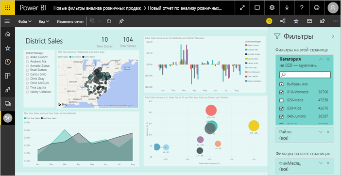
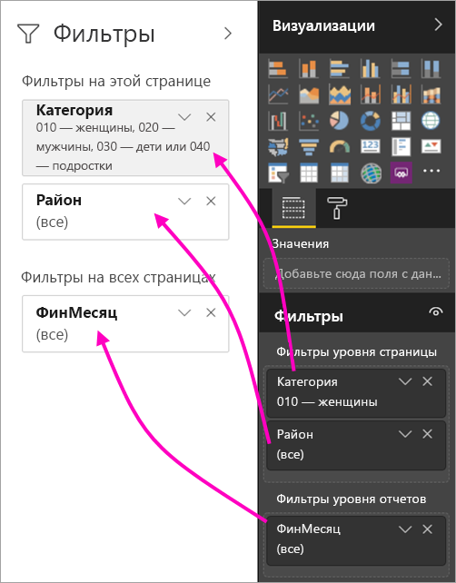
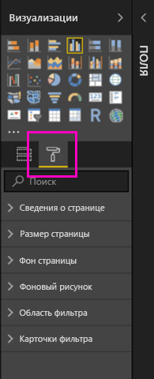
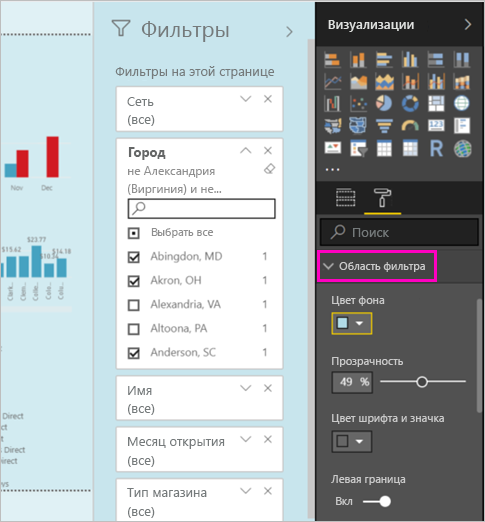
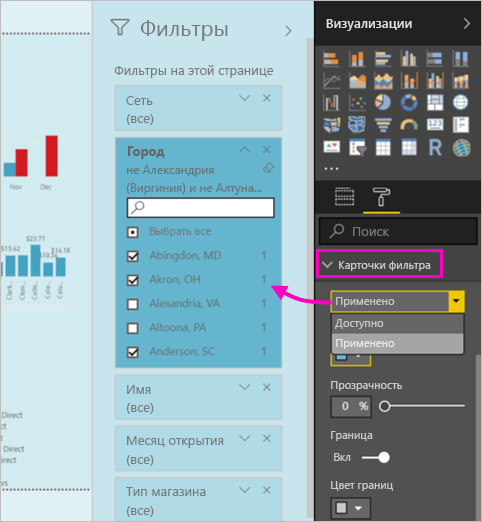
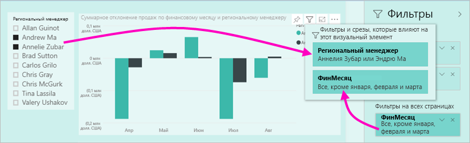

# Новые функции фильтров в отчетах Power BI (предварительная версия)

В этой статье подробно рассматриваются новые функции фильтров. Фильтры в Power BI теперь включают новые функции и имеют новый внешний вид. При разработке отчетов в Power BI Desktop или в службе Power BI можно сделать так, чтобы область фильтров можно было использовать как часть отчета. Благодаря новым функциям старая область фильтров теперь используется как область редактирования фильтра, тогда как новая область отображается только для пользователей вашего отчета. 
 

Авторы отчетов могут с помощью новых фильтров выполнять следующие задачи:

- Отображать представление фильтров только для чтения в заголовке визуального элемента, чтобы пользователи точно знали, какие фильтры или срезы влияют на определенный визуальный элемент.
- Форматировать и настраивать область фильтров так, чтобы она отображалась как часть отчета.
- Определять, является ли область фильтров развернутой или свернутой по умолчанию, когда пользователь открывает отчет.
- Скрывать всю область фильтров или определенные фильтры, чтобы они не были видны пользователям отчетов.
- Управлять состоянием новой области фильтров (отображено, открыто и свернуто), а также создавать соответствующие закладки.
- Блокировать фильтры, чтобы пользователи не могли их изменять.

## Включение новых функций фильтров 

Вы может включить новые функции в Power BI Desktop. Затем вы можете изменить фильтры там же или в службе Power BI (https://app.powerbi.com). Так как эти функции предоставляются в предварительной версии, сначала необходимо включить их в Power BI Desktop. Если вы начнете с создания отчета в службе Power BI, в нем не будет новых фильтров.

### Включение новых функций фильтров для всех новых отчетов

1. В Power BI Desktop выберите **Файл** > **Параметры и настройки** > **Параметры** > **Функции предварительной версии** и установите флажок **Новые функции фильтров**. 
2. Перезапустите Power BI Desktop, чтобы увидеть новые функции фильтров во всех новых отчетах.

После перезапуска Power BI Desktop новые функции будут включены по умолчанию для всех создаваемых отчетов.  

### Включение новых функций фильтров для существующих отчетов

Новые функции фильтров можно включить и для существующих отчетов.

1. В существующем отчете в Power BI Desktop выберите **Файл** > **Параметры и настройки** > **Параметры**.
2. В разделе **Параметры отчетов** **включите обновленную область фильтров и отобразите фильтры в заголовке визуального элемента для этого отчета**.

## Создание области фильтров

Новую включенную область фильтров можно просматривать в правой части страницы отчета в формате по умолчанию на основе текущих параметров отчета. Старая область фильтров теперь представляет собой область редактирования фильтров. Новая область фильтров показывает, что увидят пользователи вашего отчета после его публикации. Вы можете обновить существующие фильтры в новой области, при этом старая область фильтров будет использоваться для выбора включаемых фильтров.

1. Сначала определите, будут ли пользователи отчетов видеть область фильтров. Если да, выберите значок глаза  рядом с областью фильтров.

2. Чтобы создать свою область фильтров, перетащите нужные поля в область редактирования фильтров в качестве фильтра уровня визуального элемента, страницы или отчета. Они отобразятся в новой области фильтров.

    

При добавлении визуального элемента на холст отчета Power BI автоматически добавляет фильтр для каждого поля в визуальном элементе. Power BI не добавляет эти автоматические фильтры в область фильтров только для чтения. Вам нужно щелкнуть значок глаза, чтобы добавить их явно.

 
## Блокировка или скрытие фильтров

Вы можете заблокировать или скрыть отдельные карточки фильтров. Если заблокировать фильтр, пользователи отчетов смогут его видеть, но не смогут изменять. Если фильтр скрыть, пользователи не будут его видеть. Скрывать карточки фильтров удобно, если нужно скрыть фильтры очистки данных, которые исключают пустые или непредвиденные значения. 

- В области редактирования фильтров выполните нужное действие со значками **Заблокировать фильтр** или **Скрыть фильтр** в карточке фильтра.

   

Включив или отключив область редактирования фильтров, вы увидите изменения, которые отобразились в новой области фильтров. Скрытые фильтры не будут отображаться во всплывающем окне фильтров для визуального элемента.

Можно также управлять состоянием области фильтров с помощью закладок отчета. Для всех состояний области (открыто, закрыто, отображается) можно использовать закладки.
 
## Форматирование новой области фильтров

Важным компонентом новых функций является то, что теперь вы можете форматировать область фильтров в соответствии с внешним видом отчета. Вы можете отформатировать область фильтра по-разному для каждой страницы в отчете. Ниже приведены компоненты, которые можно форматировать: 

- Цвет фона
- Прозрачность фона
- Граница области фильтра: включение или отключение
- Цвет границы области фильтра

Вы также можете форматировать эти элементы для карточек фильтров в зависимости от того, применяются ли они (значение указано) или являются доступными (флажок снят): 

- Цвет фона
- Прозрачность фона
- Граница: включение или отключение
- Цвет границ

### Выбор формата для области и карточек фильтров

1. В отчете щелкните сам отчет или его фон (*фоновый рисунок*), а затем в области **визуализации** выберите **Формат**. 
    Вы увидите параметры форматирования страницы отчета, фоновый рисунок, а также область и карточки фильтров.

        

1. Разверните **Область фильтра**, чтобы настроить цвет фона, значок и дополнить страницу отчета.

    

1. Разверните **карточки фильтров**, чтобы **сделать доступным** и **применить** цвет и границу. Если вы выберете для карточек разные цвета, вам будет видно, какие фильтры применяются. 
  
    

## Просмотр фильтров для визуального элемента в режиме чтения

В режиме чтения можно навести указатель мыши на визуальный элемент, чтобы отобразить всплывающее окно со всеми фильтрами, срезами и другими компонентами, которые влияют на этот визуальный элемент. Форматирование всплывающего окна соответствует форматированию области фильтров. 

Ниже приведены типы фильтров, которые отображаются в этом представлении: 
- Базовые фильтры
- Срезы
- Перекрестное выделение 
- Перекрестная фильтрация
- Расширенные фильтры
- Фильтры первых N элементов
- Фильтрация относительных дат
- Синхронизация срезов
- Фильтры включения и исключения
- Фильтры, передаваемые по URL-адресу

## Скоро выйдет

В ближайшие месяцы мы планируем реализовать следующие улучшения:
- возможность изменять порядок карточки фильтров;
- единая панель фильтрации для создателей отчетов; 
- дополнительные параметры форматирования.

Попробуйте новые возможности фильтрации. Оставьте нам свой отзыв об этой функции и идеи относительно того, как мы можем оптимизировать работу пользователей. 

## Дальнейшие действия
[Использование фильтров отчетов](consumer/end-user-report-filter.md)

[Фильтры и выделение в отчетах](power-bi-reports-filters-and-highlighting.md)

[Взаимодействие с отчетом в режиме чтения в Power BI](consumer/end-user-reading-view.md)

[Взаимодействие с визуализациями в отчете Power BI](consumer/end-user-interactions.md)

Появились дополнительные вопросы? [Ответы на них см. в сообществе Power BI.](http://community.powerbi.com/)

