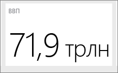

# Советы и рекомендации по созданию отчетов в Power BI Desktop и в службе Power BI
Для максимально эффективного использования данных иногда требуется небольшая помощь. Мы собрали некоторые советы и рекомендации по созданию отчетов в выпусках Microsoft Power BI Desktop, службе Power BI *и* Microsoft Excel 2016 или Microsoft Excel 2013 Professional Plus с включенной надстройкой Power Pivot и установленным и включенным компонентом Power Query.

## Power BI Desktop

### Обучение работе с редактором запросов
Редактор запросов в Power BI Desktop предоставляет практически те же возможности, что и надстройка Power Query в Excel 2013. Несмотря на наличие нескольких полезных статей в разделе поддержки Power BI, перед началом работы имеет смысл изучить документацию по Power Query на сайте support.office.com.

Дополнительные сведения см. в [Центре ресурсов Power Query](https://support.office.com/article/Microsoft-Power-Query-for-Excel-Help-2b433a85-ddfb-420b-9cda-fe0e60b82a94).

Вы также можете ознакомиться со [справочником формул](https://support.office.com/Article/Learn-about-Power-Query-formulas-6bc50988-022b-4799-a709-f8aafdee2b2f).

### Типы данных в редакторе запросов
При использовании редактора запросов в Power BI Desktop для загрузки данных обнаружение типа данных выполняется на основе предположений.  При использовании формул иногда параметры типа данных для столбцов не сохраняются. Следует проверять правильность типа данных в столбцах после выполнения следующих операций:  первоначальная загрузка данных на вкладку запросов, выполнение команд "Использовать первую строку в качестве заголовка", "Добавить столбец", "Группировать по", "Объединить", "Добавить", а также перед первой загрузкой данных.

Следует помнить следующее: курсив в сетке данных не означает, что тип данных установлен верно, — это означает. что данные не считаются текстом.

### Запросы по ссылке в редакторе запросов
В Power BI Desktop в навигаторе редактора запросов при щелчке правой кнопкой мыши одного из запросов становится доступным параметр "Ссылка".  Это удобно по одной из следующих причин.

* При использовании файлов в качестве источника данных для запроса абсолютный путь к файлу сохраняется в запросе. Совместное использование или перемещение файла Power BI Desktop или книги Excel экономит время при обновлении путей: достаточно однократно обновить элемент, не внося изменения в пути.

По умолчанию все запросы загружаются в лист Excel и модель данных (либо в оба хранилища). Некоторые запросы являются промежуточными шагами и не предназначены для конечных пользователей.  Так часто происходит при создании ссылки на запросы, как было сказано выше.  Поведением загрузки запросов можно управлять: щелкните правой кнопкой мыши запрос в навигаторе и установите нужное значение для параметра "Включить загрузку".  Если рядом с параметром "Включить загрузку" не стоит флажок, запрос будет доступен на вкладке запросов и его можно будет использовать вместе с другими запросами.  Это особенно полезно в сочетании с преобразованиями объединения, добавления и создания ссылок.  Поскольку результаты запроса не загружены в модель данных, запрос не будет отображаться в списке полей отчетов вашей модели данных.

### Точечным диаграммам требуется идентификатор точки
Используя в качестве примера простую таблицу температур и времени замера. Если отобразить эти значения непосредственно на точечной диаграмме, Power BI агрегирует все значения в одну точку. Для отображения отдельных точек данных нужно добавить поле в контейнер "Сведения" в области полей.   В Power BI Desktop можно легко сделать это на вкладке запросов: щелкните параметр "Добавить столбец индекса" на ленте "Добавить столбец".

### Строки ссылок в отчете
В Power BI Desktop можно воспользоваться вычисляемым столбцом для определения строки ссылки.  Определите таблицу и столбец, в которых требуется создать строку ссылки.  Выберите "Новый столбец" на ленте и в строке формул введите следующую формулу:

    Target Value = 100

Этот вычисляемый столбец возвратит значение 100, независимо от места использования.  Новый столбец отобразится в списке полей.  Добавьте вычисляемый столбец "Целевое значение" на линейную диаграмму, чтобы показать, как та или иная серия связана с конкретной строкой ссылки.  

### Сортировка по другому столбцу
При использовании категориального значения (строки) в Power BI в качестве осей диаграммы в среде или фильтре по умолчанию используется алфавитный порядок. Если требуется переопределить этот порядок, например для дней недели или месяцев, можно указать, чтобы сортировка в Power BI Desktop выполнялась по другому столбцу. Подробные сведения см. в разделе [Сортировка по столбцу в Power BI Desktop](desktop-sort-by-column.md).

### Упрощенное построение карт с использованием указаний на Bing
Power BI интегрируется с Bing для предоставления картографических координат по умолчанию (этот процесс называется геокодированием), что упрощает создание карт.  Bing использует определенные алгоритмы и подсказки, чтобы точнее определить местоположение, но все равно это лишь предположение. Чтобы увеличить вероятность правильного геокодирования, можно использовать следующие советы.

При создании карты часто приходится наносить на нее определенные страны, регионы и города.  В Power BI Desktop, если воспользоваться столбцами названий после географического обозначения, Bing будет проще угадать, что нужно отобразить. Так, если имеется поле с названиями штатов США, например "Калифорния" или "Вашингтон", Bing в ответ на ввод слова "Вашингтон" может отобразить "Вашингтон, округ Колумбия" вместо штата Вашингтон.  Если присвоить столбцу имя "Штат", точность геокодирования повысится.  То же самое можно сказать и о столбцах "Страна" и "Город".   

Некоторые географические обозначения неоднозначны в контексте разных стран и регионов.  В некоторых случаях то, что в одной стране или регионе считается штатом, в другой называется провинцией, графством или как-либо иначе.  Чтобы повысить точность геокодирования, можно создать столбцы, объединяющие несколько полей и затем использующие эти поля для нанесения на карту расположений данных.  Для того чтобы получить более точный результат геокодирования, можно передать "Уилтшир, Англия" вместо просто "Уилтшир".

В службе Power BI и Desktop вы всегда можете указать конкретные широту и долготу местоположения.  При этом также необходимо передать поле "Расположение". В противном случае данные будут агрегироваться по умолчанию и полученные широта и долгота могут не соответствовать вашим ожиданиям.

### Категоризация географических полей для использования геокодирования Bing
Обеспечить правильное геокодирование полей можно, указав для полей данных категорию данных.   В Power BI Desktop выберите нужную таблицу, перейдите на ленту "Дополнительно" и задайте категорию данных: адрес, город, континент, страну/регион, страну, индекс, регион или область.  Эти категории данных помогают Bing правильно расшифровать данные. Дополнительные сведения см. в разделе [Категоризация данных в Power BI Desktop](desktop-data-categorization.md).

### Улучшение геокодирования благодаря более точному указанию местоположений
Иногда указания категорий данных для сопоставления недостаточно.  Воспользовавшись редактором запросов в Power BI Desktop, создайте более конкретное местоположение, например адрес доставки.  Используйте функцию "Добавить столбец" для создания пользовательского столбца.  Затем создайте нужное местоположение следующим образом.

    = [Field1] & " " & [Field2]

Затем используйте полученное поле в визуализациях карт. Это полезно для адресов из полей "Адрес доставки", которые часто используются в наборах данных.  Стоит отметить, однако, что подобное объединение работает только для текстовых полей.  При необходимости преобразуйте номер улицы в данные текстового типа, прежде чем использовать его для формирования адреса.

### Гистограммы на этапе запроса
В Power BI Desktop существует несколько способов построения гистограмм. Мы начнем с простейшего и перейдем к более сложным.

Простейшие гистограммы: определите, в каком запросе имеется поле, на основе которого требуется построить гистограмму.  Воспользуйтесь параметром "Ссылка" для запроса, чтобы создать новый запрос, и назовите его "Гистограмма FieldName". Используйте параметр "Группировать по" на ленте "Преобразование" и выберите агрегатную функцию "подсчет строк".  Убедитесь, что для получаемого агрегатного столбца используется тип данных число. Затем представьте эти данные на странице отчетов.  Этот способ простой и быстрый, однако он не работает при наличии множества точек данных и не допускает перебора визуальных элементов.

Определение контейнеров для создания гистограммы: определите, в каком запросе имеется поле, на основе которого требуется построить гистограмму.  Воспользуйтесь параметром "Ссылка" для запроса, чтобы создать новый запрос, и назовите его FieldName.  Теперь можно определите контейнеры с правилом.  Используйте параметр "Добавить настраиваемый столбец" и создайте настраиваемое правило.  Простое правило создания контейнеров может выглядеть следующим образом.

    if([FieldName] \< 2) then "\<2 min" else
    if([FieldName] \< 5) then "\<5 min" else
    if([FieldName] \< 10) then "\<10 min" else
    if([FieldName] \< 30) then "\<30 min" else
    "longer")

Убедитесь, что для получаемого агрегатного столбца используется тип данных число. Теперь можно использовать метод "Группировать по", описанный в разделе "Простейшая гистограмма", чтобы создать гистограмму.  Этот параметр обрабатывает больше точек данных, но по-прежнему не позволяет выполнять перебор.

Определение гистограммы, которая поддерживает перебор. Перебор — это метод связывания визуальных элементов так, чтобы, когда пользователь выбирает одну точку данных в одном визуальном элементе, другие визуальные элементы на странице отчета выделяли или фильтровали точки данных, связанные с выбранной.  Поскольку мы обрабатываем данные во время запроса, потребуется создать связь между таблицами и убедиться, что мы знаем, какой элемент сведений относится к контейнеру на гистограмме, и наоборот.

Запустите процесс, воспользовавшись параметром "Ссылка" в запросе, который содержит поле, на основе которого требуется построить гистограмму.  Назовите запрос "Контейнеры".  Для этого примера назовем исходный запрос "Сведения".  Удалите все столбцы, кроме столбца, который будет использоваться как контейнер для гистограммы.  Теперь воспользуйтесь функцией "Удалить дубликаты" в контекстном меню запроса, предварительно выделив столбец, после чего в столбце останутся только уникальные значения.   Если имеются десятичные числа, сначала можно воспользоваться рекомендацией по определению контейнеров для создания гистограммы, чтобы получить управляемый набор контейнеров.  Проверьте данные, которые отображаются в области предварительного просмотра запроса.  Если вы увидите пустые значения или значения null, перед созданием связи потребуется их исправить.  См. раздел "Создание связи при наличии в данных значений null или пустых значений".   Использовать этот метод может быть проблематично из-за необходимости выполнить сортировку.  Чтобы обеспечить правильность сортировки контейнеров, воспользуйтесь инструкциями в разделе "Порядок сортировки: отображение категорий в нужном порядке".  

>[!NOTE]
>Имеет смысл подумать о порядке сортировки до начала создания любых визуальных элементов.   

Далее необходимо определить связь между запросами "Контейнеры" и "Сведения" в столбце контейнеров.  В Power BI Desktop щелкните **Управление связями** на ленте.  Создайте связь с запросами "Контейнеры" в левой таблице и запросами "Сведения" в правой таблице, а затем выберите поле, которое используется для создания гистограммы.

Затем нужно создать гистограмму.  Перетащите поле "Контейнер" из таблицы "Контейнеры".  Удалите поле по умолчанию из получившейся столбчатой диаграммы.  Теперь перетащите поле гистограммы из таблицы "Сведения" в тот же визуальный элемент.  В списке полей измените статистическое выражение по умолчанию на "Количество".  Результатом является гистограмма. При создании другого (древовидного) визуального элемента из таблицы "Сведения" выберите точку данных на древовидной диаграмме, чтобы увидеть выделенную гистограмму и показать гистограмму для выбранной точки данных относительно тенденции для всего набора данных.

### Гистограммы
Для определения гистограммы в Power BI Desktop можно воспользоваться вычисляемым полем.  Определите таблицу и столбец, на основе которых требуется создать гистограмму.  В области вычислений введите следующую формулу:

> Frequency:=COUNTROWS(\<имя столбца\>)
>
>

Сохраните изменения и вернитесь к отчету.  Добавьте \<имя столбца\> и частоту в таблицу, а затем выполните преобразование в линейчатую диаграмму.  Убедитесь, что \<имя столбца\> находится на оси x, а вычисляемое поле с частотой — на оси y.

### Советы и рекомендации по созданию связей в Power BI Desktop
Часто при загрузке наборов подробных данных из многочисленных источников созданию связей мешают такие проблемы, как наличие значений null, пустых или дублирующихся значений.

Давайте рассмотрим пример.

Допустим, мы загружаем набор данных из активных запросов поддержки клиентов и другой набор данных, состоящий из рабочих элементов со следующими схемами:

> CustomerInicdents: {IncidentID, CustomerName, IssueName, OpenedDate, Status} WorkItems: {WorkItemID, IncidentID, WorkItemName, OpenedDate, Status, CustomerName }
>
>

Если требуется отслеживать все инциденты и рабочие элементы, связанные с определенным CustomerName, невозможно просто создать связь между этими двумя наборами данных.  Некоторые рабочие элементы могут быть не связаны с CustomerName, поэтому это поле будет пустым или будет иметь значение NULL.  В элементах WorkItems и CustomerIncidents может быть несколько записей для любого заданного CustomerName.  

#### Создание связей в Power BI Desktop при наличии в данных значений null или пустых значений
Очень часто наборы данных содержат столбцы с пустыми значениями или значениями null.  Это может вызвать проблемы при попытке использования связей.  Эту проблему можно решить двумя способами.  Можно удалить строки, содержащие значения null или пустые значения.  Для этого можно воспользоваться функцией фильтрации на вкладке запросов или, если выполняется слияние запросов, выбрать параметр "Оставить только совпадающие строки". Кроме того, можно заменить значения null или пустые значения значениями, которые хорошо работают в связях: как правило, это строки NULL и "(Blank)".   Идеального решения здесь не существует: если отфильтровать строки на этапе запроса, часть строк будет удалена, что может повлиять на сводную статистику и вычисления.  При втором подходе эти строки данных сохраняются, однако несвязанные строки могут отображаться в модели как связанные, в результате чего в вычислениях могут возникать ошибки.  Если вы решите воспользоваться вторым подходом, не забудьте использовать нужные фильтры в представлении Вид/Диаграмма, чтобы получить точные результаты.  Очень важно оценить, какие строки сохраняются, а какие удаляются, и понять общее влияние этого на анализ.  

#### Создание связей в Power BI Desktop при наличии в данных повторяющихся значений
Часто при загрузке наборов подробных данных из многочисленных источников созданию связей мешают дублирующиеся значения данных.  Для решения этой проблемы можно создать таблицу измерений с уникальными значениями из обоих наборов данных.

Давайте рассмотрим пример.

Допустим, мы загружаем набор данных из активных запросов поддержки клиентов и другой набор данных, состоящий из рабочих элементов со следующими схемами:

> CustomerInicdents: {IncidentID, CustomerName, IssueName, OpenedDate, Status} WorkItems: {WorkItemID, IncidentID, WorkItemName, OpenedDate, Status, CustomerName }
>
>

Если требуется отслеживать все инциденты и рабочие элементы, связанные с определенным CustomerName, невозможно просто создать связь между двумя этими наборами данных.  Некоторые рабочие элементы могут быть не связаны с CustomerName, поэтому это поле будет пустым или будет иметь значение NULL.  Если в таблице CustomerNames имеются какие-либо пустые значения или значения null, возможно, вам по-прежнему не удастся создать связь. См. информацию в разделе "Создание связей при наличии в данных значений null или пустых значений".  В одной таблице CustomerName может присутствовать несколько элементов WorkItems и CustomerIncidents.  

Для создания связи в этом случае потребуется создать логический набор данных всех элементов CustomerNames для двух наборов данных.  На вкладке "Запрос" для создания логического набора данных можно воспользоваться следующей последовательностью.

1. Продублируйте оба запроса, назвав первый **Temp** , а второй **CustomerNames**.
2. Из каждого запроса удалите все столбцы, *кроме* CustomerName
3. В каждом запросе воспользуйтесь командой  **Удалить дубликат**.
4. В запросе **CustomerNames** выберите на ленте команду **Добавить** , а затем выберите запрос **Temp**.
5. В запросе **CustomerNames** выберите **Удалить дубликаты**.

Теперь имеется таблица измерений, которую можно использовать для связывания запросов CustomerIncidents и WorkItems и которая содержит все значения каждого из них.  

### Шаблоны начального уровня для работы с редактором запросов
Редактор запросов — очень мощный инструмент обработки данных, позволяющий формировать и очищать их, подготавливая к визуализации или моделированию. Следует помнить о некоторых правилах.

#### После вычисления результата можно удалить временные столбцы.
В Power BI Desktop часто необходимо создавать вычисление, которое преобразует данные из нескольких столбцов в один.  Иногда это непросто.  Один из удобных способов решения проблемы — разбиение процедуры на шаги.  Начните с дублирования исходных столбцов. Затем создайте временные столбцы. Затем создайте столбец для окончательного результата.  Затем можно удалить временные столбцы, чтобы не засорять окончательный набор данных. Это возможно, так как на вкладке запросов все шаги выполняются в последовательности.

#### Дублирующиеся запросы или запросы по ссылке, объединяемые с исходным запросом
Иногда полезно вычислить сводную статистику для набора данных.  Для этого можно дублировать запрос на вкладке запросов или сослаться на него. Затем с помощью команды **Группировать по** вычислите сводную статистику.  Сводная статистика помогает нормализовать данные в исходных данных, чтобы их стало удобнее сравнивать.  Это особенно полезно для сравнения отдельных значений и целого.  Для этого перейдите в исходный запрос и выберите вариант слияния.  Затем объедините данные из запроса сводной статистики, соответствующего подходящим идентификаторам.  Теперь все готово для нормализации данных так, как нужно для вашего анализа.

### Использование DAX впервые
DAX — это язык формулы вычислений в Power BI Desktop.  Он оптимизирован для бизнес-аналитики.  Он несколько отличается от привычного вам, если ранее в качестве языка запросов вы использовали только SQL. Существует множество хороших ресурсов (в Интернете и не только), позволяющих изучить DAX.

[Основные сведения о DAX в Power BI Desktop](desktop-quickstart-learn-dax-basics.md)

[Руководство по выражениям анализа данных (DAX)](https://msdn.microsoft.com/library/gg413422.aspx)

[Центр ресурсов DAX](http://social.technet.microsoft.com/wiki/contents/articles/1088.dax-resource-center.aspx)

## Служба Power BI *и* Power BI Desktop

### Ознакомьтесь с техническим документом [Principles for Designing Power BI reports](visuals/power-bi-visualization-best-practices.md) (Принципы проектирования отчетов в Power BI).
Этот документ содержит рекомендации по проектированию отчетов в Power BI. В нем рассматриваются принципы проектирования, начиная с этапа планирования, которые можно применять для создания отчетов, а также входящих в них страниц и отдельных визуальных элементов. Многие из этих рекомендаций можно использовать и при проектировании панели мониторинга.

### Прочтите и (или) посмотрите, как создавать визуально привлекательные отчеты (и панели мониторинга) в Power BI.
Член сообщества Мигель Майерс является специалистом по анализу и обработке данных, а также графическим дизайнером.

* [Прочтите блог](https://powerbi.microsoft.com/blog/how-to-design-visually-stunning-reports/)
* [Посмотрите вебинар](https://info.microsoft.com/CO-PowerBI-WBNR-FY16-04Apr-19-Design-Reports-in-PowerBI-Registration.html)

### Учитывайте аудиторию.
Какие показатели будут наиболее важными для принятия решений? Как будет использоваться отчет? Какие допущения, основанные на опыте или культурных особенностях, могут повлиять на выбор оформления? Какие сведения нужны аудитории, чтобы добиться успеха?

Где будет отображаться отчет? Если на большом мониторе, в нее можно включить дополнительное содержимое. Если читатели будут просматривать его на планшетных ПК, удобнее будет воспринимать меньшее число визуализаций.

### Представьте все необходимое, не выходя за пределы одного экрана.
На каждой странице отчета должны быть краткие данные. Можно ли отказаться от полос прокрутки на страницах? Не слишком ли запутан или перегружен отчет?  Удалите все, кроме важных сведений, которые удобно читать и интерпретировать.

### Выделите наиболее важные сведения.
Если весь текст и визуализации на странице отчета имеют один и тот же размер, читателям будет сложно определить, что является самым важным. Например, визуализация карточки — это отличный способ отображения важных чисел:  

### Не забудьте предоставить контекст  

Используйте текстовые поля и подсказки, чтобы добавить контекст в визуализации.

### Размещайте самые важные сведения в верхнем углу.
Большинство людей читают сверху вниз, поэтому рекомендуется помещать обобщенные сведения в верхней, а более подробные — в нижней части страницы, учитывая направление чтения (слева направо или справа налево).

### Используйте правильную визуализацию данных и отформатируйте ее для удобства чтения
Старайтесь не использовать разные визуализации просто для разнообразия.  Визуализации должны формировать общую картину; их должно быть удобно "читать" и интерпретировать.  Для некоторых данных и визуализаций достаточно простого графического представления. Однако другие данные могут требовать более сложных визуализаций: обязательно используйте заголовки, подписи и другие настройки, чтобы помочь пользователям.  

* Соблюдайте осторожность при использовании диаграмм, искажающих реальность, например трехмерных диаграмм или диаграмм, начинающихся не с нуля. Помните, что человеческому мозгу сложнее интерпретировать круглые фигуры. Круговые диаграммы, кольцевые графики и шкалы и другие графики круглого типа могут быть довольно привлекательными. Может быть, другой визуальный элемент лучше представит данные?    
* Будьте последовательны при выборе шкал на осях диаграммы, порядка размеров диаграммы, а также цветов, используемых для размерных значений в диаграммах.    
* Помните о правильном кодировании числовых данных. При отображении цифр их число не должно превышать три-четыре. Число цифр после десятичной запятой или разделителя тысяч или миллионов не должно превышать одну или две, т. е. 3,4 млн, а не 3 400 000.    
* Не смешивайте уровни точности и времени. Убедитесь, что временные рамки хорошо понятны.  Не размещайте одну диаграмму с последним месяцем рядом с диаграммами, отфильтрованными по определенному месяцу года.    
* Кроме того, не смешивайте мелкие и крупные показатели на одной шкале, например на графике или гистограмме.  Например, один показатель может быть указан в миллионах, а другой — в тысячах.  С таким большим масштабом будет трудно увидеть различия в показателях, указанных в тысячах.  Если смешанные данные необходимы, выберите визуализацию, которая допускает использование второй оси, например комбинированную диаграмму.    
* Не загромождайте диаграммы подписями данных, которые не являются необходимыми. Значения на гистограммах (***большие***) обычно хорошо понятны без отображения фактических цифр.   
* Обратите внимание на то, как [сортируются диаграммы](consumer/end-user-change-sort.md).  Чтобы привлечь внимание к самым высоким или самым низким значениям, выполните сортировку по показателю.  Чтобы помочь пользователям быстро находить определенную категорию среди многих других категорий, выполните сортировку по оси.  
* Круговые диаграммы наиболее эффективны, когда в них меньше восьми категорий. Поскольку на круговой диаграмме нет возможности сравнивать значения рядом друг с другом, для сравнения данных лучше использовать линейчатую диаграмму или гистограмму. Круговые диаграммы могут быть удобны для просмотра отношения частей к целому, а не для сравнения частей. Индикаторные диаграммы хорошо подходят для отображения текущего состояния в контексте цели.    

Дополнительные рекомендации, относящиеся к визуализациям, см. в разделе [Типы визуализации в Power BI](visuals/power-bi-visualization-types-for-reports-and-q-and-a.md).  

### Дополнительные рекомендации по созданию информационных панелей
Некоторые из наших любимых книг включают:

* *Storytelling with Data* (Создание сюжетов по данным), автор Коул Нуссбумер Кнафлич (Cole Nussbaumer Knafic)
* *Data points* (Точки данных), автор Натан Яю (Nathan Yau)
* *The truthful Art* (Искусство достоверного), автор Альберто Кайро (Alberto Cairo)
* *Now You See It* (Теперь все понятно), автор Стивен Фью  
* *Envisioning Information* (Визуальное представление данных), автор Эдвард Тафт (Edward Tufte)  
* *Advanced Presentations Design* (Создание расширенных презентаций), автор Эндрю Абела (Andrew Abela)   

## Дальнейшие действия
[Power BI — основные понятия](consumer/end-user-basic-concepts.md)

[Отчеты в Power BI](consumer/end-user-reports.md)

Появились дополнительные вопросы? [Ответы на них см. в сообществе Power BI.](http://community.powerbi.com/)
