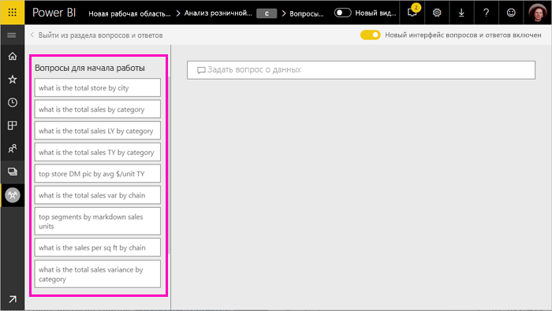
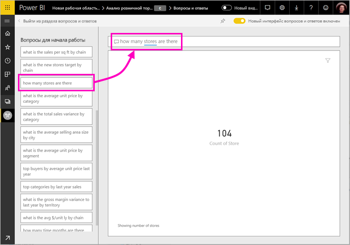

# Позволяет исследовать данные и создавать визуальные элементы Power BI Q & A

Иногда самый быстрый способ получить ответ по данным — задать вопрос, используя естественный язык. Функция "вопросы И ответы" в Power BI позволяет исследовать данные своими словами.  Первая часть этой статьи показано, как использовать Q & A в панели мониторинга в службе Power BI. Во второй части показано, что делать с вопросы И ответы по созданию отчетов в службе Power BI или Power BI Desktop. Дополнительные сведения см. в разделе [вопросы И ответы для потребителей](consumer/end-user-q-and-a.md) статьи. 

[Вопросы И ответы в мобильных приложениях Power BI](consumer/mobile/mobile-apps-ios-qna.md) и [ответы с Power BI Embedded](developer/qanda.md) рассматриваются в отдельных статьях. 

Вопросы И ответы, интерактивные и даже интересна. Часто один вопрос приводит к другим пользователям, так как визуализации раскрывают новые пути для поиска. В следующем видео Аманда показывает, как с помощью функции "Вопросы и ответы" создавать визуализации, анализировать их и закреплять на панели мониторинга.

<iframe width="560" height="315" src="https://www.youtube.com/embed/qMf7OLJfCz8?list=PL1N57mwBHtN0JFoKSR0n-tBkUJHeMP2cP" frameborder="0" allowfullscreen></iframe>

## Часть 1. Используйте вопросы И ответы на панели мониторинга в службе Power BI

В службе Power BI (app.powerbi.com) панель мониторинга содержит плитки, закрепленные из одного или несколько наборов данных, поэтому вы можете задавать вопросы о данных, содержащихся в любой из этих наборов данных. Чтобы увидеть, какие отчеты и наборы данных использовались для создания панели мониторинга, выберите **просмотра связанных элементов** в строке меню.

Поле вопроса Q & A находится в левом верхнем углу панели мониторинга, где введите свой вопрос, используя естественный язык. Не видите поле вопросов? См. в разделе [рекомендации и устранение неполадок](consumer/end-user-q-and-a.md#considerations-and-troubleshooting) в **вопросы И ответы для потребителей** статьи.  Q & A распознает слова при вводе и определяет, где (в каком наборе данных) для поиска ответа. Этот компонент также помогает сформулировать вопрос с помощью таких функций, как автоматическое завершение, изменение формулировки и другие текстовые и визуальные подсказки.

Ответ на вопрос отображается как интерактивная визуализация и обновляется по мере изменения вопроса.

1. Откройте панель мониторинга и поместите курсор в поле для вопроса. В правом верхнем углу выберите **новый интерфейс вопросов**.

    

1. Еще до начала ввода компонент вопросов и ответов открывает новое окно с полезными предложениями. Вы см. в разделе фраз и готовые вопросы, содержащий имена таблиц в базовых наборов данных или даже готовые вопросы, в списке, если владелец набора подготовил [популярные вопросы](service-q-and-a-create-featured-questions.md),

   

   Можно выбрать один из этих вопросов в качестве отправной точки и уточнять вопрос для поиска конкретного ответа. Или используйте имя таблицы поможет вам сформулировать новый вопрос.

2. Выберите в списке вопросов, или Начните вводить собственный вопрос и выберите из раскрывающегося списка предложений.

   

3. По мере ввода вопроса Q & A выбирает наиболее подходящую визуализацию для отображения ответа.

   

4. Визуализация изменится динамически, как изменения вопроса.

   

1. При вводе вопроса Power BI пытается найти наилучший ответ, используя все наборы данных, плитки которых представлены на этой панели мониторинга.  Если все плитки из *набора данных А*, то ответ будет получен из *набора данных А*.  Если имеются плитки из *набора данных а* и *набора данных б*, затем Q & A выполняет поиск лучший ответ в этих двух наборах данных.

   > [!TIP]
   > Поэтому будьте внимательны: если имеется только одна плитка из *набора данных А*, и вы удалите ее из панели мониторинга, функция вопросов и ответов больше не будет иметь доступа к *набору данных А*.
   >

5. Если вы довольны результатами, закрепите визуализацию на панели мониторинга, выбрав значок булавки в правом верхнем углу. Если доступ к панели мониторинга вам предоставил другой пользователь или она является частью приложения, вы не сможете закрепить на ней визуализацию.

   

## Часть 2. Использование функции "Вопросы и ответы" в отчете службы Power BI или Power BI Desktop

Функция "Вопросы и ответы" позволяет изучать наборы данных и добавлять визуализации в отчеты и на панели мониторинга. Отчет основан на одном наборе данных. Он может оказаться пустым или содержать несколько страниц с разными визуализациями. Но пустой отчет не означает, что в наборе нет данных для изучения — базовый набор данных, связанный с этим отчетом, ожидает от вас запросов и новых визуализаций.  Чтобы узнать, на основе какого набора данных создан отчет, откройте отчет в режиме чтения в службе Power BI и выберите действие **Просмотреть похожие** в строке меню.

Чтобы использовать вопросы И ответы в отчетах, необходимо иметь разрешения на редактирование для отчета и базового набора данных. В [вопросы И ответы для потребителей](consumer/end-user-q-and-a.md) статьи, мы называем его в виде *создатель* сценария. Если вместо этого вы *использование* отчет, который поделился с вами, Q & A не поддерживается.

1. Откройте отчет в режиме правки (служба Power BI) или отчет (Power BI Desktop) и выберите **задать вопрос** в строке меню.

    **Power BI Desktop**    
    

    **Служба**    
    

2. На холсте отчетов появится текстовое поле для функции "Вопросы и ответы". В следующем примере такое поле отображается поверх другой визуализации. С ним можно работать и так, но лучше добавить в отчет пустую страницу, прежде чем задавать вопрос.

    

3. Поместите курсор в поле для вопроса. По мере ввода текста подсистема "Вопросы и ответы" отображает некоторые предложения на основе вашего вопроса.

   

4. По мере ввода вопроса функция "Вопросы и ответы" выбирает для отображения ответа наиболее подходящую [визуализацию](visuals/power-bi-visualization-types-for-reports-and-q-and-a.md), которая динамически меняется в зависимости от вопроса.

   

5. Когда предложенная визуализация будет вас устраивать, нажмите клавишу ВВОД. Чтобы сохранить визуализацию в отчете, выберите **Файл > Сохранить**.

6. Создав визуализацию, вы можете использовать с ее. При этом не имеет значения, как именно вы ее создали, — возможности взаимодействия и форматирования будут одинаковыми.

   

   Если вы создали визуализацию в службе Power BI, ее даже можно [закрепить на панели мониторинга](service-dashboard-pin-tile-from-q-and-a.md).

## Назначение используемой визуализации для вопросов и ответов
Функция "Вопросы и ответы" позволяет не только подобрать правильные данные, но и сообщить Power BI о том, как лучше всего их отобразить. Просто добавьте в конец своего вопроса текст "как <visualization type>".  Например, "показать объем запасов по заводу как карту" и "показать всего на складе как карточку".  Попробуйте сами.

## Рекомендации и устранение неполадок
- Если вы подключаетесь к набору данных с помощью активного подключения или шлюза, [для этого набора данных следует включить функцию "Вопросы и ответы"](service-q-and-a-direct-query.md).

- Иногда эта функция не отображается в открытом отчете. Если вы используете службу Power BI, нужно открывать отчет в режиме редактирования. Если не удается открыть режим правки, значит, что у вас нет разрешения на изменение этого отчета и вопросы И ответы можно использовать с конкретного отчета.

## Дальнейшие действия

- [Вопросы И ответы для потребителей](consumer/end-user-q-and-a.md)   
- [Советы по запросам в функцию "Вопросы и ответы" в Power BI](consumer/end-user-q-and-a-tips.md)   
- [Настройка данных для работы с функцией "Вопросы и ответы" в Power BI](service-prepare-data-for-q-and-a.md)  
- [Подготовка локального набора данных для Q & A](service-q-and-a-direct-query.md)   
- [Закрепление результатов работы подсистемы вопросов и ответов в качестве плитки на панели мониторинга Power BI](service-dashboard-pin-tile-from-q-and-a.md)
