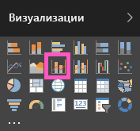

# Комбинированная диаграмма в Power (руководство)
В Power BI комбинированная диаграмма представляет собой визуализацию, сочетающую график и гистограмму. Объединение двух диаграмм в одну позволяет быстрее сравнивать данные.

Комбинированная диаграмма может содержать одну или две оси Y.

## Сферы применения комбинированной диаграммы
Комбинированная диаграмма отлично подходит:

* при наличии графика и гистограммы с одной и той же осью X;
* для сравнения нескольких показателей с другими диапазонами значений;
* для демонстрации корреляции между двумя показателями в одной визуализации;
* для проверки соответствия одного показателя целевому, который определяется другим показателем;
* чтобы освободить место на холсте.

## Создание простой комбинированной диаграммы с одной осью
Посмотрите, как Уилл создает комбинированную диаграмму на основе примера "Продажи и маркетинг".

<iframe width="560" height="315" src="https://www.youtube.com/embed/lnv66cTZ5ho?list=PL1N57mwBHtN0JFoKSR0n-tBkUJHeMP2cP" frameborder="0" allowfullscreen></iframe>

Чтобы создать собственную комбинированную диаграмму, войдите в Power BI и выберите **Получение данных \> Примеры \> Анализ розничной торговли — пример**. 

1. На панели мониторинга "Анализ розничной торговли — пример" выберите **Total Stores** (Всего магазинов), чтобы открыть отчет "Анализ розничной торговли — пример".
2. Выберите пункт **Изменить отчет** , чтобы открыть отчет в режиме редактирования.
3. [Добавьте новую страницу отчета](power-bi-report-add-page.md).
4. Создайте гистограмму, отображающую продажи за этот год и валовую прибыль по месяцам.
   
    а.  В области "Поля" выберите **Sales** \> **This Year Sales** > **Value** (Продажи > Продажи за этот год > Значение).
   
    б.  Перетащите **Sales** \> **Gross Margin This Year** (Продажи > Валовая прибыль за этот год) в область **Value** (Значение).
   
    в.  Выберите **Time** \> **FiscalMonth** (Время > Отчетный месяц), чтобы добавить время в качестве **оси**. 
   
    
5. Щелкните многоточие (...) в правом верхнем углу визуализации и выберите **Sort by FiscalMonth** (Сортировать по отчетному месяцу).
6. Преобразуйте гистограмму в комбинированную диаграмму. Выделив гистограмму, откройте область **Визуализации** и выберите **Линейная гистограмма и гистограмма с группировкой**.
   
    
7. В области **Поля** перетащите **Sales** \> **Last Year Sales** (Продажи > Продажи за прошлый год) в контейнер **Значения строк**.
   
   
   
   Ваша комбинированная диаграмма должна выглядеть следующим образом:
   
   

## Создание комбинированной диаграммы с двумя осями
В этом задании мы сравним валовую прибыль и продажи.

1. Создайте новый график для отслеживания процента валовой прибыли за прошлый год по месяцам.  В январе процент валовой прибыли составил 35 %, в апреле вырос до 45 %, в июле упал, а в августе снова подскочил. Похожа ли эта картина на данные за предыдущий год?
   
   
2. Добавьте к графику показатели **This Year Sales (Выручка за этот год) > Значение** и **Last Year Sales** (Выручка за прошлый год). Масштаб показателя **GM% Last Year** (Валовая прибыль за прошлый год) намного меньше, чем масштаб показателя **Sales** (Продажи), что усложняет сравнение.      
   
   
3. Чтобы упростить чтение и понимание визуального элемента, преобразуйте график в линейную гистограмму и гистограмму с накоплением.
   
   
4. Перетащите параметр **% валовой прибыли за прошлый год** из **значений столбцов** в **значения строк**. Power BI создаст две оси, позволяя тем самым по-разному отображать шкалы наборов данных: левая ось служит для отображения объемов продаж, а правая — для процентов.
   
       

## Добавление заголовков осей
1. Откройте панель форматирования, щелкнув значок валика .
2. Щелкните стрелку вниз, чтобы развернуть параметры **оси Y** .
3. В разделе **Ось Y (столбец)** задайте для параметра **Расположение** значение **Слева**, для переключателя **Заголовок** — положение **Вкл.**, для параметра **Стиль** — значение **Показать только заголовок**, а для параметра **Отображение** — значение **Миллионы**.
   
   
4. В разделе **Ось Y (столбец)** также убедитесь, что переключатель **Показать вторичные** установлен в положение **Вкл**. Здесь показаны параметры форматирования графика на комбинированной диаграмме.
   
   
5. Для раздела **Ось Y (строка)** оставьте для параметра **Расположение** значение **Справа**, установите переключатель **Заголовок** в расположение **Вкл.** и задайте для параметра **Стиль** значение **Показать только заголовок**.
   
   На комбинированной диаграмме теперь отображаются две оси с заголовками.
   
   

Здесь можно выполнять следующие действия:

* [Добавьте комбинированную диаграмму как плитку панели мониторинга](service-dashboard-tiles.md).
* [Сохраните отчет](service-report-save.md).

## Выделение и перекрестная фильтрация
Сведения об использовании области "Фильтры" см. в разделе [Добавление фильтра в отчет](power-bi-report-add-filter.md).

Вы можете выделить столбец или строку в комбинированной диаграмме для перекрестной фильтрации других визуализаций на странице отчета (и наоборот).

## Дальнейшие действия
[Добавление визуализации в отчет](power-bi-report-add-visualizations-i.md)

[Визуализации в отчетах Power BI](power-bi-report-visualizations.md)

[Типы визуализаций в Power BI](power-bi-visualization-types-for-reports-and-q-and-a.md)

[Power BI — основные понятия](service-basic-concepts.md)

[Бесплатная пробная версия](https://powerbi.com/)

Появились дополнительные вопросы? [Ответы на них см. в сообществе Power BI.](http://community.powerbi.com/)

