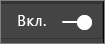
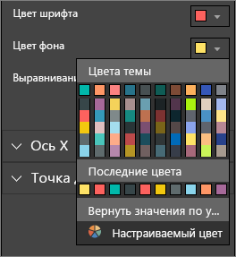
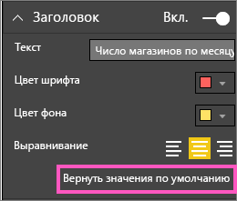
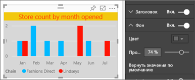
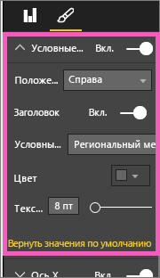
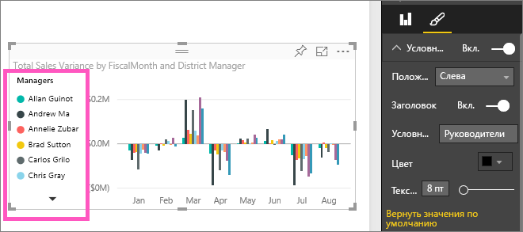

# Настройка заголовков визуализаций, условных обозначений и фона
В этом руководстве описано несколько способов настройки визуализации.   Есть множество возможностей для настройки визуализации. Проще всего изучить их, используя панель форматирования (выберите значок валика).  Из этой статьи вы узнаете, как приступить к работе и настроить заголовок визуализации, условные обозначения и фон.  

Не все визуализации можно настраивать ([см. полный список](#list)).  

Узнайте, как Аманда настраивает визуализации, просмотрев ее отчет (перемотайте до 4:50 в этом видео). Сделайте то же самое в соответствии с приведенными ниже инструкциями, используя свои данные.

<iframe width="560" height="315" src="https://www.youtube.com/embed/IkJda4O7oGs" frameborder="0" allowfullscreen></iframe>

### Предварительные требования
- Служба Power BI или Power BI Desktop
- Анализ розничной торговли — пример

## Настройка заголовка визуализации в отчете
Чтобы продолжить, войдите в службу Power BI (app.powerbi.com) и откройте отчет [Анализ розничной торговли — пример](sample-datasets.md) в [режиме правки](service-interact-with-a-report-in-editing-view.md).

> [!NOTE]
> При закреплении визуализации на информационной панели она становится плиткой.  Для самой плитки можно настроить [подпись, подзаголовок, гиперссылку, а также изменить ее размер](service-dashboard-edit-tile.md).
> 
> 

1. Перейдите на страницу "New Stores" (Новые магазины) отчета и щелкните гистограмму "Open Store Count by Open Month..." (Открытое число магазинов по открытым месяцам).
2. В области "Визуализации" щелкните значок валика, чтобы открыть параметры настройки,  и выберите **Заголовок**, чтобы развернуть этот раздел.  
   
   
3. Для включения или отключения  **заголовка** установите ползунок в положение «Вкл.» или «Выкл.». Пока оставьте значение **Вкл.**  
   
   
4. Измените **текст заголовка** , введя в текстовом поле **Store count by month opened** (Число открытых магазинов по месяцам).  
5. Измените **цвет шрифта** на оранжевый, а **цвет фона** — на желтый.
   
   * Щелкните раскрывающийся список и выберите цвет в одном из разделов: **Цвета темы**, **Последние цвета**, **Другой цвет**.
   * Щелкните раскрывающийся список, чтобы закрыть окно цвета.  
     
   
   Можно всегда вернуться к цветам по умолчанию, нажав кнопку **Вернуться к значению по умолчанию** в окне выбора цвета.
6. Увеличьте размер шрифта до 12.
7. Последняя настройка, которую мы выполним с заголовком диаграммы, — выровняем его по центру визуализации. По умолчанию заголовок выровнен по левому краю.  
   
   
    Сейчас **заголовок** вашей гистограммы должен выглядеть примерно так:  
    
   
    Чтобы отменить все сделанные настройки заголовка, нажмите кнопку **Вернуть значения по умолчанию**в нижней части панели настройки **Заголовок** .  
    

## Настройка цвета фона визуализации
Для этой же гистограммы разверните параметры "Фон".

1. Для включения или отключения фона используйте ползунок "Вкл." или "Выкл." Пока оставьте значение **Вкл.**
2. Измените цвет фона, выбрав 74 % серого.
   
   * Щелкните раскрывающийся список и выберите серый цвет в одном из разделов: **Цвета темы**, **Последние цвета**, **Другой цвет**.
   * Измените прозрачность до 74 %.   
     
   
   Чтобы отменить все изменения фона заголовка, нажмите кнопку **Вернуть значения по умолчанию**в нижней части панели настройки **Фон** .

## Настройка условных обозначений визуализации
1. Откройте страницу отчета **Overview** (Обзор) и выберите диаграмму Total Sales Variance by FiscalMonth and District Manager (Разница в общем объеме продаж по отчетным месяцам и региональным менеджерам).
2. На вкладке «Визуализация» выберите значок кисти, чтобы открыть панель форматирования.  
3. Разверните параметры **условных обозначений** .
   
      
4. Для включения или отключения условных обозначений используйте ползунок "Вкл." или "Выкл." Пока оставьте значение **Вкл.**
5. Расположение условные обозначения слева от визуализации.    
6. Добавьте заголовок условных обозначений, установив для параметра **Заголовок** значение **Вкл.** и введя в поле **Имя условных обозначений** значение **Managers**(Руководители).
   
   
   Чтобы отменить все сделанные настройки условных обозначений, нажмите кнопку **Вернуть значения по умолчанию**в нижней части панели настройки **Условные обозначения** .

## Типы визуализаций, которые могут быть настроены
| Визуализация | Заголовок | Фон | Условные обозначения |
|:--- |:--- |:--- |:--- |
| диаграмма с областями |да |да |да |
| линейчатая диаграмма |да |да |да |
| карта |да |да |Н/Д |
| многострочная карточка |да |да |Н/Д |
| гистограмма |да |да |да |
| комбинированная диаграмма |да |да |да |
| кольцевая диаграмма |да |да |да |
| картограмма |да |да |да |
| воронкообразная диаграмма |да |да |Н/Д |
| индикаторная диаграмма |да |да |Н/Д |
| КПЭ |да |да |Н/Д |
| график |да |да |да |
| карта |да |да |да |
| матрица |да |да |Н/Д |
| круговая диаграмма |да |да |да |
| точечная диаграмма |да |да |да |
| срез |да |да |Н/Д |
| таблица |да |да |Н/Д |
| текстовое поле |нет |да |Н/Д |
| диаграмма-дерево |да |да |да |
| каскадная диаграмма |да |да |да |

## Дальнейшие действия
[Настройка осей X и Y](power-bi-visualization-customize-x-axis-and-y-axis.md)  
[Настройка цветов и свойств оси](service-getting-started-with-color-formatting-and-axis-properties.md)  
[Power BI — основные понятия](service-basic-concepts.md)  
Появились дополнительные вопросы? [Ответы на них см. в сообществе Power BI.](http://community.powerbi.com/)

