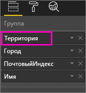
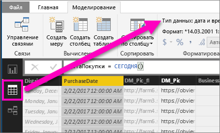

# Детализация в визуализации в Power BI
## Детализация с использованием иерархии
Если визуализация имеет иерархию, вы можете выполнить детализацию, чтобы отобразить дополнительные сведения. Например, вы можете создать визуализацию, которая отслеживает количество олимпийских медалей, с иерархией, состоящей из категорий "Спорт", "Дисциплина" и "Событие". По умолчанию в визуализации количество медалей будет отображаться по спортивным дисциплинам, таким как гимнастика, лыжный спорт, водные виды спорта и т. д. Но так как она имеет иерархию, после выбора одного из визуальных элементов (например, линейчатой диаграммы, графика или пузырьковой диаграммы) отобразятся более подробные данные. Выберите элемент **Водные виды спорта**, чтобы просмотреть данные по плаванию, прыжкам в воду и водному поло.  Затем выберите элемент **Прыжки в воду**, чтобы просмотреть данные по прыжкам с трамплина, прыжкам в воду и синхронным прыжкам в воду.

Вы можете добавлять иерархию в собственные отчеты, но не в отчеты, созданные другими пользователями.
Не уверены, какая визуализация Power BI содержит иерархию?  Наведите указатель мыши на визуализацию, и если в верхнем углу появятся элементы управления детализацией, показанные ниже, значит визуализация имеет иерархию.

    
   

Даты — это уникальный тип иерархии. При добавлении поля даты в визуализацию Power BI автоматически добавляет иерархию времени, которая включает в себя год, квартал, месяц и день. Дополнительные сведения см. в статье [Поведение иерархий и детализации визуальных элементов](guided-learning/visualizations.yml?tutorial-step=18) или посмотрите видеоролик ниже.

  <iframe width="560" height="315" src="https://www.youtube.com/embed/MNAaHw4PxzE?list=PL1N57mwBHtN0JFoKSR0n-tBkUJHeMP2cP" frameborder="0" allowfullscreen></iframe>

> [!NOTE]
> Чтобы узнать, как создать иерархии с помощью Power BI Desktop, см. видеоролик, посвященный [созданию и добавлению иерархий](https://youtu.be/q8WDUAiTGeU)
> 
> 

## Два способа детализации
В визуализации существует два способа повышения (и понижения) уровня детализации.  В этой статье описываются оба. Результат использования обоих способов одинаков, поэтому вы можете выбрать любой из них.

> [!NOTE]
> Чтобы продолжить, [откройте образец анализа розничной торговли](sample-datasets.md) в службе Power BI и создайте диаграмму "дерево" со сведениями об **общем количестве единиц, проданных за этот год**, (значения) по **территориям**, **городу**, **почтовому индексу** и **имени** (группе).  
> 
> 

## Первый способ детализации
Этот метод основан на использовании значков детализации, которые отображаются в верхнем углу самой визуализации.

1. В Power BI откройте отчет в [режиме чтения или правки](service-reading-view-and-editing-view.md). Для детализации требуется визуализация с иерархией. 
   
   Иерархия показана на анимации ниже.  Иерархия в визуализации состоит из категорий "Территория", "Город", "Почтовый индекс" и "Название города". Каждая территория состоит из одного или нескольких городов, каждый город имеет один или несколько почтовых индексов и т. д. По умолчанию в визуализации отображаются только данные о территории, так как категория *Территория* стоит первой в списке.
   
   
2. Чтобы включить детализацию, выберите значок со стрелкой в правом верхнем углу визуализации. Темный значок означает, что детализация включена. Если детализация отключена, при выборе визуального элемента (например, линейчатая или пузырьковая диаграмма) выполняется перекрестная фильтрация других диаграмм на странице отчета.    
   
   
3. Чтобы получить детализацию по **одному полю за раз**, выберите один из элементов в визуализации. В линейчатой диаграмме для этого нужно щелкнуть один из столбцов. В диаграмме "дерево" для этого нужно щелкнуть **один из листьев**. Обратите внимание, что при выполнении детализации и возвращении на прежний уровень изменяется заголовок. На этой анимации он изменяется с Total Units This Year by Territory (Всего единиц за этот год по территории) на Total Units This Year by Territory and City (Всего единиц за этот год по территории и городу), затем на Total Units This Year by Territory, City and PostalCode (Всего единиц за этот год по территории, городу и почтовому индексу) и на Total Units This Year by Territory, City, PostalCode, and Name (Всего единиц за этот год по территории, городу, почтовому индексу и названию). Чтобы вернуться на предыдущий уровень детализации, щелкните значок **Drill Up** (Уменьшить уровень детализации)  в левом верхнем углу визуализации, как показано ниже.
   
   
4. Чтобы выполнить детализацию по ***всем полям одновременно***, щелкните двойную стрелку в левом верхнем углу визуализации.
   
   
5. Чтобы вернуться на предыдущий уровень детализации, выберите стрелку вверх в левом верхнем углу визуализации.
   
   

## Второй способ детализации
В этом способе используется раскрывающийся список **Explore** (Обзор) в верхней строке меню Power BI.

1. В Power BI откройте отчет в [режиме чтения или правки](service-reading-view-and-editing-view.md). Для детализации требуется визуализация с иерархией. 
   
   Иерархия показана на рисунке ниже.  Иерархия в визуализации состоит из категорий "Территория", "Город", "Почтовый индекс" и "Название города". Каждая территория состоит из одного или нескольких городов, каждый город имеет один или несколько почтовых индексов и т. д. По умолчанию в визуализации отображаются только данные о территории, так как категория *Территория* стоит первой в списке.
   
   
2. Чтобы включить детализацию, щелкните визуализацию, чтобы сделать ее активной, и в верхней строке меню Power BI выберите **Explore** > **Drill Down** (Обзор > Детализировать). Фон значка детализации, расположенного в правом верхнем углу визуализации, потемнеет.   
   
   
3. После включения функции выполните детализацию по одному полю, выбрав одну из ветвей диаграммы "дерево". В этом примере выбирается территория с именем **NC**, чтобы просмотреть общее количество единиц, проданных за этот год в Северной Каролине.
   
   
4. Чтобы детализировать все поля одновременно, выберите **Обзор** > **Показать следующий уровень**.
   
   
5. Чтобы вернуться на прежний уровень, выберите **Обзор** > **Уменьшить детализацию**.
   
   

6. Чтобы увидеть данные, используемые для создания визуального элемента, выберите **See data** (Просмотр данных). Данные появятся в области под визуальным элементом. Эта область продолжает отображаться по мере детализации визуального элемента. Дополнительные сведения см. в статье [Просмотр данных, используемых для создания визуальных элементов](service-reports-show-data.md).

## Основные сведения об оси иерархии и группе иерархии
Ось иерархии и группу иерархии можно считать механизмами, позволяющими повышать и понижать степень детализации данных, которые вы хотите просмотреть. Любые данные, которые можно разбить на категории и подкатегории, считаются имеющими иерархическую структуру. Сюда, конечно, входят данные о датах и времени.

Можно создать визуализацию с иерархией в Power BI, выбрав одно или несколько полей данных, добавляемых в колодец **Ось** или **Группа**, вместе с данными, которые требуется просматривать как поля данных, в колодце **Значения**. Вы узнаете, имеют ли ваши данные иерархическую структуру, по тому, появляются ли значки режима детализации в верхних левом и правом углах визуализации. 

В сущности, целесообразно разбить иерархические данные на два типа.
- Данные о датах и времени. Если существует поле данных с типом данных DateTime, то у вас уже имеются иерархические данные. Power BI автоматически создает иерархию для любого поля данных, значения которого можно проанализировать в структуре [DateTime](https://msdn.microsoft.com/library/system.datetime.aspx). Достаточно просто добавить одно поле DateTime в колодец **Ось** или **Группа**.
- Категориальные данные. Если ваши данные извлекаются из коллекций, которые содержат вложенные коллекции, или в них существуют строки данных с общими значениями, то у вас имеются иерархические данные.

Power BI позволяет разворачивать данные по одному или по всем подмножествам. Вы можете выполнять детализацию, чтобы просматривать по одному подмножеству на каждом уровне или просмотреть все подмножества одновременно на каждом уровне. Например, можно выполнить детализацию, чтобы увидеть результаты для определенного года, или просмотреть все результаты для каждого года, продвигаясь вниз по иерархии. И наоборот, можно таким же образом понижать степень детализации.

В следующих разделах описывается повышение степени детализации от представления наивысшего уровня, представления среднего уровня и представления наинизшего уровня.

### Иерархические данные и данные о времени
В данном примере используйте [пример анализа розничной торговли](sample-datasets.md) и создайте визуализацию в виде гистограммы с накоплением для просмотра месяцев **Month** (ось) по объемам продаж **TotalSales** (значения).  

Несмотря на то, что поле данных оси — **Month** (Месяц), в колодце **Ось** создается также категория **Year** (Год). Это происходит потому, что Power BI обеспечивает полную структуру DateTime для всех считываемых значений. На верхнем уровне иерархии отображаются данные за год.

Включите режим повышения степени детализации и щелкните столбец на диаграмме, чтобы перейти на один уровень иерархии вниз. Вы увидите три столбца для данных по доступным кварталам. Затем в верхнем левом значке выберите пункт **Expand all down one level of the hierarchy** (Развернуть все на один уровень иерархии вниз). Затем повторите это действие еще раз, чтобы дойти до самого нижнего уровня иерархии, на котором показываются результаты для каждого месяца.

Помимо визуализации, иерархия также отражается в данных, отображаемых для каждого отчета. В следующей таблице показаны результаты команды **Show Data** (Просмотр данных) в отчете с детализацией от одного месяца или всех месяцев. 

Обратите внимание, что данные для квартального и годового отчетов одинаковы, но после детализации до уровня, указанного для **значений**, можно видеть, что отчет для одного месяца становится более конкретным, а отчет для всех месяцев имеет больше данных.

|Режим развертывания|Год|Квартал|Месяц|День|
| ---|:---:|:---:|:---:|---|
|Однонаправленная|||||
|Все|||||

### Данные иерархических категорий
Данные, которые моделируются из коллекций и вложенных коллекций, являются иерархическими. Хорошим примером таких данных являются данные о расположении. Рассмотрим таблицу в источнике данных, в столбцах которого указаны страна, регион, город и почтовый индекс. Данные, имеющие одинаковую страну, регион и город, являются иерархическими.

В данном примере используйте [пример анализа розничной торговли](sample-datasets.md). Создайте визуализацию в виде гистограммы с накоплением для просмотра **общего количества единиц за этот год** (значения) по **территории**, **городу**, **почтовому индексу** и **названию** (группа).  

При включенном режиме повышения уровня детализации в верхнем левом значке три раза выберите пункт **Expand all down one level of the hierarchy** (Развернуть все на один уровень иерархии вниз).
Вы должны оказаться на самом низком уровне иерархии, на котором отображаются результаты для территории, города и почтового индекса.

Помимо визуализации, иерархия также отражается в данных, отображаемых для каждого отчета. В следующей таблице показаны результаты команды **Show Data** (Просмотр данных) в отчете с детализацией от одной территории или от всех территорий. По мере детализации можно видеть, как отчет для одной территории становится все более конкретным, а в отчете для всех территорий отображается все больше данных.

| Режим развертывания|Территория|Город|Почтовый индекс|Имя|
| ---|:---:|:---:|:---:|---|
|Однонаправленная|||||
|Все|||||

## Рекомендации и ограничения
* Если после добавления поля даты в визуализацию иерархия не была создана, это может означать, что это поле не сохранено в качестве даты. Если у вас есть набор данных, откройте его в представлении *Данные* в Power BI Desktop, выберите столбец, содержащий дату, а затем на вкладке "Моделирование" задайте для параметра **Data Type** (Тип данных) значение **Date** (Дата) или **Date/Time** (Дата и время). Если отчет предоставил вам другой пользователь, свяжитесь с ним и попросите внести изменения.  
  
  

## Дальнейшие действия
[Визуализации в отчетах Power BI](power-bi-report-visualizations.md)

[Отчеты Power BI](service-reports.md)

[Power BI — основные понятия](service-basic-concepts.md)

Появились дополнительные вопросы? [Ответы на них см. в сообществе Power BI.](http://community.powerbi.com/)

