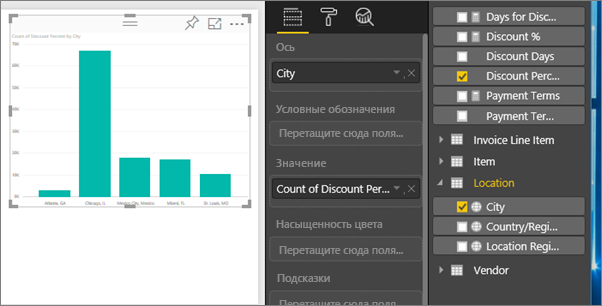
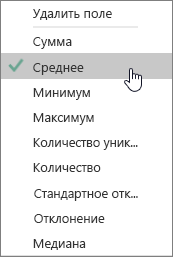
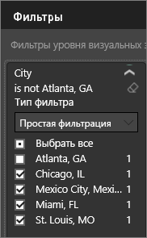
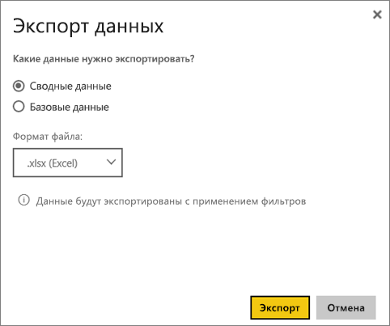

# Экспорт данных из визуализаций
Чтобы просмотреть данные, которые используются для создания визуализации, [откройте их в Power BI](service-reports-show-data.md) или экспортируйте в Excel в виде файла с расширением XLSX или CSV.   

Просмотрите видео, в котором показан экспорт данных из визуализации в отчете и сохранение их в файл XLSX с последующим просмотром в Excel. Затем сделайте то же самое, выполнив пошаговые инструкции, приведенные под видео.

<iframe width="560" height="315" src="https://www.youtube.com/embed/KjheMTGjDXw" frameborder="0" allowfullscreen></iframe>

## Экспорт из визуализации на панели мониторинга Power BI
1. Щелкните многоточие в правом верхнем углу визуализации.
   
    
2. Выберите значок  **Экспорт данных** .
   
    
3. Данные экспортируются в файл CSV. Если визуальный элемент фильтруется, то скачанные данные также будут отфильтрованы.
4. Браузер предложит сохранить файл.  Откройте сохраненный файл CSV в программе Excel.
   
    

## Экспорт из визуализации в отчете
Для начала откройте [отчет по примеру анализа закупок](sample-procurement.md) в [представлении редактирования](service-reading-view-and-editing-view.md). [Добавьте новую пустую страницу отчета](power-bi-report-add-page.md). Затем выполните следующие действия, чтобы добавить агрегирование и фильтры уровня визуализации.

1. Создайте гистограмму.  В области "Поля" выберите **Location > City** (Расположение > Город) и **Invoice > Discount Percent** (Счет > Процент скидки).  Возможно, нужно будет переместить **Процент скидки** в область "Значение". 
   
    
2. Измените тип агрегации для **процента скидки** с **количества** на **среднее значение**. В области значений щелкните стрелку справа от параметра **Discount Percent** (Процент скидки) (он может называться **Count of Discount Percent** (Число процента скидки)) и выберите значение **Average** (Среднее значение).
   
    
3. Добавьте фильтр для **города**, чтобы удалить **Атланту**.
   
   
   
   Теперь можно попробовать оба варианта для экспорта данных.
4. Щелкните многоточие в правом верхнем углу визуализации. Выберите  **Экспорт данных**.
   
   
5. Если в визуализации есть статистическое выражение (например, если значение **количества** заменено на *среднее значение*, **сумму** или *минимальное значение*), вам доступно два варианта: **сводные данные** и **базовые данные**. Дополнительные сведения о статистических выражениях см. в статье [Статистические выражения в Power BI](service-aggregates.md).
   
    
6. Выберите **Сводные данные** > **Экспорт**, а затем выберите формат (XLSX или CSV). Power BI экспортирует данные.  Если к визуализации применялись фильтры, данные будут экспортированы с учетом фильтров. При выборе элемента **Экспорт** браузер предложит сохранить файл. Откройте сохраненный файл в программе Excel.
   
   **Сводные данные**. Выбирайте этот вариант, если: 1) у вас нет статистических выражений; 2) у вас есть статистические выражения, но вам не нужна полная разбивка. Например, если в гистограмме отображается 4 столбца, вы получите 4 строки данных. Сводные данные можно получить в формате XLSX и CSV.
   
   В этом примере в экспортированных данных Excel отображается итоговая сумма для каждого города. Так как мы отфильтровали Атланту, этого города нет в результатах.  В первой строке электронной таблицы отображаются фильтры, использованные при извлечении данных из Power BI.
   
   
7. Теперь выберите **Базовые данные** > **Экспорт** и выберите формат XLSX. Power BI экспортирует данные. Если к визуализации применялись фильтры, экспортированные данные будут экспортированы с учетом фильтров. При выборе элемента **Экспорт** браузер предложит сохранить файл. Откройте сохраненный файл в программе Excel.
   
   >[!WARNING]
   >Экспорт базовых данных позволяет пользователям видеть все подробные сведения, включая каждый столбец в данных. Администраторы службы Power BI могут отключить этот параметр для своей организации. Если вы являетесь владельцем набора данных, определите собственные столбцы как скрытые, чтобы они не отображались в списке полей на рабочем столе или в службе Power BI.
   
   
   **Базовые данные**. Выбирайте этот вариант, если у вас нет статистических выражений в визуализации и вам нужно просмотреть все исходные данные. По сути, выбрав элемент *Базовые данные*, вы удалите статистическое выражение. После нажатия кнопки **Экспортировать** данные экспортируются в файл XLSX и браузер предлагает сохранить этот файл. Откройте сохраненный файл в программе Excel.
   
   В этом примере в экспортированных данных Excel отображается по одной строке для каждой строки "Город" в наборе данных и процент скидки для одной записи. Другими словами, данные преобразованы в плоскую структуру без суммирования. В первой строке электронной таблицы отображаются фильтры, использованные при извлечении данных из Power BI.  
   
   

## Рекомендации и ограничения
* Максимальное число строк, которые можно экспортировать из **Power BI Desktop** и **службы Power BI** в CSV-файл, — 30 000.
* Максимальное количество строк, которое можно экспортировать в XLSX-файл, — 150 000.
* Экспорт с помощью *базовых данных* не будет работать, если источником данных является динамическое соединение Analysis Services версии старше 2016 и если для таблиц в модели не существует уникального ключа.  
* Экспорт с помощью *базовых данных* не будет работать, если для экспортируемой визуализации используется параметр *Показать элементы без данных*.
* При использовании DirectQuery максимальный объем данных, который можно экспортировать, составляет 16 МБ. Это может привести к экспорту меньшего числа строк, чем максимальное, особенно если таблица содержит много столбцов либо данные, трудно поддающиеся сжатию, или есть другие факторы, увеличивающие размер файла и уменьшающие число экспортируемых строк.
* Power BI поддерживает только экспорт в визуальные элементы, которые используют основные статистические функции. Экспорт не доступен для визуальных элементов, которые используют меры модели или отчетов.
* Пользовательские визуализации и визуализации R пока не поддерживаются.
* Экспорт данных недоступен для пользователей за пределами вашей организации, которые используют предоставленную им панель мониторинга. 
* Если в CSV-файле содержится знак Юникода, то текст в Excel может отображаться неправильно. Но при этом в блокноте все будет работать нормально. Примерами знаков Юникода являются символы валют и иностранные слова. Решением этой проблемы является импорт CSV-файла в Excel вместо открытия его напрямую. Для этого выполните следующие действия.
  
  1. Откройте Excel
  2. На вкладке **Данные** выберите **Получить внешние данные** > **Из текста**.
* Администраторы Power BI имеют возможность отключить экспорт данных.

## Дальнейшие действия
[Панели мониторинга в Power BI](service-dashboards.md)  
[Отчеты в Power BI](service-reports.md)  
[Power BI — основные понятия](service-basic-concepts.md)

Появились дополнительные вопросы? [Попробуйте задать вопрос в сообществе Power BI.](http://community.powerbi.com/)

