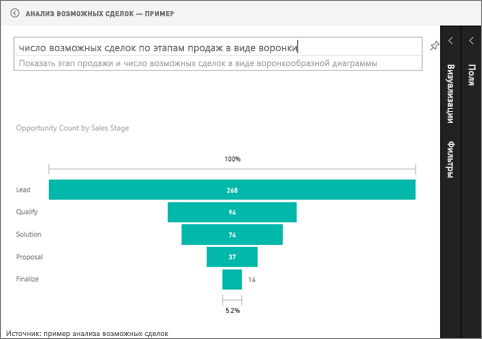

# Воронкообразные диаграммы (руководство)
Воронкообразная диаграмма позволяет визуализировать линейный процесс, который имеет последовательные связанные этапы. Например, воронка продаж, которая отслеживает клиентов по этапам: "Интерес" \> "Соответствующий интерес" \> "Потенциальный клиент" \> "Контракт" \> "Закрыто".  Форма воронки визуально передает состояние отслеживаемого процесса.

Каждый этап воронки представляет долю от общего количества. Таким образом, в большинстве случаев воронкообразная диаграмма имеет форму воронки: первый этап самый большой, а каждый следующий этап меньше предыдущего.  Грушевидная воронка также удобна: она позволяет определить проблему в процессе.  Но, как правило, первый этап, этап "вхождения", является самым крупным.

## Сферы применения воронкообразных диаграмм
Воронкообразная диаграмма отлично подходит:

* когда данные последовательны и проходят по крайней мере четыре этапа;
* когда ожидается, что число "элементов" на первом этапе превышает число на последнем этапе;
* для вычисления потенциальных показателей (доход, продажи, сделки и пр.) по этапам;
* для вычисления и отслеживания показателей эффективности и удержания;
* для выявления узких мест в линейном процессе;
* для отслеживания рабочего процесса корзины;
* для отслеживания хода выполнения и успешности рекламных и маркетинговых кампаний с переходами по рекламным ссылкам.

## Работа с воронкообразными диаграммами
Воронкообразные диаграммы:

* можно закрепить из отчетов и функции "Вопросы и ответы";
* можно сортировать;
* поддерживают несколько диаграмм;
* могут быть объектами выделения и перекрестной фильтрации для других визуализаций на той же странице отчета;
* могут использоваться для выделения и перекрестной фильтрации других визуализаций на той же странице отчета.

## Создание простой воронкообразной диаграммы
Посмотрите это видео, чтобы увидеть, как Уилл создает воронкообразную диаграмму на основе примера "Продажи и маркетинг".

<iframe width="560" height="315" src="https://www.youtube.com/embed/maTzOJSRB3g" frameborder="0" allowfullscreen></iframe>

Создайте собственную воронкообразную диаграмму, показывающую количество возможных сделок на этапах продаж.

Эти инструкции основаны на примере анализа возможных сделок. Для дальнейшей работы [загрузите пример](sample-datasets.md), войдите в Power BI и выберите **Получить данные \> Примеры \> Анализ возможностей — пример \> Подключить**.

1. Начните с [пустой страницы отчета](power-bi-report-add-page.md) в [представлении редактирования](service-interact-with-a-report-in-editing-view.md) и выберите поле **Этап продажи** \> **Этап продажи**.  
   
    
2. [Преобразуйте диаграмму](power-bi-report-change-visualization-type.md) в воронку. Обратите внимание, что параметр **Этап продажи** также находится в **группе** . 
3. В области **Поля** выберите пункты **Факт** \> **Число возможностей**.
   
    
4. При наведении указателя мыши на столбец отображается много ценных сведений:
   
   * имя этапа;
   * текущее число возможных сделок на этом этапе;
   * общий показатель эффективности (доля от интереса); 
   * поэтапное значение (интенсивность отбрасывания), которое представляет собой долю от предыдущего этапа (в данном случае этап предложения/этап решения).
     
     
5. [Добавьте воронкообразную диаграмму как плитку панели мониторинга](service-dashboard-tiles.md). 
6. [Сохраните отчет](service-report-save.md).

## Выделение и перекрестная фильтрация
Сведения об использовании области "Фильтры" см. в разделе [Добавление фильтра в отчет](power-bi-report-add-filter.md).

Вы можете выделить столбец в воронкообразной диаграмме для перекрестной фильтрации других визуализаций на странице отчета (и наоборот). Добавьте на страницу отчета еще несколько визуальных элементов с воронкообразной диаграммой.

1. На воронкообразной диаграмме выберите столбец **Proposal** (Предложение). Это приведет к перекрестному выделению других визуализаций на странице. Используйте клавишу CTRL, чтобы выбрать сразу несколько элементов.
   
   
2. Сведения о том, как настроить параметры перекрестного выделения и фильтрации визуальных элементов, см. в статье [Взаимодействие визуальных элементов в Power BI](service-reports-visual-interactions.md).

## Создание воронкообразной диаграммы в компоненте "Вопросы и ответы"
Выделите панель мониторинга, в которой есть по крайней мере одна визуализация, закрепленная из набора данных Opportunity Tracking (Отслеживание возможных сделок).  При вводе вопроса в поле "Вопросы и ответы" Power BI ищет ответы во всех наборах данных, которые связаны с выбранной панелью мониторинга (то есть их плитки закреплены на этой панели мониторинга). Дополнительные сведения см. в разделе [Power BI — основные понятия](service-basic-concepts.md).

1. Выделите панель мониторинга, в которой есть по крайней мере одна плитка, закрепленная из набора данных "Отслеживание возможных сделок".
2. Начните вводить вопрос в окне вопросов и ответов.
   
   
   
   Не забудьте добавить "как воронка", чтобы указать Power BI предпочтительный тип визуализации.

## Дальнейшие действия
[Типы визуализаций в Power BI](power-bi-visualization-types-for-reports-and-q-and-a.md)

[Закрепление визуализации на панели мониторинга](service-dashboard-pin-tile-from-report.md)

[Power BI — основные понятия](service-basic-concepts.md)

Появились дополнительные вопросы? [Ответы на них см. в сообществе Power BI.](http://community.powerbi.com/)

