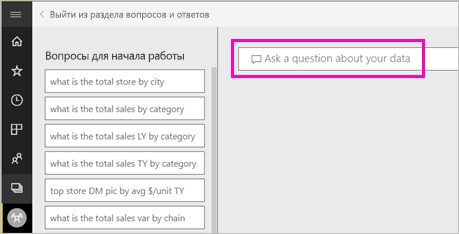
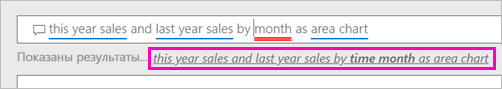

# Создание визуального элемента, используя функцию "Вопросы и ответы" Power BI

Иногда самый быстрый способ получить ответ по данным — задать вопрос, используя естественный язык.  В этой статье мы рассмотрим два разных способа создания одной визуализации: ввод вопроса в функции "Вопросы и ответы" и ее встраивание в отчет. Мы будем использовать службу Power BI для сборки визуального элемента в отчете, но этот процесс применим и для Power BI Desktop.

Для работы с этим руководством нужен отчет, который вы можете изменять. Поэтому будем использовать один из доступных примеров в Power BI.

## Создание визуализации с использованием "Вопросов и ответов"

Как мы можем создать этот график, используя функцию "Вопросы и ответы"?

1. В рабочей области Power BI выберите **Получить данные** \> **Примеры** \> **Анализ розничной торговли — пример** > **Подключить**.

1. Откройте панель мониторинга примера Анализа розничной торговли и поместите курсор в поле "Вопросы и ответы" **Задать вопрос о своих данных**.

    

2. В поле "Вопросы и ответы" введите нечто вроде этого вопроса:
   
    **продажи за текущий год и продажи за прошлый год помесячно в виде диаграммы с областями**
   
    По мере ввода вопроса функция "Вопросы и ответы" Power BI выбирает наиболее подходящую визуализацию для отображения ответа; и эта визуализация динамически меняется по мере изменения вопроса. Кроме того, функция помогает отформатировать вопрос, используя предложения, автоматическое завершение и правку орфографии. В "Вопросы и ответы" рекомендуется небольшое изменение формулировки: продажи за текущий год и продажи за прошлый год *помесячно* в виде диаграммы с областями.  

    

4. Выберите предложение, чтобы принять рекомендации. 
   
   Когда вы закончите вводить вопрос, вы увидите, что результатом является такая же диаграмма, какую вы видели на панели мониторинга.
   
   

4. Чтобы закрепить диаграмму на панели мониторинга, выберите значок булавки.  в правом верхнем углу.

## Создание визуального элемента в редакторе отчетов

1. Вернитесь на информационную панель "Анализ розничной торговли — пример".
   
2. Панель мониторинга содержит такую же плитку диаграммы с областями "Продажи за прошлый год и за этот год".  Выберите эту плитку. Не выбирайте плитку, созданную с помощью "Вопросы и ответы". При выборе откроется панель "Вопросы и ответы". Исходная плитка диаграммы с областями была создана в отчете, поэтому отчет открывается на странице, содержащей эту визуализацию.

    

1. Откройте отчет в режиме редактирования, выбрав пункт **Изменить отчет**.  Не являясь владельцем отчета, вы не сможете открыть отчет в представлении редактирования.
   
    
4. Выберите диаграмму с областями и просмотрите параметры в области **Поля** .  Автор отчетов создал эту диаграмму, выбрав эти три значения (**Продажи за прошлый год** и **Продажи за этот год > Значение** из таблицы **Продажи** и **FiscalMonth** из таблицы **Время**) и упорядочив их в наборах **Оси** и **Значения**.
   
    

    Вы увидите, что они завершились с одним и тем же визуальным элементом. Создать таким образом совсем не сложно. Однако, создание с помощью "Вопросы и ответы" было проще!

## Дальнейшие действия

- [Использование функции "Вопросы и ответы" в панелях мониторинга и отчетах](power-bi-tutorial-q-and-a.md)  
- [Вопросы и ответы для потребителей](consumer/end-user-q-and-a.md)
- [Настройка данных для работы с функцией "Вопросы и ответы" в Power BI](service-prepare-data-for-q-and-a.md)

Появились дополнительные вопросы? [Ответы на них см. в сообществе Power BI.](https://community.powerbi.com/)

